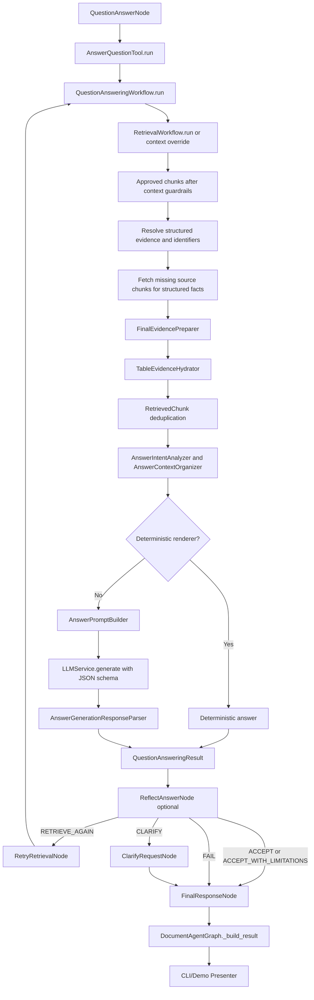

# Answer Pipeline After Answer Intent

## Purpose

This report explains what happens in the current system after the answering pipeline has decided it is in question-answering mode and begins preparing the final retrieved evidence for answer generation.

The focus is:

1. how retrieved chunks are transformed before the answer LLM sees them
2. which branches bypass the LLM
3. how reflection can change the outcome
4. how the final response text is selected and presented to the user

This is a code-inspection report only. No implementation changes were made.

---

## 1. Executive Summary

The system does not send raw retrieval output directly to the answer LLM.

Instead, the active question-answering path does the following:

1. retrieves evidence chunks
2. filters them through context guardrails
3. resolves extra structured evidence and identifier-backed source chunks
4. hydrates table-heavy chunks to full table text when possible
5. deduplicates the final evidence set
6. organizes that evidence into a `StructuredAnswerContext`
7. either:
   - returns a deterministic answer for some intents such as identifier lookup and spare-parts list rendering, or
   - builds a grounded answer-generation prompt and calls the LLM
8. optionally runs a reflection pass that can accept, accept with limitations, retry retrieval, ask for clarification, or fail
9. resolves the final answer text from graph state
10. renders that final text in the CLI or demo runtime

Important implementation detail:

- Only approved chunks go into answer generation.
- Rejected chunks are not passed to the answer LLM.
- Rejected chunks can still be shown to the reflection LLM as summaries for critique/retry decisions.

---

## 2. Main Active Entry Points

### 2.1 Direct graph CLI

File:

- `scripts/agent_cli.py`

Main runtime call:

- `run_graph_request()`
- `runtime.graph.run(...)`

This path prints either plain text or JSON and can optionally show context chunks.

### 2.2 Demo runtime CLI

Files:

- `scripts/demo_agent_cli.py`
- `src/application/agent_runtime/demo_agent_runtime.py`
- `src/application/agent_runtime/presenters/console_presenter.py`

This is the more polished enterprise/demo path.

It builds:

- `QuestionAnsweringWorkflow`
- `AnswerGenerationService`
- `ReflectionService`
- `DocumentAgentGraph`

and then renders the result through:

- `ConsolePresenter.render_graph_result()`

### 2.3 LangGraph node that invokes QA

File:

- `src/application/langgraph/nodes/question_answering/answer_question_node.py`

This is the LangGraph node that calls the answer-question tool and stores the tool result into graph state.

---

## 3. High-Level Flow

---

## 4. Where Answer Intent Fits

The answer-intent logic is centered in:

- `src/application/services/answer_generation/intent/answer_intent_analyzer.py`

Primary usage points:

- `QuestionAnsweringWorkflow._resolve_structured_answer_intent_decision()`
- `AnswerGenerationService._resolve_intent_decision()`

Important behavior:

1. `QuestionAnsweringWorkflow` analyzes answer intent before building structured answer context.
2. That decision is passed down through `AnswerGenerationRequest.answer_intent_decision`.
3. `AnswerGenerationService` reuses the existing decision instead of recomputing it when available.

Why this matters:

- the structured context and answer prompt stay aligned to the same intent
- there is no second, conflicting intent decision inside answer generation

---

## 5. From Retrieved Chunks to Approved Chunks

Main code:

- `src/application/workflows/question_answering/question_answering_workflow.py`

Relevant methods:

- `QuestionAnsweringWorkflow._handle_retrieval()`
- `QuestionAnsweringWorkflow._answer_from_chunks()`

The initial retrieval result arrives as:

- `RetrievalWorkflowResult`

Relevant model:

- `src/application/workflows/retrieval/retrieval_workflow_result.py`

Key detail:

- `RetrievalWorkflowResult.final_chunks` returns `context_chunks` if present, otherwise raw retrieval-result chunks.

The chunk model used downstream is:

- `src/domain/retrieval/retrieved_chunk.py`

Fields include:

- `chunk_id`
- `document_id`
- `content`
- `score`
- `retrieval_source`
- `chunk_type`
- `section_id`
- `section_path`
- `source`
- `citation`
- `statistics`
- `metadata`
- `identifier_values`

Before answer generation, the workflow runs:

1. context guardrails
2. document-scope check

Files involved:

- `ContextGuardrailChain` via `QuestionAnsweringWorkflow`
- document-scope check inside `QuestionAnsweringWorkflow._document_scope_violation()`

Output of this phase:

- `approved_chunks`
- `approved_chunk_ids`
- `rejected_chunk_ids`

Only these approved chunks continue into answer generation.

---

## 6. Structured Evidence Resolution Before Prompting

The workflow does not rely on chunk text alone.

It also merges structured evidence from retrieval or caller-provided data:

- identifiers
- extracted structured entities

Main method:

- `QuestionAnsweringWorkflow._resolve_structured_evidence()`

Behavior:

1. starts from `request.resolved_identifiers` and `request.resolved_structured_entities`
2. merges in retrieval-side `workflow_result.structured_evidence`
3. deduplicates both identifiers and structured entities

This means the answering layer can use:

- retrieved chunks
- retrieved structured facts
- caller-supplied structured facts

in one unified answer-generation request.

---

## 7. Missing Source Chunks Are Pulled Back In

Main method:

- `QuestionAnsweringWorkflow._join_structured_facts()`

This is an important step.

If a resolved identifier or structured entity points to a source chunk that did not surface in normal retrieval, the workflow will fetch that chunk directly through:

- `DocumentLookupService.get_chunks_by_ids()`

Then it converts those chunks back into `RetrievedChunk` objects through:

- `QuestionAnsweringWorkflow._to_retrieved_chunk()`

Why this exists:

- the LLM should see the original chunk evidence that backed a structured fact
- structured facts are not meant to float separately without their source text when possible

So the effective answer-generation evidence set is:

- approved retrieved chunks
- plus fetched source chunks for structured facts that were not already present

---

## 8. Final Evidence Preparation Before LLM Input

Main file:

- `src/application/workflows/question_answering/evidence/final_evidence_preparer.py`

Core method:

- `FinalEvidencePreparer.prepare()`

This stage does two important things:

1. table evidence hydration
2. retrieved-chunk deduplication

### 8.1 Table hydration

File:

- `src/application/workflows/question_answering/evidence/table_evidence_hydrator.py`

Behavior:

- loads the persisted `DocumentGraph` for the chunk's document
- checks whether the source `DocumentChunk` references one or more `table_ids`
- for table-like chunk types, replaces the chunk content with richer table text

Targeted chunk types:

- `SPARE_PARTS_TABLE`
- `TECHNICAL_SPECIFICATION`
- `CERTIFICATION_INFO`
- `TROUBLESHOOTING`
- `MAINTENANCE_INTERVAL`
- `MAINTENANCE_PROCEDURE`

Hydrated content uses:

- `TableAsset.to_embedding_text()`
- `TableAsset.to_structured_row_text()`

It also stores structured rows into:

- `metadata["table_rows_json"]`

Meaning:

- the answer LLM often sees the complete table evidence text, not just the partial table fragment that happened to be retrieved

### 8.2 Deduplication

Still inside `FinalEvidencePreparer.prepare()`, the final chunk list is passed to:

- `RetrievedChunkDeduplicator`

So the answering layer sees a cleaned evidence list rather than raw duplicated retrieval hits.

---

## 9. How Chunks Become Answer Sources

Main files:

- `src/application/workflows/question_answering/answer_context/answer_context_organizer.py`
- `src/application/workflows/question_answering/answer_context/structured_source_builder.py`
- `src/application/workflows/question_answering/answer_context/models/answer_source.py`
- `src/application/workflows/question_answering/answer_context/models/structured_answer_context.py`

The organizer transforms the prepared `RetrievedChunk` list into a `StructuredAnswerContext`.

### 9.1 Source conversion

`StructuredSourceBuilder.build_sources()` maps each `RetrievedChunk` to an `AnswerSource`.

Important fields in `AnswerSource`:

- `source_number`
- `chunk_id`
- `chunk_name`
- `chunk_type`
- `document_id`
- `document_title`
- `section_path`
- `page_start`
- `page_end`
- `score`
- `content`
- `table_rows`
- `retrieval_source`
- `section_id`
- `statistics`
- `identifier_values`
- `metadata`
- `collapsed_chunk_ids`

This is the main source object used by the prompt builder.

### 9.2 Grouping and extraction

`AnswerContextOrganizer.organize()` builds:

- `sources`
- `source_groups`
- `section_groups`
- `key_values`
- `maintenance_entries`
- diagnostics

The organizer delegates to:

- `KeyValueExtractor`
- `MaintenanceEntryMerger`
- `SourceGroupBuilder`
- `SectionGroupBuilder`

So the system does not pass only flat chunk text into the prompt. It also builds:

- structured key/value facts
- grouped maintenance entries
- section-level groupings
- source-level grouping metadata

---

## 10. Exact AnswerGenerationRequest Passed Downstream

Main model:

- `src/application/services/answer_generation/answer_generation_request.py`

`QuestionAnsweringWorkflow` constructs this request with:

- `question`
- `context_chunks`
- `query_intent`
- `retrieval_intent`
- `chunk_type_preferences`
- `resolved_identifiers`
- `resolved_structured_entities`
- `structured_context`
- `answer_intent_decision`
- `route`

Important implementation fact:

- by the time `AnswerGenerationService.generate()` is called, the request may already include a fully built `StructuredAnswerContext`
- this prevents downstream recomputation drift

---

## 11. Branch 1: Deterministic Answer Renderers Can Bypass the LLM

Main file:

- `src/application/services/answer_generation/answer_generation_service.py`

Before building an answer prompt, the service tries deterministic renderers.

### 11.1 Identifier renderer

File:

- `src/application/services/answer_generation/formatting/identifier_answer_renderer.py`

This is used when:

- `answer_intent == IDENTIFIER_LOOKUP`

It prefers:

- `StructuredAnswerContext.key_values`

and falls back to:

- `resolved_identifiers`

If it can produce a good answer, the LLM is not called.

### 11.2 Spare-parts renderer

File:

- `src/application/services/answer_generation/formatting/spare_parts_list_renderer.py`

This is used when:

- the intent is table- or identifier-related
- the question looks like a spare-parts request
- the question is not asking for export format

It prefers:

- structured spare-part entities

and falls back to:

- parsed table-bearing `AnswerSource`s

If this renderer succeeds, the LLM is not called.

### 11.3 Result of deterministic rendering

In either deterministic case:

- `GeneratedAnswer.answer_text` is filled
- citations are still attached separately
- `model_name` becomes a deterministic pseudo-model label such as:
  - `deterministic_identifier_renderer`
  - `deterministic_spare_parts_renderer`

So not every final answer comes from an LLM.

---

## 12. Branch 2: If No Deterministic Renderer Applies, the LLM Is Called

### 12.1 LLM wrapper

Files:

- `src/application/services/ai/llm_service.py`
- `src/infrastructure/ai/llm/ollama_llm_provider.py`

The answer-generation service calls:

- `LLMService.generate(prompt, model=..., response_schema=...)`

The Ollama provider passes the schema to Ollama as:

- `format=response_schema`

So this is schema-guided structured output, not pure free-form text.

### 12.2 Prompt builder

File:

- `src/application/prompts/answer_generation/answer_prompt_builder.py`

The prompt contains:

1. global grounding rules
2. required JSON output shape
3. answer intent
4. retrieval/query intent
5. answer format policy
6. resolved identifiers
7. organized context
8. raw sources

Grounding rules source:

- `src/application/prompts/common/grounding_rules.py`

Important rule:

- the prompt explicitly tells the model not to reference internal source labels, chunk IDs, or system classifications in the user-facing answer
- the application will attach citations separately

### 12.3 What the model actually sees

The model sees two evidence layers:

#### Organized context

Produced from `StructuredAnswerContext`:

- maintenance entries
- key values
- structured entities and their relationships
- source groups
- section groups

#### Raw sources

For each source, `AnswerPromptBuilder._format_answer_source_block()` emits:

- `SOURCE N`
- `Document: ...`
- `Section: ...`
- `Pages: ...`
- raw `content`

So the final LLM input is not raw chunk JSON.

It is a prompt that mixes:

- extracted structured facts
- grouped evidence
- plus the original chunk content as normalized source blocks

### 12.4 Response schema

Files:

- `src/application/services/answer_generation/answer_generation_response_schema.py`
- `src/application/services/answer_generation/answer_generation_response_parser.py`

Expected JSON shape:

- `answer_text`
- optional `limitation_note`

The parser:

- strips code fences and `<think>` blocks
- validates the JSON with Pydantic
- raises `SchemaValidationError` if malformed

---

## 13. What the AnswerGenerationService Returns

Model:

- `src/application/services/answer_generation/answer_generation_result.py`

The service returns `GeneratedAnswer`, which includes:

- `answer_text`
- `citations`
- `cited_chunk_ids`
- `prompt_version`
- `model_name`
- `confidence`
- `raw_model_output`
- `metadata`
- `answer_intent`
- `limitation_note`
- `diagnostics`

Important detail:

- citations are built from the chunk objects, not from the model output
- the model is not asked to generate final citation objects

---

## 14. How the Workflow Returns the QA Result

Back in:

- `QuestionAnsweringWorkflow._answer_from_chunks()`

the final `QuestionAnsweringResult` contains:

- `answer_text`
- `citations`
- `retrieval_result`
- `approved_chunk_ids`
- `rejected_chunk_ids`
- `resolved_identifiers`
- `resolved_structured_entities`
- `answer_intent`
- diagnostics

This result is wrapped into a `ToolResult` by:

- `src/application/tools/question_answering/answer_question_tool.py`

and then stored into LangGraph state by:

- `AnswerQuestionNode.__call__()`

State fields patched by `AnswerQuestionNode` include:

- `response_text`
- `tool_results["answer_question"]`
- `initial_context_chunks`
- `merged_context_chunks`
- `merged_chunk_ids`
- `resolved_identifiers`
- `resolved_structured_entities`

Important current detail:

- `response_text` is initially set to `qa_result.answer_text` or `safe_user_message`
- the LangGraph state therefore already has a candidate user-facing answer before reflection runs

---

## 15. Reflection Stage

Main files:

- `src/application/langgraph/nodes/question_answering/reflect_answer_node.py`
- `src/application/langgraph/reflection/services/reflection_service.py`
- `src/application/langgraph/reflection/validation/reflection_validator.py`
- `src/application/prompts/reflection/reflection_prompt_builder.py`

### 15.1 What reflection reviews

`ReflectAnswerNode` collects:

- generated answer text
- approved chunks
- rejected chunks
- citations
- selected document info
- answer intent

Then it calls:

- `ReflectionService.review(...)`

### 15.2 Reflection decision types

Model:

- `src/application/langgraph/reflection/models/reflection_decision.py`

Allowed outcomes:

- `ACCEPT`
- `ACCEPT_WITH_LIMITATIONS`
- `RETRIEVE_AGAIN`
- `CLARIFY`
- `FAIL`

### 15.3 Reflection LLM input

The reflection prompt includes:

- original user question
- selected document title/id
- answer intent
- generated answer
- approved chunk summaries
- rejected chunk summaries
- citations
- retry counts

Important detail:

- unlike answer generation, reflection is allowed to see internal chunk-level metadata such as `chunk_id`, `chunk_type`, page, score, and section path
- this is for critique and retry control, not for user output

### 15.4 Reflection validation

`ReflectionValidator` can override weak or invalid model decisions.

Examples:

- downgrade some bad `CLARIFY` decisions to `ACCEPT_WITH_LIMITATIONS`
- force retry for identifier-list questions when the answer failed to actually list identifiers
- protect spare-parts list questions from incorrect denial answers
- protect maintenance interval questions from false fails when relevant evidence exists

So the reflection model is not final authority. The validator is a deterministic guard layer.

---

## 16. Retry Branch

If reflection returns `RETRIEVE_AGAIN`, the graph enters:

- `src/application/langgraph/nodes/question_answering/retry_retrieval_node.py`

Behavior:

1. builds or reuses `retry_query`
2. reruns retrieval or retrieval-strategy execution
3. merges initial and retry chunks with `EvidenceMerger`
4. calls `AnswerQuestionTool` again using:
   - `context_override_chunks=merged_chunks`

Important consequence:

- the second answer-generation pass can run on a merged evidence set instead of fresh retrieval alone
- the retry path re-enters the same `QuestionAnsweringWorkflow`

---

## 17. FinalResponseNode: Last Response Guardrail and Recovery

Main file:

- `src/application/langgraph/nodes/control/final_response_node.py`

This node does not generate a new answer.

It resolves and finalizes the response text already present in graph state.

Main steps:

1. save conversation/session state
2. compute `response_text` via `resolve_state_response_text(state)`
3. run post-response guardrail service
4. recover usable generated answer if a safe-failure fallback incorrectly replaced it

Important recovery logic:

- if reflection decision is usable (`ACCEPT` or `ACCEPT_WITH_LIMITATIONS`)
- and the current final text equals the safe failure message
- but the underlying generated answer is still available
- then `FinalResponseNode` restores the generated answer

Safe failure constant:

- `src/application/langgraph/reflection/constants/reflection_constants.py`

Current safe failure message:

- `I could not verify a grounded answer confidently enough from the current evidence.`

---

## 18. Response Text Resolution Logic

Main file:

- `src/application/langgraph/common/response_text_resolver.py`

This is the core utility that decides which answer text wins.

Behavior:

1. get generated answer from `tool_results["answer_question"]`
2. compare it with current fallback `state["response_text"]`
3. if reflection decision is usable and fallback text is a safe failure, prefer the generated answer
4. otherwise prefer fallback response text if present
5. otherwise fall back to generated answer

This utility is reused in:

- `FinalResponseNode`
- `DocumentAgentGraph._build_result()`

So the answer recovery logic is applied in more than one place.

---

## 19. How GraphResult Is Built

Main file:

- `src/application/langgraph/graphs/document_agent_graph.py`

Method:

- `DocumentAgentGraph._build_result()`

This method constructs the final `GraphResult` returned to the CLI/runtime.

It:

1. resolves final answer text with `_extract_answer()`
2. re-runs a usable-reflection recovery if needed
3. extracts answer intent
4. extracts citations
5. extracts and enriches context chunks
6. packs everything into `GraphResult.data`

Important output fields:

- `data["answer"]`
- `data["answer_intent"]`
- `data["context_chunks"]`
- `data["citations"]`
- `data["reflection_result"]`
- `data["reflection_decision"]`
- `data["retry_query"]`
- `data["tool_results"]`

The final `GraphResult.response_text` is set to:

- the resolved answer, or
- fallback state response text

### 19.1 Context chunk enrichment for presentation

`_extract_context_chunks()` and `_enrich_context_chunks()`:

- read the retrieval payload
- attach citation-derived document title / section title where possible
- set `approved` / `rejected` flags based on QA filtering

So the user-facing context display is enriched after QA, not just a raw dump from retrieval.

---

## 20. How the Final Response Reaches the User

There are two main presentation paths.

### 20.1 `scripts/agent_cli.py`

This script prints:

- `result.response_text` or `result.data["answer"]`

With `--show-context`, it prints:

- `result.data["context_chunks"]`

With `--json`, it prints:

- `route`
- `success`
- `answer`
- `answer_intent`
- `document_id`
- `reflection_result`
- `reflection_decision`
- `context_chunks`
- `citations`
- diagnostics

### 20.2 Demo runtime

Files:

- `scripts/demo_agent_cli.py`
- `src/application/agent_runtime/presenters/console_presenter.py`
- `src/application/agent_runtime/presenters/json_presenter.py`

`ConsolePresenter.render_graph_result()` prints:

1. user request
2. optional react trace
3. final answer
4. status footer

The final answer text is chosen by:

- `ConsolePresenter._final_answer_text()`

This again protects usable reflection decisions from showing a safe failure message if the generated answer is still available.

The footer can show:

- current document
- route
- mode
- strategy
- reflection decision
- source count
- elapsed time

### 20.3 JSON presenter

`JsonPresenter.render()` returns:

- `route`
- `success`
- `answer`
- `document_id`
- `selected_document`
- `context_chunks`
- `citations`
- `diagnostics`
- optional trace

---

## 21. Important Branches and Non-Obvious Behaviors

### 21.1 `include_context` does not change the answer-generation evidence

`include_context` is carried through requests and graph state, but in the active QA path it is mainly a presentation/runtime flag.

It controls whether context is shown to the user, not whether the LLM receives evidence.

The LLM evidence set is built from:

- approved chunks
- joined structured-fact source chunks
- hydrated/deduplicated evidence

regardless of `include_context`.

### 21.2 Rejected chunks do not go to answer generation

Rejected chunks are filtered out before `AnswerGenerationRequest` is built.

They may still be visible to reflection as critique input.

### 21.3 Some answers are fully deterministic

Identifier and spare-parts answers may never touch the answer LLM.

### 21.4 Table answers are often richer than retrieval previews

Because `TableEvidenceHydrator` can replace chunk content with full table text plus structured rows, the answer LLM may see better table evidence than the short retrieval preview suggests.

### 21.5 Structured entities can pull in extra evidence chunks

Even if retrieval did not surface a chunk, the QA workflow may add it if a resolved identifier/entity points back to that chunk.

---

## 22. Practical Mental Model

If you want the simplest correct mental model of the current pipeline after answer intent:

1. retrieval finds candidate chunks
2. QA guardrails keep only approved chunks
3. structured evidence may add missing source chunks
4. table-heavy chunks may be upgraded to full table text
5. evidence is deduplicated
6. the system organizes evidence into:
   - raw sources
   - key values
   - maintenance entries
   - structured entities
   - groups
7. deterministic renderers get first chance
8. otherwise the answer LLM receives:
   - grounding rules
   - intent and format policy
   - organized context
   - raw source blocks
9. reflection may accept, retry, clarify, or fail
10. final response assembly chooses the best safe answer text
11. CLI/demo presenters render that final answer and optionally the context chunks

---

## 23. Key Files Map

### Entry and runtime

- `scripts/agent_cli.py`
- `scripts/demo_agent_cli.py`
- `src/application/agent_runtime/demo_agent_runtime.py`

### LangGraph orchestration

- `src/application/langgraph/nodes/question_answering/answer_question_node.py`
- `src/application/langgraph/nodes/question_answering/reflect_answer_node.py`
- `src/application/langgraph/nodes/question_answering/retry_retrieval_node.py`
- `src/application/langgraph/nodes/control/final_response_node.py`
- `src/application/langgraph/common/response_text_resolver.py`
- `src/application/langgraph/graphs/document_agent_graph.py`

### QA workflow

- `src/application/workflows/question_answering/question_answering_workflow.py`
- `src/application/workflows/question_answering/question_answering_request.py`
- `src/application/workflows/question_answering/question_answering_result.py`

### Evidence preparation

- `src/application/workflows/question_answering/evidence/final_evidence_preparer.py`
- `src/application/workflows/question_answering/evidence/table_evidence_hydrator.py`

### Structured answer context

- `src/application/workflows/question_answering/answer_context/answer_context_organizer.py`
- `src/application/workflows/question_answering/answer_context/structured_source_builder.py`
- `src/application/workflows/question_answering/answer_context/models/structured_answer_context.py`
- `src/application/workflows/question_answering/answer_context/models/answer_source.py`

### Answer generation

- `src/application/services/answer_generation/answer_generation_service.py`
- `src/application/services/answer_generation/answer_generation_request.py`
- `src/application/services/answer_generation/answer_generation_result.py`
- `src/application/services/answer_generation/answer_generation_response_parser.py`
- `src/application/services/answer_generation/answer_generation_response_schema.py`
- `src/application/services/answer_generation/formatting/answer_format_policy.py`
- `src/application/services/answer_generation/formatting/identifier_answer_renderer.py`
- `src/application/services/answer_generation/formatting/spare_parts_list_renderer.py`

### Prompts

- `src/application/prompts/common/grounding_rules.py`
- `src/application/prompts/answer_generation/answer_prompt_builder.py`
- `src/application/prompts/reflection/reflection_prompt_builder.py`

### LLM wrapper

- `src/application/services/ai/llm_service.py`
- `src/infrastructure/ai/llm/ollama_llm_provider.py`

### Reflection

- `src/application/langgraph/reflection/services/reflection_service.py`
- `src/application/langgraph/reflection/validation/reflection_validator.py`
- `src/application/langgraph/reflection/models/reflection_decision.py`
- `src/application/langgraph/reflection/constants/reflection_constants.py`

### Presentation

- `src/application/agent_runtime/presenters/console_presenter.py`
- `src/application/agent_runtime/presenters/json_presenter.py`

---

## 24. Final Verdict

The current pipeline after answer intent is not a simple:

- retrieve chunks -> pass chunks to LLM -> print result

It is a layered answering pipeline with:

- evidence approval
- source recovery for structured facts
- table hydration
- structured-context assembly
- deterministic answer branches
- schema-constrained answer generation
- reflection and retry
- final response recovery logic
- separate user-facing presentation formatting

The most important answer to your question is:

### How are retrieved chunks given to the LLM?

They are first filtered, optionally enriched with missing structured-fact source chunks, table-hydrated, deduplicated, reorganized into `StructuredAnswerContext`, and then rendered into a prompt that contains both organized context and raw source blocks.

### How is the final response given to the user?

The generated answer is stored in LangGraph state, optionally reviewed by reflection, resolved again by final-response logic, packed into `GraphResult`, and then rendered by either:

- `scripts/agent_cli.py`, or
- `ConsolePresenter` / `JsonPresenter` in the demo runtime.

