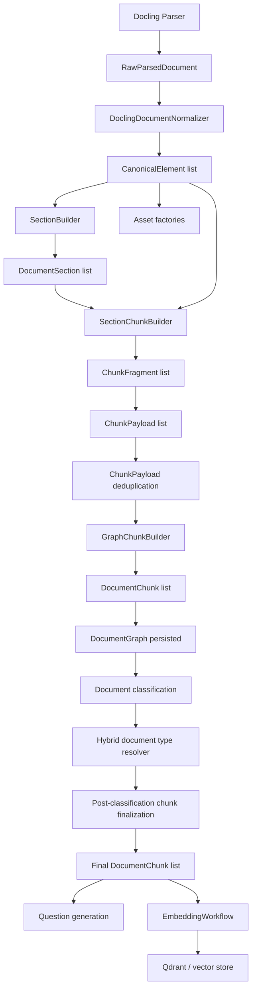

# Chunking System Architecture

## Purpose

This document explains how chunking currently works in the repository, from the moment canonical elements are available to the point where final `DocumentChunk` objects are persisted, embedded, and later consumed by retrieval.

The goal is to describe the real implementation that exists today, including the main strategies, the data model, the configuration layers, the post-classification rechunk flow, and the current caveats.

Primary code areas:

- `src/application/workflows/parsing/builders/document_graph_builder.py`
- `src/application/workflows/parsing/builders/document_graph/graph_chunk_builder.py`
- `src/application/workflows/parsing/builders/chunking/`
- `src/application/workflows/classification/post_classification_chunk_finalization_workflow.py`
- `src/application/workflows/retrieval/`

---

## 1. Executive Summary

The system does not chunk raw PDF text directly.

It first:

1. Parses the PDF with Docling.
2. Normalizes Docling output into canonical elements.
3. Builds a section hierarchy.
4. Converts section-scoped elements into intermediate chunk fragments.
5. Merges, splits, types, enriches, and deduplicates those fragments into chunk payloads.
6. Materializes final domain `DocumentChunk` objects in the `DocumentGraph`.

Chunking is therefore:

- section-aware
- document-type-aware
- structured-evidence-aware
- table/picture-aware
- retrieval-oriented

There are two chunking passes in the broader system:

- Provisional chunking during parsing.
- Final chunking during post-classification finalization.

The second pass may reuse stored chunks, refresh them, or fully rechunk them depending on the hybrid document-type decision.

---

## 2. Where Chunking Runs

### Main parsing path

Chunking is invoked during `ParsingWorkflow.parse()`:

- `src/application/workflows/parsing/parsing_workflow.py`

That workflow calls:

- `DocumentGraphBuilder.build()`

Inside `DocumentGraphBuilder.build()`:

1. sections are built
2. elements and assets are materialized
3. `GraphChunkBuilder.build_chunks()` is called

### Final chunking path after classification

Chunking can run again in:

- `src/application/workflows/classification/post_classification_chunk_finalization_workflow.py`

This workflow:

1. loads the persisted parsed graph
2. resolves a final document type and chunking profile
3. decides whether rechunking is needed
4. rebuilds chunks when needed
5. persists the final chunk artifacts
6. optionally embeds the final chunk set

### Debug and inspection entrypoint

The best inspection script is:

- `scripts/debug_parse_document.py`

It can show:

- canonical elements
- initial graph chunks
- structural profile inference
- document classification
- post-classification final chunks

---

## 3. High-Level Flow

---

## 4. Core Chunking Data Model

Chunking moves through several representations:

### 4.1 `CanonicalElement`

Source:

- `src/application/workflows/parsing/canonical_element.py`

This is the normalized parsing unit used as chunking input. It contains:

- normalized text
- element type
- order index / reading order
- section assignment later in the pipeline
- page range and bounding box
- table/picture references and parser metadata

### 4.2 `DocumentSection`

Source:

- `src/domain/document/entities/section.py`

Sections provide:

- `section_id`
- `title`
- `level`
- `parent_section_id`
- `section_path`
- page and reading-order boundaries

Chunking is section-driven, so the quality of section detection directly affects chunk quality.

### 4.3 `ChunkFragment`

Source:

- `src/application/workflows/parsing/builders/chunking/models/chunk_fragment.py`

This is the first chunking-specific intermediate unit.

A fragment carries:

- text
- provisional `chunk_type`
- `standalone` flag
- section metadata
- linked element/table/picture ids
- page range
- token count
- optional table rows

Fragments are finer-grained than final chunks. Multiple fragments may later merge into a single payload.

### 4.4 `ChunkPayload`

Source:

- `src/application/workflows/parsing/builders/chunking/models/chunk_payload.py`

This is the final pre-domain chunk representation.

It contains:

- resolved `section_id`
- cleaned `section_path`
- `content`
- resolved `chunk_type`
- `embedding_text`
- linked element/table/picture ids
- page range

### 4.5 `DocumentChunk`

Source:

- `src/domain/document/entities/chunk.py`

This is the persisted domain chunk used by retrieval and embedding.

Important fields:

- `chunk_id`
- `document_id`
- `section_id`
- `content`
- `chunk_type`
- `chunk_type_source`
- `section_path`
- `element_ids`
- `table_ids`
- `picture_ids`
- `source.page_start/page_end`
- `sequence_number`
- `chunk_index`
- `chunk_total`
- `embedding_text`
- `statistics`

`chunk_index` and `chunk_total` are per-section family counters, so multiple chunks can and often do share the same `section_id`.

---

## 5. Upstream Input: Section Hierarchy Before Chunking

Chunking depends on the section hierarchy created by:

- `src/application/workflows/parsing/builders/section_builder.py`

That builder:

1. sorts canonical elements
2. extracts section headers
3. resolves hierarchy and effective levels
4. creates `DocumentSection` entities
5. assigns every element to an active section

If no headers exist, it creates a root section for the entire document.

Why this matters:

- chunking uses `section_path`
- merge rules depend on parent/child/sibling relationships
- overview chunks are generated from parent/child section relationships
- retrieval context expansion later relies on section lineage

---

## 6. Chunking Runtime Assembly

The runtime is assembled in:

- `src/application/workflows/parsing/builders/chunking/runtime/chunking_runtime_factory.py`

`ChunkingRuntimeFactory.create()` builds a `ChunkingRuntime` with:

- `DocumentChunkingPolicy`
- `ChunkTextSplitter`
- `ChunkFragmentBuilder`
- `SectionChunkSkipper`
- `ChunkPayloadFactory`
- `SectionMergePolicy`

This means chunking behavior is a composition of small focused components rather than one giant builder.

---

## 7. Chunking Policy Resolution

Policy resolution lives in:

- `src/application/workflows/parsing/builders/chunking/policies/document_chunking_policy_resolver.py`

Resolution order is:

1. explicit `chunking_profile_override`
2. direct `DocumentType -> ChunkingProfile` mapping
3. structural profile inference from document structure

The YAML-backed policy registry is:

- `src/application/workflows/parsing/builders/chunking/policies/chunking_policy_registry.py`

Policy YAML files live in:

- `src/config/chunking/*.yaml`

The current profiles are:

- `default`
- `manual`
- `datasheet`
- `drawing`
- `report`
- `certificate`

### Current YAML values

| Profile | max_chunk_tokens | chunk_overlap | same_topic_merge_tokens | intro_context_tokens | asset_context_window | asset_context_max_tokens | include_picture_chunks | include_table_context |
|---|---:|---:|---:|---:|---:|---:|---|---|
| `default` | 200 | 20 | 90 | 120 | 1 | 72 | true | true |
| `manual` | 1000 | 100 | 120 | 160 | 2 | 90 | true | true |
| `datasheet` | 600 | 75 | 80 | 110 | 1 | 60 | false | true |
| `drawing` | 300 | 35 | 60 | 80 | 1 | 48 | true | false |
| `report` | 800 | 100 | 100 | 120 | 1 | 70 | true | true |
| `certificate` | 500 | 60 | 80 | 100 | 1 | 60 | false | true |

### Important current behavior

Although policies define `max_chunk_tokens`, `chunk_overlap`, and the section-text threshold, `DocumentGraphBuilder` currently injects global overrides from `IngestionSettings` into `ChunkingRuntimeFactory`:

- `MAX_CHUNK_TOKENS`
- `CHUNK_OVERLAP`
- `MIN_SECTION_TEXT_LENGTH`

Source:

- `src/application/workflows/parsing/builders/document_graph_builder.py`
- `src/config/settings/ingestion_settings.py`

So today:

- profile-specific values for `same_topic_merge_tokens`
- `intro_context_tokens`
- asset-context settings
- `include_picture_chunks`
- `include_table_context`

are honored,

but profile-specific `max_chunk_tokens` and `chunk_overlap` are effectively overridden by the ingestion defaults unless the builder is constructed differently.

That is an important implementation detail for anyone tuning chunk size per document type.

---

## 8. Structural Profile Inference

Structural inference lives in:

- `src/application/workflows/parsing/builders/chunking/policies/chunking_profile_inferer.py`
- `chunking_profile_statistics_builder.py`
- `chunking_profile_scorer.py`

It examines:

- section depth
- nested section ratio
- table ratio
- picture ratio
- list/code/caption ratios
- long vs short text ratios
- title and heading markers
- procedure-like section counts

The scorer assigns weighted scores for:

- manual
- datasheet
- drawing
- report
- certificate
- default

If no profile is clearly dominant, `default` is selected with capped confidence.

The inference result includes:

- selected profile
- confidence
- per-profile scores
- reasons
- the raw statistics snapshot

This inference is used:

- during initial policy resolution when `DocumentType` is not usable
- again during post-classification finalization as one side of the hybrid decision

---

## 9. Section Skipping Strategy

Section skipping lives in:

- `src/application/workflows/parsing/builders/chunking/builders/section_chunk_skipper.py`

It removes sections that are low value for retrieval, especially:

- table of contents
- reference sections
- front matter / boilerplate root sections

The skipper uses:

- contents/reference title checks
- boilerplate heuristics
- first pages / front matter heuristics
- a structured signal detector to recover sections that look important despite TOC ancestry

The structured detector is:

- `src/application/workflows/parsing/builders/chunking/builders/structured/structured_signal_detector.py`

This prevents obvious noise from becoming chunks while still allowing recovery of structured evidence sections.

---

## 10. Fragment Creation Strategy

Fragment creation lives in:

- `src/application/workflows/parsing/builders/chunking/builders/chunk_fragment_builder.py`

This is where section elements become `ChunkFragment` objects.

The builder does two things:

1. It asks `StructuredSectionFragmentBuilder` to carve out special structured evidence fragments first.
2. It then converts any remaining non-consumed elements into generic fragments.

### 10.1 Structured fragments first

This is the high-value path for things like:

- manuals
- datasheets
- drawings
- certificates
- reports
- sensor / instrument / tag / IO lists

The structured system is defined across:

- `structured_section_fragment_builder.py`
- `structured_family_spec_factory.py`
- `structured/markers/*.py`
- `structured/families/*.py`

Structured evidence families are modeled by:

- `src/application/workflows/parsing/builders/chunking/builders/structured/structured_evidence_family.py`

Examples include:

- drawing title blocks
- drawing revision tables
- certificate particulars
- datasheet ordering examples
- datasheet specification tables
- report device information
- manual maintenance intervals
- manual troubleshooting
- manual spare parts
- sensor lists

Each family builder produces `StructuredSectionWindowSpec` definitions with:

- family
- section path
- anchor markers
- target `ChunkType`
- radius before/after anchor
- minimum token count
- whether windows should be combined
- whether full-section fallback is allowed

### 10.2 Generic fragment creation

For remaining elements:

- text/list/key-value/code become generic non-standalone fragments
- tables become standalone fragments
- pictures become standalone fragments

#### Table fragments

Table fragment text is built from:

- caption
- nearby text window, if table context is enabled
- markdown table text

Table fragments are marked as `SPARE_PARTS_TABLE` when spare-part markers or spare-part header rows are detected. Otherwise they start as `GENERAL`.

#### Picture fragments

Picture fragment text may contain:

- `Figure: ...`
- `Context: ...`
- `OCR: ...`

Pictures are normally classified as:

- `DRAWING_REFERENCE`

but if their text suggests oil/lubrication/quantity/service-fill content, they are retyped as:

- `MAINTENANCE_INTERVAL`

If `include_picture_chunks` is disabled for the active profile, large page-sized images are still kept so scanned documents do not lose all content.

#### Low-value suppression

Fragments are dropped if:

- text is empty after cleaning
- text looks like low-value noise / boilerplate

---

## 11. Structured Evidence System

The structured system is one of the main reasons chunking is more than a simple fixed-size splitter.

### Marker organization

Markers are grouped by document family:

- `structured/markers/manual_markers.py`
- `structured/markers/datasheet_markers.py`
- `structured/markers/drawing_markers.py`
- `structured/markers/certificate_markers.py`
- `structured/markers/report_markers.py`
- `structured/markers/sensor_markers.py`

### Family builders

Families are built by dedicated classes in:

- `structured/families/`

Examples:

- `ManualStructuredFamilyBuilder`
- `DatasheetStructuredFamilyBuilder`
- `DrawingStructuredFamilyBuilder`
- `CertificateStructuredFamilyBuilder`
- `ReportStructuredFamilyBuilder`
- `SensorListStructuredFamilyBuilder`

### Benchmark tuning layer

The structured family system also supports an optional tuning layer:

- `structured/structured_family_marker_tuning.py`
- `structured/tuning/benchmark_structured_family_marker_tuning.py`

Current behavior:

- `StructuredFamilySpecFactory` enables benchmark tuning by default.

That means the production default still includes some benchmark-specific extra markers such as:

- `mk311`
- `3540.6000`
- `p33`
- `jam release wrench`
- `lmt100`

This is an important current caveat:

- the structured system is mostly generic
- but benchmark-specific tuning is still enabled by default in the runtime

---

## 12. Merge Strategy Across Sections

Merging behavior lives in:

- `src/application/workflows/parsing/builders/chunking/policies/section_merge_policy.py`

Chunking does not simply flush at every section boundary.

Instead, it decides whether adjacent fragments should remain together based on:

- semantic compatibility
- path relationship
- parent/child/sibling structure
- whether a section is introductory
- whether section titles share a topic
- whether sections are task-like
- soft token budget
- intro and same-topic thresholds

### Core merge behaviors

The policy tends to allow:

- introductory parent text to merge with a child section when useful
- same-topic neighboring sections to merge
- related small task sections to stay together if they fit

The policy tends to flush when:

- semantic families conflict
- section paths are unrelated
- token budget is already near the soft cap
- large parent/sibling transitions would make chunks noisy

### Semantic compatibility guard

`ChunkTypeResolver.are_semantically_compatible()` prevents obviously conflicting fragment families from merging into the same chunk.

That stops, for example:

- procedural fragments
- safety chunks
- troubleshooting chunks
- specification chunks

from being mixed together blindly.

---

## 13. Token Splitting and Overlap

Token splitting lives in:

- `src/application/workflows/parsing/builders/chunking/text/chunk_text_splitter.py`

Strategy:

1. clean the text
2. if already under limit, keep as one chunk
3. otherwise recursively split by:
   - paragraphs
   - lines
   - sentences
4. if still too large, split into token windows
5. add overlap from the tail of the previous window

### Token counters

Token counting is pluggable:

- `whitespace`
- `transformer`

Factory:

- `text/tokenization/chunk_token_counter_factory.py`

Counters:

- `WhitespaceChunkTokenCounter`
- `TransformerChunkTokenCounter`

Settings:

- `CHUNK_TOKEN_COUNTER_PROVIDER`
- `CHUNK_TOKENIZER_MODEL`
- `CHUNK_TOKENIZER_LOCAL_ONLY`

The transformer counter uses `transformers.AutoTokenizer`, but it falls back to whitespace logic if tokenizer operations fail.

### Fragment overlap

In addition to text-window overlap, the section chunk builder also preserves overlap fragments between chunk payloads:

- only for `GENERAL` fragments
- only up to the configured overlap budget

This happens in `SectionChunkBuilder._overlap_fragments()`.

So overlap exists at two levels:

- text-window overlap for oversized fragments
- fragment carry-over overlap for consecutive general fragments

---

## 14. Chunk Type Resolution

Chunk type resolution lives in:

- `src/application/workflows/parsing/builders/chunking/builders/chunk_type_resolver.py`
- `chunk_semantic_signal_extractor.py`

### Available chunk types

Current enum:

- `overview`
- `maintenance_procedure`
- `maintenance_interval`
- `spare_parts_table`
- `safety_warning`
- `troubleshooting`
- `technical_specification`
- `installation_instruction`
- `operation_instruction`
- `certification_info`
- `drawing_reference`
- `general`
- `unknown`

### Resolution logic

The resolver:

1. preserves special fragment types when appropriate
2. aggregates semantic scores from section title, section path, content, and table evidence
3. chooses the highest scoring type only if:
   - score meets `min_score`
   - score gap over the second-best type meets `min_gap`
4. otherwise returns `GENERAL`

Special preserved types:

- `OVERVIEW`
- `DRAWING_REFERENCE`
- `SPARE_PARTS_TABLE`

Standalone specification-like fragments may also preserve their type.

### Signals used

The semantic extractor scores using:

- title markers
- local section path markers
- ancestor path markers
- content markers
- regex interval patterns
- regex specification-value patterns
- direct table evidence bonuses

There is also explicit table bias logic so direct table evidence can override inherited section-path safety wording. This helps cases such as specification tables inside safety-related paths.

---

## 15. Section Path Resolution and Sanitization

Section path cleanup lives in:

- `src/application/workflows/parsing/builders/chunking/text/section_path_sanitizer.py`

The sanitizer:

- removes TOC reset markers like `Contents`
- removes known branding fragments
- collapses duplicate consecutive titles
- resets path state when numbering conflicts indicate a sibling transition
- drops the document title prefix when it is just the top-level wrapper

Why it matters:

- chunk search uses section paths
- deduplication uses section paths
- retrieval context expansion uses section paths
- answer formatting later often uses section-path-derived labels

### Payload section id selection

When several fragments are merged into one payload, `ChunkPayloadFactory` tries to:

1. sanitize all fragment section paths
2. compute a common path prefix
3. map that prefix back to a real section id

If no common section-path mapping is found, it falls back to the first fragment's section id/path.

This means cross-section merged chunks can still point to a meaningful ancestor section when possible.

---

## 16. Overview Chunk Strategy

Overview chunks are built by:

- `src/application/workflows/parsing/builders/chunking/builders/section_overview_chunk_builder.py`

A section gets an overview chunk when it has child sections.

The overview text is built from:

- `Section overview: <section title>`
- direct textual content of the section itself
- a `Subsections:` summary from child titles

Important traits:

- overview chunks are standalone
- overview text is token-limited
- overview chunks are inserted before descendant payloads when their path is an ancestor prefix

These chunks are not the main evidence for precise retrieval, but they are valuable for:

- high-level exploration
- ancestor context assembly
- overview-style questions

---

## 17. Deduplication Strategy

Payload deduplication lives in:

- `src/application/workflows/parsing/builders/chunking/deduplication/`

Key classes:

- `ChunkPayloadDeduplicator`
- `ChunkPayloadSignature`
- `ChunkPayloadSimilarityPolicy`

The deduplicator groups related payloads by:

- section id
- section path prefixes
- overlapping page spans

It then collapses duplicates conservatively.

### Duplicate roles

Signature logic classifies payloads as roles such as:

- `atomic_evidence`
- `context_companion`
- `overview_companion`
- `asset_companion`

### What gets collapsed

Examples:

- exact normalized duplicates
- context companions that only restate the same atomic evidence
- overview companions that duplicate atomic evidence
- high-containment duplicates where one chunk mostly contains the other

### What is preserved

The deduplicator does not collapse:

- conflicting identifier-bearing chunks
- table chunks with different row content
- unrelated paths or pages

Representative selection prefers stronger evidence, for example:

- table / spare-parts chunks over companions
- specific semantic chunks over generic companions
- earlier / tighter chunks over noisier ones

This dedup happens before chunks become persisted `DocumentChunk` objects.

---

## 18. Materialization into Final `DocumentChunk`

`GraphChunkBuilder.build_chunks()` converts payloads into domain chunks.

For each payload it assigns:

- generated `chunk_id`
- `document_id`
- resolved `section_id`
- `content`
- `chunk_type`
- `section_path`
- linked element/table/picture ids
- page range
- `sequence_number` across the document
- `chunk_index` and `chunk_total` within the section grouping
- `embedding_text`
- token/char statistics

This is the chunk set stored inside `DocumentGraph`.

---

## 19. Embedding Text Construction

Embedding text is built in:

- `src/application/workflows/parsing/builders/chunking/builders/chunk_payload_factory.py`
- `src/application/services/ai/chunk_embedding_enricher.py`

Base embedding text contains:

- document title
- section path
- chunk content

It is then enriched with:

- chunk-type label
- local section and component hints
- table caption/context/headers/row labels/units
- related terms and maintenance/spec aliases

This is important because retrieval quality depends not just on `content`, but on the richer `embedding_text`.

---

## 20. Post-Classification Finalization and Rechunking

The chunk set created during parsing is provisional.

Final chunk ownership belongs to:

- `src/application/workflows/classification/post_classification_chunk_finalization_workflow.py`

### What happens there

1. load stored graph
2. load saved document classification
3. re-run structural profile inference
4. resolve hybrid document type / chunking decision
5. rebuild chunks if needed
6. optionally LLM-reclassify unresolved chunk types
7. replace chunk artifacts in the graph
8. optionally generate questions
9. persist final chunk artifacts
10. optionally delete old vectors and re-embed final chunks

### Final chunk modes

The workflow can:

- reuse stored final chunks
- rebuild missing chunks
- refresh stale chunks
- rechunk because profile changed
- use an asset-aware fallback chunk set
- fall back to old chunks if a rebuild produced zero chunks

### Hybrid decision logic

The hybrid resolver lives in:

- `src/application/workflows/classification/hybrid_document_type_resolver.py`

It combines:

- parser/title hint
- structural profile inference
- saved document classification

The output is:

- `DocumentTypeDecision`

with:

- `effective_document_type`
- `effective_chunking_profile`
- `confidence`
- `reasons`
- `should_rechunk`

### Important current caveat

`HybridDocumentTypeResolver` explicitly maps:

- manual
- datasheet
- drawing
- report

but currently does not round-trip `certificate` through `_document_type_for_profile()` and `_profile_for_document_type()`.

That means certificate handling is asymmetric:

- `DocumentChunkingPolicyResolver` knows the certificate profile
- the hybrid resolver currently falls back to `unknown/default` for that branch

This is part of the current implementation and should be treated as a real caveat when reasoning about final chunk selection.

---

## 21. Optional LLM Chunk-Type Reclassification

After final chunks are chosen, unresolved chunk types can be reclassified by LLM in:

- `src/application/workflows/classification/chunk_type_classification_workflow.py`

This workflow:

- only touches `GENERAL` and `UNKNOWN` chunks
- classifies them one by one via `ChunkTypeLLMClassifier`
- sets `chunk_type_source = "llm"` when successful

This is controlled by:

- `CHUNK_TYPE_CLASSIFICATION_ENABLED`

It is post-processing, not the primary chunking mechanism.

---

## 22. How Retrieval Uses the Chunking Output

Chunking is retrieval-shaped, not storage-shaped.

### Chunk type preference mapping

Query intent is mapped to preferred chunk types in:

- `src/application/workflows/retrieval/retrieval_query_chunk_type_preference_mapper.py`

Examples:

- identifier queries prefer spare-parts/specification/certification/drawing chunks
- maintenance queries prefer maintenance interval and procedure chunks
- procedure queries prefer operation / installation / maintenance procedure chunks
- table queries prefer spare-parts and technical-specification chunks

### Context expansion

Context expansion lives in:

- `src/application/workflows/retrieval/retrieval_context_expander.py`
- `retrieval_context_assembler.py`

It uses chunk structure to assemble related context through relations such as:

- `same_section_part`
- `ancestor_overview`
- `asset_companion`
- `descendant_detail`
- `sibling_section`
- `neighbor`

This works because chunking preserves:

- section ids
- section paths
- asset ids
- chunk family indexes

So chunking is a foundational retrieval signal, not just a text-splitting step.

---

## 23. Quality Gates and Evaluation Around Chunking

### Parsing-quality checks

Chunking-related quality checks exist in:

- `src/application/validation/document_quality/chunking_quality_checks.py`

Current checks include:

- excessive `GENERAL` chunk ratio
- missing section paths
- maintenance headings without maintenance chunk types

### Retrieval benchmark linkage

Chunk quality is also indirectly evaluated through retrieval benchmarking in:

- `src/application/evaluation/retrieval/evaluators/chunk_quality_evaluator.py`

So quality is validated both structurally and by retrieval outcome.

---

## 24. Configuration Surface

### Global chunking settings

Source:

- `src/config/settings/chunking_settings.py`

Settings:

- `CHUNK_TOKEN_COUNTER_PROVIDER`
- `CHUNK_TOKENIZER_MODEL`
- `CHUNK_TOKENIZER_LOCAL_ONLY`

### Global ingestion overrides affecting chunking

Source:

- `src/config/settings/ingestion_settings.py`

Settings:

- `MAX_CHUNK_TOKENS`
- `CHUNK_OVERLAP`
- `MIN_SECTION_TEXT_LENGTH`
- `ENABLE_QUESTION_GENERATION`

### Chunk-type classification

Source:

- `src/config/settings/classification_settings.py`

Setting:

- `CHUNK_TYPE_CLASSIFICATION_ENABLED`

### YAML policies

Source directory:

- `src/config/chunking/`

---

## 25. Current Strengths

The current chunking system is strong in these areas:

- section-aware rather than flat text splitting
- structured family extraction for manuals/datasheets/drawings/certificates/reports
- table and picture handling
- semantically aware merge rules
- dedicated chunk typing stage
- embedding-text enrichment tuned for retrieval
- post-classification finalization and possible rechunking
- conservative deduplication instead of naive deletion
- retrieval context assembly that understands chunk family relationships

---

## 26. Current Caveats and Implementation Realities

These are the main caveats in the current codebase:

1. Profile YAML token sizes are not fully authoritative.
   `DocumentGraphBuilder` currently injects global ingestion overrides, so profile-specific `max_chunk_tokens` and `chunk_overlap` do not fully drive runtime behavior.

2. Benchmark tuning is still enabled by default.
   `StructuredFamilySpecFactory` currently enables `BenchmarkStructuredFamilyMarkerTuning()` unless replaced.

3. Certificate handling is asymmetric in the hybrid finalization resolver.
   The policy resolver knows `certificate`, but the hybrid resolver currently does not round-trip it explicitly.

4. Overview chunks intentionally coexist with direct evidence chunks.
   This is good for exploration and context, but it means deduplication quality matters a lot.

5. Chunk typing is still partly heuristic-first.
   The deterministic semantic signal extractor is the primary classifier; LLM chunk-type reclassification only refines unresolved final chunks.

---

## 27. File Map for Future Work

If you need to change chunking behavior, these are the main files to inspect first:

### Entry and orchestration

- `src/application/workflows/parsing/parsing_workflow.py`
- `src/application/workflows/parsing/builders/document_graph_builder.py`
- `src/application/workflows/parsing/builders/document_graph/graph_chunk_builder.py`
- `src/application/workflows/classification/post_classification_chunk_finalization_workflow.py`

### Chunking runtime

- `src/application/workflows/parsing/builders/chunking/runtime/chunking_runtime_factory.py`
- `src/application/workflows/parsing/builders/chunking/runtime/chunking_runtime.py`

### Policies

- `src/application/workflows/parsing/builders/chunking/policies/document_chunking_policy_resolver.py`
- `chunking_profile_inferer.py`
- `chunking_profile_scorer.py`
- `section_merge_policy.py`
- `section_semantics.py`

### Builders

- `src/application/workflows/parsing/builders/chunking/builders/section_chunk_builder.py`
- `chunk_fragment_builder.py`
- `structured_section_fragment_builder.py`
- `chunk_payload_factory.py`
- `chunk_type_resolver.py`
- `chunk_semantic_signal_extractor.py`
- `section_chunk_skipper.py`
- `section_overview_chunk_builder.py`

### Structured evidence

- `src/application/workflows/parsing/builders/chunking/builders/structured/`

### Deduplication

- `src/application/workflows/parsing/builders/chunking/deduplication/`

### Tokenization

- `src/application/workflows/parsing/builders/chunking/text/`

### Retrieval consumers

- `src/application/workflows/retrieval/retrieval_query_chunk_type_preference_mapper.py`
- `retrieval_context_expander.py`
- `retrieval_context_assembler.py`

---

## 28. Practical Mental Model

The simplest accurate mental model for this repository is:

- sections are built first
- sections produce structured and generic fragments
- fragments are merged into retrieval-oriented payloads
- payloads are typed, enriched, and deduplicated
- payloads become domain chunks
- document classification may later force a better final chunk profile
- retrieval relies heavily on chunk type, section path, asset links, and family continuity

This is not a generic paragraph splitter.

It is a layered chunking pipeline optimized for technical-document retrieval.

