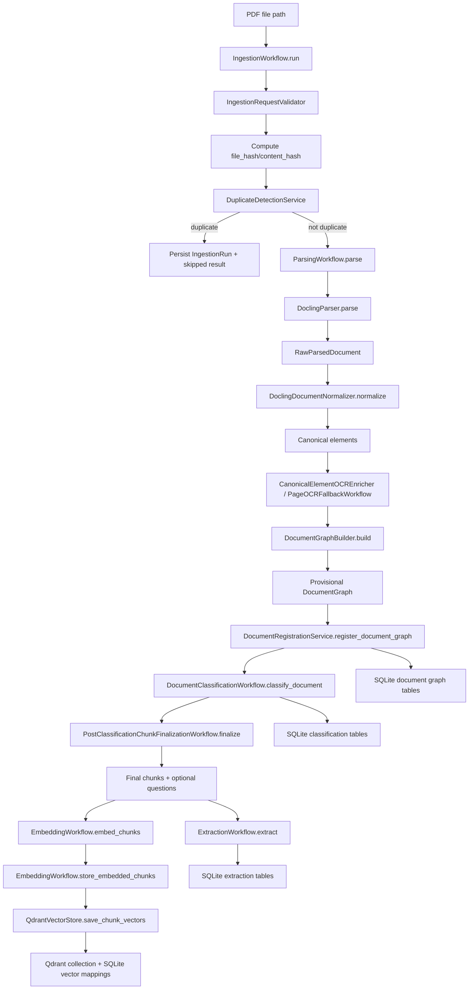
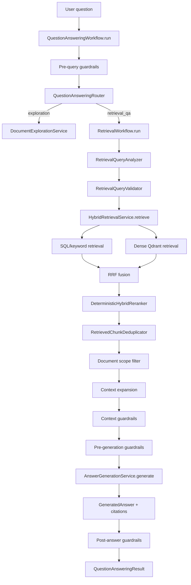
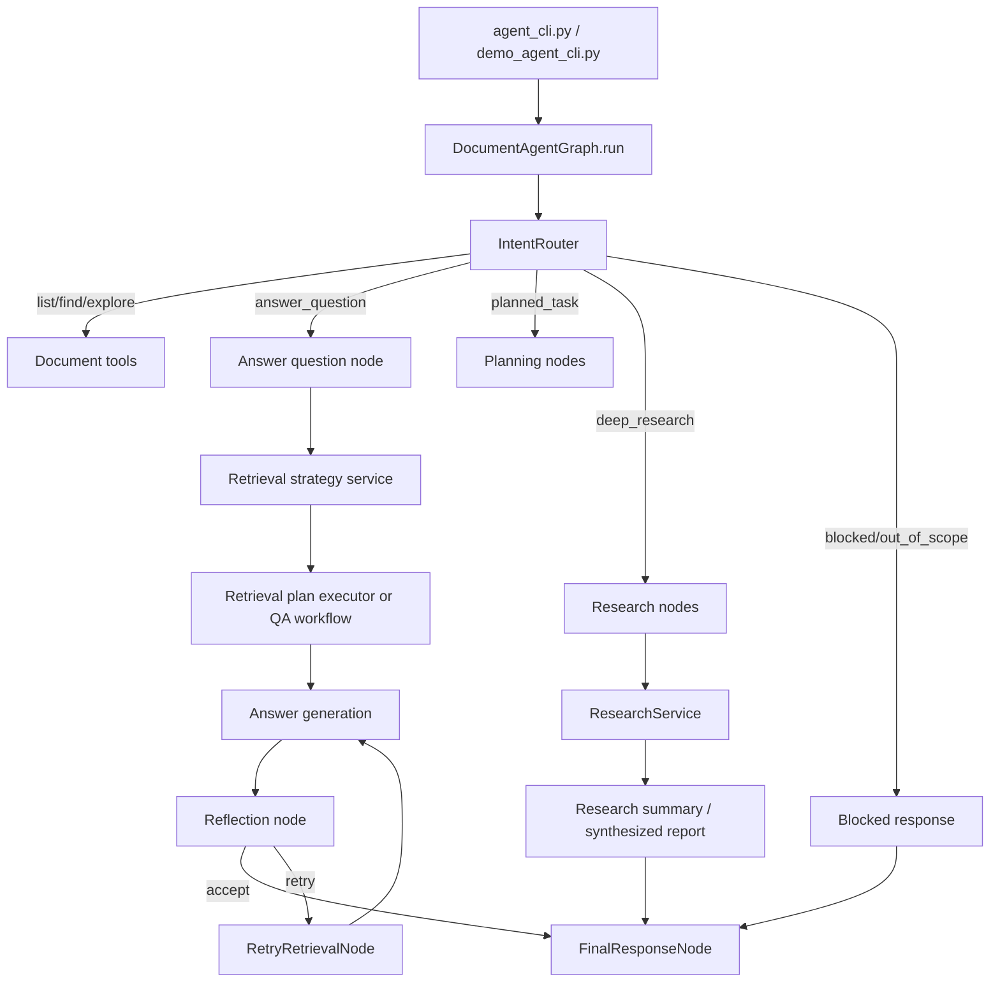
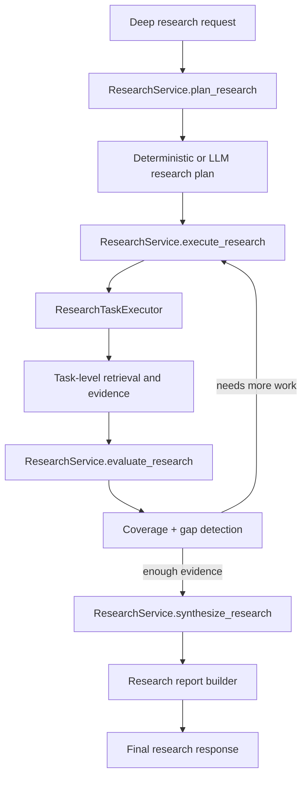

# Current Document AI Agent Flow Report

## 1. Executive Summary

The current system is a document-grounded AI stack with two major halves:

1. Ingestion: parse PDF-like documents, normalize them into canonical elements, build a `DocumentGraph`, classify the document, finalize chunking, optionally generate chunk questions, extract structured facts, embed final chunks, persist metadata in SQLite, and store vectors in local Qdrant.
2. Retrieval and QA: accept a user query, route it through either a direct QA workflow or a LangGraph agent runtime, apply guardrails, run deterministic or hybrid retrieval, optionally expand context, generate a grounded answer, optionally reflect and retry, and in the LangGraph runtime optionally run deep research.

At the architecture level, the intended production ingestion path is `src/application/workflows/ingestion/ingestion_workflow.py::IngestionWorkflow.run`. The intended production QA path is split:

- direct workflow path: `src/application/workflows/question_answering/question_answering_workflow.py::QuestionAnsweringWorkflow.run`
- agent path: `src/application/langgraph/graphs/document_agent_graph.py::DocumentAgentGraph.run`

The system already contains:

- Docling-based PDF parsing
- canonical element normalization
- hierarchical section building
- policy-driven chunking with post-classification finalization
- document classification
- optional chunk classification and chunk-type reclassification
- optional question generation
- extraction
- embeddings via BGE
- vector persistence in Qdrant
- SQL/keyword plus dense hybrid retrieval
- retrieval deduplication, reranking, and context expansion
- multi-layer guardrails
- reflection
- retrieval strategy planning
- deep research
- interactive demo runtime

The biggest current architecture realities are:

- the ingestion workflow is solid conceptually, but the benchmark seeder still bypasses it
- file-hash and content-hash are currently the same value in the main ingestion workflow
- vector storage across SQLite and Qdrant is orchestrated but not atomic
- reingestion and deletion are intentionally blocked because replacement boundaries are not fully safe yet
- parsing bottlenecks are mostly Docling conversion and canonical normalization, not graph build

## 2. Ingestion Flow: PDF to Embedding

### 2.1 Entry Points

#### Main production-style path

- `src/application/workflows/ingestion/ingestion_workflow.py::IngestionWorkflow.run`
- tool wrapper: `src/application/tools/ingestion/ingest_document_tool.py::IngestDocumentTool.run`

This is the most complete application-owned ingestion path. It owns:

- request validation
- duplicate detection
- parsing
- provisional graph registration
- document classification
- post-classification chunk finalization
- extraction
- embedding
- vector indexing
- ingestion run persistence
- stage events

#### Debug and developer paths

- `scripts/debug_parse_document.py`
  - debug-only inspection path
  - runs parse -> classification -> post-classification chunk decision
  - writes Markdown and JSON inspection artifacts
  - does not persist to DB or vectors
- `scripts/profile_graph_build.py`
  - profiling/debug path for parsing and graph build performance

#### Evaluation / benchmark paths

- `scripts/seed_retrieval_benchmark_corpus.py`
  - evaluation corpus seeding path
  - composes parsing, registration, classification, finalization, and embedding directly
  - does not go through `IngestionWorkflow.run`
- `src/application/evaluation/retrieval/benchmarking/corpus/retrieval_benchmark_corpus_seeder.py::RetrievalBenchmarkCorpusSeeder`
- `scripts/run_retrieval_benchmark.py`
  - evaluation only
  - runs retrieval benchmark against final persisted chunks/vectors

#### Stubs / intentionally blocked paths

- `src/application/workflows/ingestion/ingestion_workflow.py::IngestionWorkflow.reingest`
  - raises `ReingestionNotSupportedError`
- `src/application/workflows/ingestion/delete_document_workflow.py::DeleteDocumentWorkflow.run`
  - raises `DeleteDocumentNotSupportedError`
- tool wrappers exist for both:
  - `src/application/tools/ingestion/reingest_document_tool.py`
  - `src/application/tools/ingestion/delete_document_tool.py`

#### Active-path conclusion

The active, workflow-owned ingestion design is `IngestionWorkflow.run`, but day-to-day corpus seeding for evaluation currently bypasses it through `RetrievalBenchmarkCorpusSeeder`. That split is one of the main architecture risks.

### 2.2 File Registration and Hashing

#### Request validation

- `src/application/validation/ingestion/ingestion_request_validator.py::IngestionRequestValidator.validate`

`IngestionWorkflow.run` validates `IngestionRequest` before any work begins.

#### Hash computation

- `src/application/workflows/ingestion/ingestion_workflow.py::IngestionWorkflow._compute_hashes`
- duplicate service: `src/application/services/document/duplicate_detection_service.py::DuplicateDetectionService`

Current behavior:

- the workflow computes SHA-256 over raw file bytes
- `file_hash` is returned
- `content_hash` is currently returned as the same exact value

So duplicate detection checks both fields, but they are not truly different signals today.

#### Duplicate detection

- `src/application/workflows/ingestion/ingestion_workflow.py::IngestionWorkflow._check_duplicate`
- `src/application/services/document/duplicate_detection_service.py::DuplicateDetectionService.check_file_hash`
- `src/application/services/document/duplicate_detection_service.py::DuplicateDetectionService.check_content_hash`

Order:

1. file-hash duplicate check
2. content-hash duplicate check

Settings gate the checks:

- `duplicate_detection_settings.enable_file_hash_check`
- `duplicate_detection_settings.enable_content_hash_check`

#### Document ID creation

Document ID is created in parsing, not in the repository:

- `src/application/workflows/parsing/parsing_workflow.py::ParsingWorkflow.parse`

If no `document_id` is supplied, the workflow uses:

- `src/shared/ids/IdGenerator`
- `IdPrefix.DOCUMENT`

#### Ingestion run creation

In the main ingestion workflow, `IngestionRun` is created immediately:

- `src/application/workflows/ingestion/ingestion_workflow.py::IngestionWorkflow.run`
- domain model: `src/domain/workflow/ingestion_run.py::IngestionRun`

Persistence:

- repository contract: `src/application/contracts/document/ingestion_run_repository.py`
- implementation: `src/infrastructure/db/repositories/document/ingestion_run_repository.py::SqlAlchemyIngestionRunRepository`

Important inconsistency:

- `SqlAlchemyIngestionRunRepository` currently imports from non-`src.` paths:
  - `from domain.workflows import IngestionRun`
  - `from infrastructure.db.mappers import IngestionRunMapper`

That is an architecture hygiene issue.

### 2.3 PDF Parsing

#### Main parser path

- `src/infrastructure/parsing/docling/docling_parser.py::DoclingParser.parse`
- converter factory: `src/infrastructure/parsing/docling/docling_converter_factory.py`
- orchestration: `src/application/workflows/parsing/parsing_workflow.py::ParsingWorkflow.parse`

#### Representation of parser output

- `src/application/workflows/parsing/raw_parsed_document.py::RawParsedDocument`

This carries the Docling raw document plus parser metadata like parser name, parser version, title, and page count.

#### Parser configuration

Configuration is supplied through:

- `src/config/settings/__init__.py`
- `docling_settings`

Current resolved non-secret runtime values:

- backend: `pypdfium2`
- accelerator device: `auto`
- image scale: `1.0`
- table structure: enabled
- threads: `2`
- layout batch size: `2`
- table batch size: `1`
- Docling OCR: disabled

#### OCR and parsing behavior

There are two OCR layers in the codebase:

1. Docling internal OCR
   - wired in `docling_converter_factory.py`
   - currently disabled by config
2. external provider OCR
   - wired later in parsing workflow through:
     - `src/application/workflows/parsing/canonical_element_ocr_enricher.py::CanonicalElementOCREnricher`
     - `src/application/workflows/parsing/ocr/page_ocr_fallback_workflow.py::PageOCRFallbackWorkflow`

Current resolved OCR settings:

- Docling OCR enabled: `False`
- provider OCR enabled: `True`
- provider OCR name: `paddleocr`
- asset OCR enrichment: enabled
- page fallback OCR: disabled
- region fallback OCR: disabled

#### Table extraction and image handling

Docling output is normalized through dedicated extractors:

- `DoclingTableExtractor`
- `DoclingCaptionExtractor`
- `DoclingItemExtractor`
- `DoclingProvenanceExtractor`

These live under:

- `src/application/workflows/parsing/normalizers/`

### 2.4 Canonical Normalization

#### Main normalizer

- `src/application/workflows/parsing/normalizers/docling_document_normalizer.py::DoclingDocumentNormalizer.normalize`

This converts `RawParsedDocument` into canonical elements tied to a resolved `document_id`.

#### Canonical element representation

- `src/application/workflows/parsing/canonical_element.py`
- element enum source: `src/domain/common/enums.py::ElementType`

Observed element types include:

- `title`
- `section_header`
- `text`
- `list_item`
- `table`
- `picture`
- `caption`
- `key_value`
- `form`
- `code`
- `formula`
- `unknown`

#### Metadata carried forward

Canonical elements include or derive:

- `element_id`
- `document_id`
- `element_type`
- `text`
- `page_start` / `page_end`
- `bbox`
- `order_index`
- `section_title`
- `section_path`
- `parent_section_id`
- `raw_ref`
- `metadata`

#### Table and image handling

Tables are converted into canonical table-bearing text and later into table assets.

Important fix already present:

- table markdown export now passes the Docling `doc` argument during export
- that avoids the Docling deprecation path for `TableItem.export_to_markdown()`

#### OCR enrichment after normalization

Optional canonical OCR enrichment:

- `src/application/workflows/parsing/canonical_element_ocr_enricher.py::CanonicalElementOCREnricher.enrich`

Optional page/region fallback OCR:

- `src/application/workflows/parsing/ocr/page_ocr_fallback_workflow.py::PageOCRFallbackWorkflow.run`

The OCR enrichment path is additive and defensive. It enriches elements rather than replacing the parser stage.

### 2.5 Document Graph Build

#### Main graph builder

- `src/application/workflows/parsing/builders/document_graph_builder.py::DocumentGraphBuilder.build`

This is where canonical elements become the domain aggregate:

- `src/domain/document/aggregates/document_graph.py::DocumentGraph`

#### Section building

- `src/application/workflows/parsing/builders/section_builder.py::SectionBuilder.build`

Supporting section logic includes:

- `SectionHeaderFilter`
- `SectionHierarchyResolver`
- `SectionPathRelinker`
- `SectionStackBuilder`

The builder creates:

- root section if needed
- parent/child hierarchy
- section path relinking
- section assignment for elements

#### Element ordering

Ordering is preserved from canonical elements through:

- `order_index`
- section reading order
- graph materialization via `ParsedElementFactory`

#### Chunk creation

Graph chunk orchestration:

- `src/application/workflows/parsing/builders/document_graph/graph_chunk_builder.py::GraphChunkBuilder.build_chunks`

Main chunk builder entrypoint:

- `src/application/workflows/parsing/builders/chunking/builders/section_chunk_builder.py::SectionChunkBuilder.build_document_chunk_payloads`

#### Chunk sizes and overlap

Chunking is policy-driven, not fixed globally.

Policy resolver:

- `src/application/workflows/parsing/builders/chunking/policies/document_chunking_policy_resolver.py::DocumentChunkingPolicyResolver`

Profiles:

- default
- manual
- datasheet
- drawing
- certificate
- report

Observed profile policies:

- default: `200 / 20`
- manual: `1000 / 100`
- datasheet: `600 / 75`
- drawing: `300 / 35`
- certificate: `500 / 60`
- report: `800 / 100`

Important nuance:

- `ingestion_settings.max_chunk_tokens=1000` and `chunk_overlap=150` are not the only active limits
- the actual runtime chunk policy is resolved by document type or inferred structural profile

#### Post-classification chunking

Chunking happens in two phases conceptually:

1. provisional structural chunking during parsing
2. final chunk decision in `PostClassificationChunkFinalizationWorkflow`

That workflow can:

- reuse stored chunks
- rebuild if missing
- refresh stale structures
- fully rechunk if hybrid type/profile decision changes the chunking profile

#### Table and asset linking

`DocumentGraphBuilder` also materializes and links:

- `TableAsset`
- `PictureAsset`

Nearby asset text is enriched by:

- `AssetNearbyTextEnricher`

#### Identifier extraction during graph build

Not part of active graph build.

The graph aggregate has identifier support:

- `DocumentGraph.identifiers`
- `IdentifierORM`

But the active ingestion flow does not currently populate graph identifiers directly. Structured extraction is handled later by `ExtractionWorkflow`.

### 2.6 Classification

#### Document classification

- workflow: `src/application/workflows/classification/document_classification_workflow.py::DocumentClassificationWorkflow.classify_document`
- prompt builder: `src/application/prompts/classification/document_classification_prompt_builder.py::DocumentClassificationPromptBuilder`
- summary builder: `src/application/prompts/classification/document_classification_summary_builder.py::DocumentClassificationSummaryBuilder`
- parser: `ClassificationResponseParser`
- validator: `src/application/validation/classification/document_classification_validator.py::DocumentClassificationValidator`
- persistence service: `src/application/services/classification/classification_service.py::ClassificationService`

The document prompt uses:

- document metadata
- statistics
- graph-derived section and chunk summaries

It explicitly tells the model to prioritize graph-derived evidence over filename/path hints.

#### Hybrid document-type decision

- `src/application/workflows/classification/hybrid_document_type_resolver.py::HybridDocumentTypeResolver`

Inputs:

- parser/title hint document type
- structural chunking profile inference
- saved document classification

Output:

- effective document type
- effective chunking profile
- confidence
- reasons
- `should_rechunk`

#### Chunk classification and chunk-type classification

Two separate capabilities exist:

1. chunk type reclassification
   - `src/application/workflows/classification/chunk_type_classification_workflow.py`
   - used to reclassify unresolved/general chunk types
2. chunk classification persistence
   - `src/application/workflows/classification/chunk_classification_workflow.py`
   - validates and persists `ChunkClassification`

Current resolved settings:

- chunk classification enabled: `False`
- chunk-type classification enabled: `True`

So chunk-type refinement is active, but persisted chunk classification is currently off by default.

#### Models and provider path

Application wrapper:

- `src/application/services/ai/llm_service.py::LLMService`

Infrastructure provider:

- `src/infrastructure/ai/llm/ollama_llm_provider.py::OllamaLLMProvider`

Current resolved model settings:

- general LLM: `qwen2.5:3b`
- classification LLM: `qwen2.5:3b`

#### Answer intent relevance

Answer intent exists, but it is not part of ingestion classification. It belongs to answer generation later in the retrieval/QA flow.

### 2.7 Question Generation

#### Active design

There is no standalone `QuestionGenerationWorkflow` currently used in ingestion. The active path is service-driven and invoked from post-classification finalization.

- service: `src/application/services/question_generation/question_generation_service.py::QuestionGenerationService`
- prompt builder: `src/application/prompts/question_generation/question_prompt_builder.py::QuestionPromptBuilder`
- orchestration call site: `src/application/workflows/classification/post_classification_chunk_finalization_workflow.py`

#### Behavior

Questions are generated:

- per chunk
- after final chunk selection
- only once
- after rechunk decision
- excluding `ChunkType.OVERVIEW`

#### Persistence

Generated questions are persisted through the graph/document repository path:

- domain model: `src/domain/document/entities/question.py::GeneratedQuestion`
- ORM: `src/infrastructure/db/orm_models/document_models.py::GeneratedQuestionORM`

#### Current runtime state

Current resolved setting:

- `enable_question_generation=False`

So the capability exists, but is off by default in the current runtime.

### 2.8 Embedding Text Construction

#### Active construction path

- `src/application/services/ai/embedding_service.py::EmbeddingService`
- enrichment helper: `src/application/services/ai/chunk_embedding_enricher.py::enrich_embedding_text`

#### Base embedded text

The service embeds:

- `chunk.embedding_text` if present
- otherwise `chunk.content`

#### Additional enrichment

The current enrichment layer can add:

- `Chunk type: ...`
- `Section: ...`
- `Component: ...`
- table caption
- table context
- table headers
- row labels
- units
- related terms

That enrichment is selective and depends on chunk type or table metadata.

#### Included and not included

Included in active embedding construction:

- chunk content
- chunk type
- local section label
- parent component label
- table-oriented metadata
- related terms derived from content/section semantics

Not clearly included in the active embedding input path:

- generated questions
- extracted identifiers as first-class embedding fields
- document title as a mandatory explicit prefix

So the current embedding text is chunk-centric with structured enrichment, not question-augmented.

### 2.9 Embedding and Vector Storage

#### Application workflow

- `src/application/workflows/embedding/embedding_workflow.py::EmbeddingWorkflow`

Methods:

- `embed_chunks`
- `store_embedded_chunks`
- `embed_and_store_chunks`

#### Embedding provider

- contract: `src/application/contracts/ai/embedding_provider.py`
- service: `src/application/services/ai/embedding_service.py::EmbeddingService`
- infrastructure provider: `src/infrastructure/ai/embeddings/bge_embedding_provider.py::BgeEmbeddingProvider`

Current resolved embedding settings:

- provider: `bge`
- model: `BAAI/bge-small-en-v1.5`
- dimensions: `384`

#### Batching

Batch embedding is supported through `EmbeddingService.embed_chunks` and provider batch methods.

#### Vector store

- contract: `src/application/contracts/retrieval/vector_store.py`
- implementation: `src/infrastructure/retrieval/vector/qdrant_vector_store.py::QdrantVectorStore`

Current resolved vector settings:

- Qdrant mode: local
- Qdrant collection: `document_chunks`
- vector distance: `cosine`

#### Vector IDs and payload

In `QdrantVectorStore.save_chunk_vectors`:

- Qdrant point IDs are generated with `uuid4()`
- SQLite vector mapping records get their own `vector_id`

Payload mapping:

- `src/infrastructure/retrieval/vector/qdrant_payload_mapper.py::QdrantPayloadMapper.from_chunk`

Payload includes:

- `document_id`
- `chunk_id`
- `section_id`
- `section_path`
- `chunk_type`
- `content`
- `sequence_number`
- `chunk_index`
- `chunk_total`
- `page_start`
- `page_end`
- optional `document_type`

#### SQLite vector mapping

- ORM: `src/infrastructure/db/orm_models/vector_models.py::ChunkVectorORM`
- repository: `src/infrastructure/db/repositories/retrieval/vector_mapping_repository.py`

Stored mapping includes:

- document ID
- chunk ID
- qdrant collection
- qdrant point ID
- embedding model
- embedding text hash

#### Failure handling

Embedding workflow raises if embedding count does not match chunk count:

- `InfrastructureError` from `EmbeddingWorkflow.embed_chunks`

Important boundary:

- SQLite vector mappings and Qdrant upserts are orchestrated together
- they are not atomic across both stores

The ingestion workflow explicitly exposes that risk in success diagnostics.

### 2.10 SQLite Persistence

#### Main persistence seam

- `src/infrastructure/db/unit_of_work.py::SqlAlchemyUnitOfWork`

#### Main document graph persistence

- reader: `src/infrastructure/db/repositories/document/document_reader.py`
- writer: `src/infrastructure/db/repositories/document/document_writer.py`
- app service: `src/application/services/document/document_registration_service.py`

#### Persisted entities

Document metadata and graph:

- `DocumentORM`
- `SectionORM`
- `ElementORM`
- `ChunkORM`

Chunk dependents:

- `GeneratedQuestionORM`
- `IdentifierORM`

Classification:

- `DocumentClassificationORM`
- `ChunkClassificationORM`

Extraction:

- `ExtractionResultORM`
- `MaintenanceTaskORM`
- `SparePartORM`
- `EquipmentInfoORM`
- `ManufacturerORM`

Vectors:

- `ChunkVectorORM`

Workflow/run tracking:

- `IngestionRunORM`

Support tables also exist for:

- activity
- audit
- events
- conversation/session memory

#### Replacement boundaries

`DocumentWriter.replace_document_chunk_artifacts` currently replaces:

- chunk classifications
- generated questions
- identifiers
- chunks

It does not replace extraction results in the same atomic boundary. That is one of the reasons safe reingestion is currently blocked.

### 2.11 Quality Gates / Validation

#### Request and graph validation

- `IngestionRequestValidator`
- `DocumentGraphValidator`
- `DocumentClassificationValidator`
- `ChunkClassificationValidator`
- `ExtractionResultValidator`
- `RetrievalQueryValidator`

#### Quality gate

- `src/application/validation/document_quality/document_quality_gate.py::DocumentQualityGate`

Checks parsing quality:

- section count
- orphan element ratio
- elements with pages
- OCR target failures
- OCR target page numbers

Checks chunking quality:

- general chunk ratio
- chunk section paths
- maintenance headings have chunks

Checks retrieval quality:

- retrieved chunk scores
- retrieved chunks have content

#### What happens on failure

Validation-style failures:

- `.raise_if_invalid()` is used in application services/workflows
- errors propagate as existing shared exceptions

Quality gate failures:

- they do not automatically abort ingestion
- they contribute warnings and diagnostics

#### What is missing

Missing or not clearly wired as an active gate:

- dedicated embedding vector-quality validator
- active `IngestionRunValidator` usage inside `IngestionWorkflow`

### 2.12 Current Weaknesses / Risks

1. `IngestionWorkflow._compute_hashes` returns identical file and content hashes, so content-duplicate detection is not truly content-normalized today.
2. The benchmark seeder bypasses `IngestionWorkflow`, so `IngestionRun`, stage events, and one canonical ingestion path are not used everywhere.
3. Reingestion is intentionally unsupported because chunk replacement and extraction replacement are not fully atomic together.
4. Delete workflow is intentionally unsupported.
5. Qdrant writes and SQLite vector mappings are not atomic across both stores.
6. `IngestionStage.EXTRACTION` exists, but there is no matching `IngestionStatus.EXTRACTED`; the persisted run status does not reflect extraction as a distinct state.
7. `IngestionRequest.source_name` is accepted but not persisted by the current document model.
8. `IngestionRequest.enable_ocr` per-request override is accepted but not actually applied; the workflow emits a warning instead.
9. Identifier storage exists architecturally, but active ingestion does not appear to populate `DocumentGraph.identifiers`.
10. Parsing performance is still dominated by Docling conversion and normalization, especially for large manuals.
11. There is no single canonical composition root used by all ingestion paths.
12. Import hygiene is inconsistent in `SqlAlchemyIngestionRunRepository`.

## 3. Retrieval Flow: User Query to Final Response

### 3.1 Entry Points

#### Direct QA CLI

- `scripts/ask_document.py`

This is the simpler non-LangGraph path. It resolves a document, builds a `QuestionAnsweringWorkflow`, and runs retrieval plus answer generation.

#### LangGraph agent CLI

- `scripts/agent_cli.py`

This is the main engineering-facing agent entrypoint for routed commands and questions. It supports:

- routing
- retrieval strategy
- reflection
- deep research
- JSON output
- trace output
- context display

#### Demo runtime

- `scripts/demo_agent_cli.py`
- composition root: `src/application/agent_runtime/demo_agent_runtime.py::build_agent_runtime`

This is the richer interactive demo runtime with presenters, session state, command dispatch, progress indicator, and trace writing.

#### Evaluation and test paths

- `scripts/run_agent_eval.py`
- `scripts/run_retrieval_benchmark.py`
- `scripts/run_retrieval_quality_gate.py`

#### Active-path conclusion

There are two active answer paths:

1. direct QA workflow
2. LangGraph agent runtime

The richer current “agent” behavior lives in the LangGraph path.

### 3.2 User Input and Session Context

#### Direct QA path

`scripts/ask_document.py`:

- reads the question from CLI args
- resolves a document by:
  - explicit `--document-id`
  - partial `--document` lookup
  - `--latest`
- can output JSON
- can show context
- can write retrieval trace

This path is mostly stateless.

#### LangGraph path

`scripts/agent_cli.py` and `scripts/demo_agent_cli.py` pass user input into:

- `src/application/langgraph/graphs/document_agent_graph.py::DocumentAgentGraph.run`

The graph carries:

- selected document ID/title/file name
- session ID
- route
- tool results
- retrieval strategy state
- reflection state
- research state
- guardrail state
- trace

State model:

- `src/application/langgraph/state/agent_state.py::AgentState`

#### Session memory

The demo/agent runtime supports session persistence:

- `ConversationMemory`
- `SessionStateStore`
- `SessionManager`

The final response node saves selected document and clarification state back into memory.

### 3.3 Guardrails

#### Pre-route guardrails

- `src/application/guardrails/services/pre_route_guardrail_service.py::PreRouteGuardrailService.check`

This layer checks for:

- unsafe destructive requests
- prompt injection
- secret requests
- tool abuse
- domain scope problems
- ambiguity

#### Retrieval guardrails

Used in workflow/runtime composition:

- `QueryScopeGuardrail`
- `DocumentRelevanceGuardrail`
- `RetrievalEvidenceGuardrail`
- `IdentifierEvidenceGuardrail`
- `RetrievalConfidenceGuardrail`

#### Context guardrails

Public chain:

- `src/application/guardrails/context/context_guardrail_chain.py::ContextGuardrailChain.run`

Typical guardrails:

- `ScopedDocumentConsistencyGuardrail`
- `ContextFilteringGuardrail`
- `ContextQualityGuardrail`
- `ContextBudgetGuardrail`

#### Pre-tool guardrails

Used in planning/tool execution paths:

- `src/application/guardrails/services/pre_tool_guardrail_service.py::PreToolGuardrailService`
- invoked by `src/application/langgraph/planning/plan_executor.py`

#### Pre-generation guardrails

- `src/application/guardrails/services/pre_generation_guardrail_service.py::PreGenerationGuardrailService.check`

This blocks answer generation when:

- evidence is missing
- source metadata is insufficient
- grounding requirements are not met

#### Post-response guardrails

- `src/application/guardrails/services/post_response_guardrail_service.py::PostResponseGuardrailService.check`

This can:

- sanitize internal IDs
- sanitize local file paths
- check prompt leakage
- check secret leakage
- check citation failures
- check grounding failures

#### Guardrail result storage

Primary model:

- `src/application/guardrails/models/guardrail_result.py::GuardrailResult`

Stored/returned in:

- `QuestionAnsweringResult.guardrail_result`
- `RetrievalWorkflowResult.guardrail_result`
- LangGraph final response patch:
  - `guardrail_result`
  - `guardrail_decision`
  - `guardrail_trace_id`
  - `guardrail_trace`

#### User-facing guardrail messages

- `src/application/guardrails/messages/guardrail_message_builder.py::GuardrailMessageBuilder`

User-safe messages propagate through `safe_user_message`.

### 3.4 Routing

#### Direct QA workflow routing

- `src/application/workflows/question_answering/question_answering_router.py::QuestionAnsweringRouter.decide`

This splits into:

- `DOCUMENT_EXPLORATION`
- `RETRIEVAL_QA`

#### LangGraph routing

- `src/application/langgraph/routing/intent_router.py::IntentRouter`

Observed route types include:

- `answer_question`
- `retrieve_evidence`
- `document_exploration`
- `list_documents`
- `find_document`
- `document_details`
- `planned_task`
- `deep_research`
- `blocked_action`
- `out_of_scope`
- `needs_clarification`
- `help`
- `exit`

#### Active routing conclusion

The direct QA path is simple and deterministic. The LangGraph path is the fully routed agent surface.

### 3.5 Retrieval Strategy Selection

#### Deterministic query analysis

- `src/application/workflows/retrieval/retrieval_query_analyzer.py::RetrievalQueryAnalyzer`

This enriches a `RetrievalQuery` with:

- detected identifiers
- deterministic rewritten query
- inferred retrieval intent
- chunk-type preferences

Supporting parts:

- `RetrievalQueryIdentifierExtractor`
- `RetrievalQueryRewriter`
- `RetrievalQueryIntentInferer`
- `RetrievalQueryChunkTypePreferenceMapper`

Current rewrite behavior is deterministic only. No generative query rewrite is active in the normal retrieval workflow.

#### LangGraph retrieval strategy layer

- `src/application/langgraph/retrieval_strategy/services/retrieval_strategy_service.py::RetrievalStrategyService.select_and_plan`

It uses:

- `RetrievalQueryAnalyzer`
- `RetrievalSignalExtractor`
- `DeterministicStrategySelector`
- optional `LLMStrategySelector`
- optional `StrategyAdvisor`
- `StrategyDecisionMerger`
- `RetrievalStrategyValidator`
- `RetrievalPlanner`
- `RetrievalPlanValidator`

#### LLM advisor

- `src/application/langgraph/strategy_advisor/advisor.py::StrategyAdvisor`

This is guarded and optional. It can propose strategy refinements, but the result is validated and merged back into the deterministic baseline.

#### Protected identifiers

No separate protected-identifier preservation service was found beyond:

- identifier extraction in `RetrievalQueryAnalyzer`
- deterministic normalization in `RetrievalQueryRewriter`

So identifier handling is present, but not as a separately named protected-identifier layer.

#### Trace

Strategy trace model:

- `src/application/langgraph/retrieval_strategy/tracing/retrieval_strategy_trace.py`

`agent_cli.py --show-retrieval-strategy` exposes the selected strategy and plan.

### 3.6 Retrieval Execution

#### Main retrieval workflow

- `src/application/workflows/retrieval/retrieval_workflow.py::RetrievalWorkflow.run`

Stages:

1. analyze query
2. validate query
3. optional pre-retrieval guardrails
4. retrieve candidate pool
5. deduplicate candidates
6. enforce document scope
7. optional post-retrieval guardrails
8. strict evidence checks
9. context expansion
10. return `RetrievalWorkflowResult`

#### Hybrid retrieval service

- `src/application/services/retrieval/hybrid_retrieval_service.py::HybridRetrievalService.retrieve`

Inputs:

- SQL/keyword backend
- optional dense vector store
- optional reranker

#### Keyword / SQL retrieval

- `src/infrastructure/db/repositories/retrieval/sql_keyword_repository.py`
- scorer: `src/infrastructure/retrieval/keyword/sql_keyword_scorer.py::SqlKeywordScorer`

Searches across:

- chunk content
- embedding text
- section path
- document title
- document filename

Filters:

- `document_id`
- `document_types`
- `chunk_types`

Current candidate breadth logic expands beyond final top-k before scoring.

#### Dense retrieval

- `src/infrastructure/retrieval/vector/qdrant_vector_store.py::QdrantVectorStore.search`

Query embedding is generated from `query.effective_query()`.

Dense filters support:

- `document_id`
- `document_type`
- `chunk_type`

#### Fusion

Hybrid fusion uses reciprocal-rank fusion in:

- `HybridRetrievalService._fuse_results`

Metadata recorded per candidate includes:

- retrieval source list
- fused score
- best source score
- per-source score

#### Reranking

- `src/infrastructure/retrieval/rerankers/deterministic_hybrid_reranker.py::DeterministicHybridReranker`

This is the active reranker seam in runtime composition.

#### Deduplication

- `src/application/workflows/retrieval/deduplication/retrieved_chunk_deduplicator.py::RetrievedChunkDeduplicator`

This runs after candidate collection and before final top-k slicing.

#### Top-k handling

`RetrievalWorkflow` can widen candidate breadth through `_candidate_query()` before final slicing.

Current resolved settings:

- retrieval top-k: `10`
- dense top-k: `20`
- keyword top-k: `20`
- SQL top-k: `20`
- final retrieval top-k: `5`

### 3.7 Evidence Validation

#### Document scope validation

`RetrievalWorkflow` enforces document scope twice:

- immediately after retrieval result assembly
- again after context expansion

Rejected chunk IDs are placed into diagnostics.

#### Guardrail-based evidence validation

Evidence guardrails in use include:

- `QueryScopeGuardrail`
- `DocumentRelevanceGuardrail`
- `RetrievalEvidenceGuardrail`
- context consistency/quality filters

#### Evidence sufficiency

- `RetrievalResult.has_results()`
- `RetrievalResult.has_enough_evidence(min_chunks)`

`RetrievalWorkflow` can raise:

- `NoEvidenceFoundError`

when `strict_evidence=True`.

#### Leakage prevention

Leakage prevention is layered:

- retrieval scope filter
- context scope filter
- `ScopedDocumentConsistencyGuardrail`
- reflection evidence-quality scoring

### 3.8 Answer Intent and Prompt Building

#### Answer intent detection

- intent enum: `src/application/services/answer_generation/intent/answer_intent.py::AnswerIntent`
- analyzer: `src/application/services/answer_generation/intent/answer_intent_analyzer.py::AnswerIntentAnalyzer`

Observed answer intents:

- general
- specification summary
- maintenance summary
- procedure steps
- safety warnings
- troubleshooting
- certification summary
- identifier lookup
- table summary
- document summary

The analyzer combines:

- question terms
- retrieval intent
- chunk-type preferences
- approved chunk content
- route hints

#### Answer format policy

- `src/application/services/answer_generation/formatting/answer_format_policy.py::AnswerFormatPolicy`

This keeps output-format policy separate from prompt-building logic.

#### Context organization

The active organizer sits under the QA workflow package:

- `src/application/workflows/question_answering/answer_context/answer_context_organizer.py::AnswerContextOrganizer`

Supporting files:

- `structured_answer_context.py`
- `key_value_extractor.py`
- `source_group_builder.py`
- `section_group_builder.py`

#### Answer prompt builder

- `src/application/prompts/answer_generation/answer_prompt_builder.py::AnswerPromptBuilder`

The prompt includes:

- grounding rules
- answer intent
- format policy
- question
- organized context
- raw sources

### 3.9 Answer Generation

#### Main service

- `src/application/services/answer_generation/answer_generation_service.py::AnswerGenerationService.generate`

Dependencies:

- `LLMService`
- `AnswerPromptBuilder`
- `AnswerIntentAnalyzer`
- `AnswerContextOrganizer`
- `AnswerFormatPolicy`

#### Model

Current resolved answer-generation model:

- `qwen2.5:3b`

Provider path:

- `LLMService`
- `OllamaLLMProvider`

#### Result model

- `src/application/services/answer_generation/answer_generation_result.py::GeneratedAnswer`

#### Citation behavior

Citations are not trusted from model output. They are built from approved retrieved chunks by:

- `AnswerGenerationService._build_citations`

That is a good grounding decision.

#### Failure behavior

If answer generation is disabled:

- the QA workflow returns a safe retrieval-only message

If answer generation is not configured:

- the QA workflow returns a configured-not-available message

If pre-generation guardrails fail:

- the workflow returns a blocked/clarification-safe result instead of generating

### 3.10 Reflection / Self-Correction

#### Main service

- `src/application/langgraph/reflection/services/reflection_service.py::ReflectionService.review`

This combines:

- deterministic scoring
- optional LLM reflection review
- validator-enforced safe decision

#### Inputs

The reflection service considers:

- original user question
- generated answer
- selected document
- answer intent
- approved chunks
- rejected chunks
- citations
- reflection attempt count
- retrieval retry count

#### Decisions

Reflection can yield:

- accept
- retrieve again
- clarify
- fail

#### Retry flow

- node: `src/application/langgraph/nodes/question_answering/retry_retrieval_node.py::RetryRetrievalNode`

Retry behavior:

- can build a retry query
- can use retrieval strategy planning again
- merges initial and retry evidence via `EvidenceMerger`
- reruns answer generation with merged context

#### Retry limit

- policy: `src/application/langgraph/reflection/policies/reflection_policy.py`
- validator: `src/application/langgraph/reflection/validation/reflection_validator.py`

Observed default:

- `max_reflection_attempts = 1`

### 3.11 Deep Research Flow

#### Main service

- `src/application/langgraph/research/services/research_service.py::ResearchService`

It owns:

- planning
- execution
- evaluation
- synthesis

#### Planning

- deterministic planner first
- optional validated LLM research planner

Relevant files:

- `ResearchPlanningPromptBuilder`
- `ResearchPlanBuilder`
- `ResearchPlanValidator`
- `ResearchPlanRepair`

#### Execution

- `src/application/langgraph/research/executors/research_task_executor.py::ResearchTaskExecutor`

This performs task-level retrieval and evidence collection.

#### Evaluation

Research evaluation uses:

- evidence coverage evaluation
- gap detection
- iteration control

#### Synthesis

Research synthesis uses:

- `ResearchReportBuilder`
- report validator
- presentation formatters

#### Models

- `ResearchGoal`
- `ResearchPlan`
- `ResearchTask`
- `ResearchEvidence`
- `ResearchReport`

### 3.12 Final Response Assembly

#### LangGraph final response node

- `src/application/langgraph/nodes/control/final_response_node.py::FinalResponseNode`

Responsibilities:

- save session state
- resolve final response text
- run post-response guardrails
- attach guardrail result and trace

#### Response text resolver

- `src/application/langgraph/common/response_text_resolver.py::resolve_state_response_text`

Priority:

1. combined formatted answer if already present
2. `answer_question` tool payload answer text
3. fallback response text

#### CLI formatting

`scripts/agent_cli.py` currently supports:

- response text
- `--show-context`
- `--json`
- `--trace`
- `--show-retrieval-strategy`
- `--show-plan`
- `--show-research-plan`
- `--show-research-trace`

Context formatting helper:

- `scripts/agent_cli.py::print_context_chunks`

JSON helper:

- `scripts/agent_cli.py::build_json_output`

Current JSON includes:

- route
- success
- answer
- document ID
- context chunks
- citations
- diagnostics
- optional trace

#### Direct QA CLI formatting

`scripts/ask_document.py` has its own, simpler result presentation. This means the repo currently has more than one response-formatting surface.

### 3.13 Current Weaknesses / Risks

1. There are two active answer surfaces, `ask_document.py` and LangGraph, so UX and safeguards can drift.
2. The retrieval architecture is strong, but complex; behavior now depends on guardrails, dedup, reranking, context expansion, answer intent, and optional strategy/reflection layers.
3. There is no separate protected-identifier preservation service beyond deterministic rewrite and identifier extraction.
4. Final answer composition is more polished in the LangGraph/demo path than in the older direct QA path.
5. Cross-document leakage is heavily guarded, but the architecture relies on multiple layers rather than one hard boundary.
6. Reflection is limited to one retry by default; that is safe, but shallow for hard cases.
7. Deep research exists, but it adds many moving parts and needs continued evaluation coverage.
8. Internal agent/runtime composition still lives heavily in scripts and runtime factories rather than one universal application entry surface.

## 4. End-to-End Diagrams

### 4.1 Ingestion Pipeline Diagram



### 4.2 Retrieval / QA Pipeline Diagram



### 4.3 LangGraph Agent Flow Diagram



### 4.4 Deep Research Flow Diagram



## 5. Key Data Models

| Model | File | What it represents |
|---|---|---|
| `DocumentGraph` | `src/domain/document/aggregates/document_graph.py` | Aggregate for document, sections, elements, chunks, questions, identifiers, and assets |
| `DocumentSection` | `src/domain/document/entities/section.py` | Hierarchical section node with path and ordering |
| `DocumentChunk` | `src/domain/document/entities/chunk.py` | Retrieval unit with chunk type, section path, page range, linked elements/assets, and embedding text |
| `GeneratedQuestion` | `src/domain/document/entities/question.py` | Generated chunk-level question |
| `DocumentClassification` | `src/domain/classification/document_classification.py` | Final document-level classification |
| `ChunkClassification` | `src/domain/classification/chunk_classification.py` | Persisted chunk classification result |
| `ExtractionResult` | `src/domain/extraction/extraction_result.py` | Structured extraction aggregate for tasks/parts/equipment/manufacturers |
| `IngestionRun` | `src/domain/workflow/ingestion_run.py` | Persisted ingestion run status and model metadata |
| `RetrievalQuery` | `src/domain/retrieval/retrieval_query.py` | Retrieval request with query text, filters, top-k, and analysis fields |
| `RetrievalResult` | `src/domain/retrieval/retrieval_result.py` | Ranked retrieval result set |
| `RetrievedChunk` | `src/domain/retrieval/retrieved_chunk.py` | Retrieved chunk plus score, section path, metadata, and citation |
| `Citation` | `src/domain/retrieval/citation.py` | User-facing citation metadata |
| `AnswerGenerationRequest` | `src/application/services/answer_generation/answer_generation_request.py` | Answer-generation input bundle with context, intent, and formatting |
| `GeneratedAnswer` | `src/application/services/answer_generation/answer_generation_result.py` | Answer text, citations, diagnostics, and model metadata |
| `QuestionAnsweringResult` | `src/application/workflows/question_answering/question_answering_result.py` | Direct QA workflow result |
| `RetrievalWorkflowResult` | `src/application/workflows/retrieval/retrieval_workflow_result.py` | Retrieval result plus context chunks, sufficiency, and diagnostics |
| `GuardrailResult` | `src/application/guardrails/models/guardrail_result.py` | Guardrail decision, user-safe message, and diagnostics |
| `GraphResult` | `src/application/langgraph/common/graph_result.py` | LangGraph runtime result returned to CLI/demo |
| `AgentState` | `src/application/langgraph/state/agent_state.py` | Mutable state carried through the LangGraph execution |
| `ResearchGoal` | `src/application/langgraph/research/models/research_goal.py` | Research objective and type |
| `ResearchPlan` | `src/application/langgraph/research/models/research_plan.py` | Multi-step deep research plan |
| `ResearchTask` | `src/application/langgraph/research/models/research_task.py` | One research execution step |
| `ResearchEvidence` | `src/application/langgraph/research/models/research_evidence.py` | Structured evidence collected during deep research |
| `ResearchReport` | `src/application/langgraph/research/models/research_report.py` | Synthesized research output |

## 6. Key Services / Workflows

| Area | File/Class | Responsibility |
|---|---|---|
| Ingestion | `src/application/workflows/ingestion/ingestion_workflow.py::IngestionWorkflow` | End-to-end ingestion orchestration |
| Parsing | `src/application/workflows/parsing/parsing_workflow.py::ParsingWorkflow` | Docling parse, normalization, OCR enrichment, graph build |
| Docling adapter | `src/infrastructure/parsing/docling/docling_parser.py::DoclingParser` | Infrastructure parser adapter |
| Canonical normalization | `src/application/workflows/parsing/normalizers/docling_document_normalizer.py::DoclingDocumentNormalizer` | Docling output to canonical elements |
| Graph build | `src/application/workflows/parsing/builders/document_graph_builder.py::DocumentGraphBuilder` | Build `DocumentGraph` from canonical elements |
| Section build | `src/application/workflows/parsing/builders/section_builder.py::SectionBuilder` | Build section hierarchy and assignments |
| Chunk build | `src/application/workflows/parsing/builders/chunking/builders/section_chunk_builder.py::SectionChunkBuilder` | Structural and structured chunk payload assembly |
| Document registration | `src/application/services/document/document_registration_service.py::DocumentRegistrationService` | Validate and persist graphs/chunk artifacts |
| Duplicate detection | `src/application/services/document/duplicate_detection_service.py::DuplicateDetectionService` | File-hash and content-hash duplicate lookup |
| Document classification | `src/application/workflows/classification/document_classification_workflow.py::DocumentClassificationWorkflow` | Prompt, classify, validate, persist document type |
| Hybrid type decision | `src/application/workflows/classification/hybrid_document_type_resolver.py::HybridDocumentTypeResolver` | Merge parser/structural/model signals |
| Post-classification finalization | `src/application/workflows/classification/post_classification_chunk_finalization_workflow.py::PostClassificationChunkFinalizationWorkflow` | Final chunk decision, optional chunk classification, optional question generation, optional embedding |
| Question generation | `src/application/services/question_generation/question_generation_service.py::QuestionGenerationService` | Generate chunk questions |
| Extraction | `src/application/workflows/extraction/extraction_workflow.py::ExtractionWorkflow` | Extract structured facts from final chunks |
| Embedding | `src/application/workflows/embedding/embedding_workflow.py::EmbeddingWorkflow` | Generate embeddings and store vectors |
| Embedding provider | `src/infrastructure/ai/embeddings/bge_embedding_provider.py::BgeEmbeddingProvider` | BGE embedding adapter |
| LLM provider | `src/infrastructure/ai/llm/ollama_llm_provider.py::OllamaLLMProvider` | Ollama chat/completion adapter |
| OCR provider | `src/infrastructure/ai/ocr/paddle_ocr_provider.py::PaddleOCRProvider` | PaddleOCR adapter |
| Retrieval backend | `src/application/services/retrieval/hybrid_retrieval_service.py::HybridRetrievalService` | SQL + dense hybrid retrieval and fusion |
| SQL retrieval | `src/infrastructure/db/repositories/retrieval/sql_keyword_repository.py` | SQL-backed lexical retrieval |
| SQL scoring | `src/infrastructure/retrieval/keyword/sql_keyword_scorer.py::SqlKeywordScorer` | Deterministic lexical ranking |
| Dense retrieval | `src/infrastructure/retrieval/vector/qdrant_vector_store.py::QdrantVectorStore` | Qdrant indexing and search |
| Reranking | `src/infrastructure/retrieval/rerankers/deterministic_hybrid_reranker.py::DeterministicHybridReranker` | Intent-aware final reranking |
| Retrieval orchestration | `src/application/workflows/retrieval/retrieval_workflow.py::RetrievalWorkflow` | Validation, retrieval, dedup, scope, guardrails, context expansion |
| Direct QA | `src/application/workflows/question_answering/question_answering_workflow.py::QuestionAnsweringWorkflow` | Direct retrieval QA workflow |
| Answer generation | `src/application/services/answer_generation/answer_generation_service.py::AnswerGenerationService` | Intent-aware grounded answer generation |
| Answer context organization | `src/application/workflows/question_answering/answer_context/answer_context_organizer.py::AnswerContextOrganizer` | Structured answer context shaping |
| Guardrails | `src/application/guardrails/services/*.py` | Pre-route, pre-tool, pre-generation, post-response guardrail orchestration |
| LangGraph graph | `src/application/langgraph/graphs/document_agent_graph.py::DocumentAgentGraph` | Main agent graph |
| LangGraph routing | `src/application/langgraph/routing/intent_router.py::IntentRouter` | Route user input into tools, QA, planning, research |
| Retrieval strategy | `src/application/langgraph/retrieval_strategy/services/retrieval_strategy_service.py::RetrievalStrategyService` | Strategy selection and plan building |
| Reflection | `src/application/langgraph/reflection/services/reflection_service.py::ReflectionService` | Review answer quality and decide retry/clarify/fail |
| Deep research | `src/application/langgraph/research/services/research_service.py::ResearchService` | Plan, execute, evaluate, synthesize research |
| Agent runtime composition | `src/application/agent_runtime/demo_agent_runtime.py::build_agent_runtime` | Builds the LangGraph runtime and dependencies |
| Demo agent | `src/application/agent_runtime/demo_agent.py::DemoAgent` | Interactive runtime orchestration |

## 7. Current Configuration

Configuration objects are exported from:

- `src/config/settings/__init__.py`

Important active settings discovered from the current runtime:

### Storage

- database provider: `sqlite`
- database file: `data/maintenance_ai.db`
- Qdrant mode: `local`
- Qdrant path: `qdrant_data`
- Qdrant collection: `document_chunks`
- Qdrant distance: `cosine`

### Embeddings

- embedding provider: `bge`
- embedding model: `BAAI/bge-small-en-v1.5`
- embedding dimensions: `384`
- Ollama embedding model configured separately: `nomic-embed-text`

### LLMs

- general LLM: `qwen2.5:3b`
- classification LLM: `qwen2.5:3b`
- question generation LLM: `qwen2.5:3b`
- extraction LLM: `qwen3:8b`
- answer generation LLM: `qwen2.5:3b`
- planning LLM: `qwen2.5:3b`

### Chunking and parsing

- max chunk tokens setting: `1000`
- chunk overlap setting: `150`
- min section text length: `150`
- Docling backend: `pypdfium2`
- Docling device: `auto`
- Docling image scale: `1.0`
- Docling threads: `2`
- Docling table structure: enabled
- Docling OCR: disabled
- Docling OCR engine: `auto`
- Docling OCR batch size: `1`
- Docling layout batch size: `2`
- Docling table batch size: `1`

### OCR

- provider OCR enabled: `True`
- provider OCR provider: `paddleocr`
- asset OCR fallback: enabled
- page OCR fallback: disabled
- region OCR fallback: disabled
- OCR trace: disabled

### Classification

- classification enabled: `True`
- chunk classification enabled: `False`
- chunk-type classification enabled: `True`
- classification confidence threshold: `0.75`
- strong model threshold: `0.80`
- strong structural threshold: `0.75`
- weak signal threshold: `0.55`

### Question generation / answer generation

- question generation enabled: `False`
- answer generation enabled: `True`

### Retrieval

- retrieval top-k: `10`
- dense top-k: `20`
- keyword top-k: `20`
- SQL top-k: `20`
- final retrieval top-k: `5`
- retrieval context token budget: `900`
- retrieval max context chunks: `8`
- retrieval neighbor window: `1`
- retrieval min score: `0.5`
- retrieval relevance threshold: `0.4`
- minimum evidence chunks: `2`
- citations required: `True`
- answer minimum claim support score: `0.6`

### LangGraph / agent

- LangGraph enabled: `True`
- LangGraph max steps: `20`
- LLM planning enabled: `True`
- deep research enabled: `True`
- LLM research planning enabled: `True`
- reflection enabled: `True`
- retrieval strategy enabled: `True`
- LLM retrieval strategy enabled: `True`

## 8. Test Coverage Map

### Coverage summary

| Area | Existing Tests | Missing Tests |
|---|---|---|
| Ingestion | `tests/unit/application/workflows/ingestion/test_ingestion_workflow.py`, `tests/unit/application/tools/ingestion/test_ingestion_tools.py`, `tests/integration/db/test_ingestion_run_repository.py` | no full end-to-end production ingestion smoke test through DB + Qdrant boundary |
| Parsing | `tests/unit/application/workflows/parsing/*`, `tests/unit/infrastructure/parsing/docling/*` | limited heavy-document performance regression coverage |
| Graph build / chunking | `tests/unit/application/workflows/parsing/builders/*`, `tests/unit/application/workflows/parsing/builders/chunking/*` | no single end-to-end chunk-quality acceptance test across all document families |
| Classification | `tests/unit/application/workflows/classification/*`, `tests/unit/application/validation/classification/*`, `tests/integration/db/test_classification_repository.py` | limited integration coverage for chunk-type reclassification inside finalization |
| Question generation | service path is indirectly covered by finalization tests; prompt/service tests exist around related modules | no dedicated end-to-end workflow test with persistence enabled |
| Extraction | `tests/unit/application/workflows/extraction/test_extraction_workflow.py`, `tests/unit/application/services/extraction/*`, `tests/integration/db/test_extraction_repository.py` | no full ingestion-stage extraction integration test |
| Embedding | `tests/unit/application/workflows/embedding/test_embedding_workflow.py`, `tests/unit/application/services/ai/test_embedding_service.py`, `tests/unit/infrastructure/ai/embeddings/*`, `tests/unit/infrastructure/retrieval/vector/test_qdrant_vector_store.py` | limited failure-mode coverage for partial Qdrant/SQLite vector write mismatch |
| Retrieval | `tests/unit/application/workflows/retrieval/*`, `tests/unit/application/services/retrieval/test_hybrid_retrieval_service.py`, `tests/unit/infrastructure/retrieval/keyword/*`, `tests/unit/infrastructure/retrieval/rerankers/*`, `tests/integration/db/test_retrieval_repositories.py` | more end-to-end scoped retrieval tests would help |
| QA workflow | `tests/unit/application/workflows/question_answering/test_question_answering_workflow.py`, `tests/unit/application/tools/question_answering/test_answer_question_tool.py` | limited coverage for parity between direct QA CLI and LangGraph answer paths |
| Guardrails | `tests/unit/application/guardrails/*` | more cross-layer agent integration tests with guardrail-triggered route changes |
| LangGraph | `tests/unit/application/langgraph/**/*`, `tests/unit/cli_scripts/test_agent_cli.py`, `tests/unit/cli_scripts/test_demo_agent_cli.py` | limited long-path integration tests across strategy + reflection + deep research in one run |
| Deep research | `tests/unit/application/langgraph/research/**/*` | no true end-to-end research execution against a seeded corpus |
| Evaluation / benchmarking | `tests/unit/application/evaluation/retrieval/**/*`, `tests/unit/cli_scripts/test_run_agent_eval.py` | corpus-level acceptance still relies heavily on manual reseed/benchmark runs |
| Demo runtime | `tests/unit/application/agent_runtime/**/*`, `tests/unit/cli_scripts/test_demo_agent_cli.py` | limited operator-facing UX regression testing |

### Lightweight verification commands run-safe in this repo

These are good manual verification commands for the current architecture:

```powershell
python -m pytest tests/unit/application/workflows/parsing -q
python -m pytest tests/unit/application/langgraph -q --basetemp tmp_pytest_arch_langgraph
python -m pytest tests/unit/application/guardrails -q
```

Additional manual flow verification commands:

```powershell
python scripts/debug_parse_document.py --input "TestDoc\\19P006-31-FWC12-5-1-0_Manual.pdf"
python scripts/ask_document.py "What is the maintenance interval?" --latest --show-context
python scripts/agent_cli.py "What is the maintenance interval?" --document FWC12 --show-context --trace
python scripts/demo_agent_cli.py --interactive
python scripts/seed_retrieval_benchmark_corpus.py --truth-set TestDoc/retrieval_truth_set.md
python scripts/run_retrieval_benchmark.py --truth-set TestDoc/retrieval_truth_set.md
python scripts/run_agent_eval.py
```

## 9. Recommended Next Improvements

### P0 — correctness / safety

1. Fix true content-hash computation in `IngestionWorkflow._compute_hashes` and keep duplicate detection semantically distinct.
   - Why: current content-hash duplicate check is effectively redundant.
   - Where: `src/application/workflows/ingestion/ingestion_workflow.py`
   - Risk if ignored: false confidence in duplicate-detection architecture.

2. Route benchmark corpus seeding through `IngestionWorkflow` or extract a shared orchestration seam.
   - Why: current evaluation seeding bypasses `IngestionRun`, events, and the main workflow boundary.
   - Where: `scripts/seed_retrieval_benchmark_corpus.py`, `RetrievalBenchmarkCorpusSeeder`, `IngestionWorkflow`
   - Risk if ignored: ingestion behavior diverges between “real” and benchmark paths.

3. Close the extraction/reingestion replacement gap.
   - Why: delete/reingest are blocked because chunk artifact replacement is safer than extraction replacement.
   - Where: `DocumentWriter.replace_document_chunk_artifacts`, ingestion/delete/reingest workflows
   - Risk if ignored: operational lifecycle remains incomplete.

4. Fix import hygiene in `SqlAlchemyIngestionRunRepository`.
   - Why: repo standard is `src.` imports only.
   - Where: `src/infrastructure/db/repositories/document/ingestion_run_repository.py`
   - Risk if ignored: inconsistent import behavior and maintainability drift.

### P1 — architecture cleanup

1. Introduce one canonical application composition root for ingestion.
   - Why: scripts and evaluation runtimes currently own too much orchestration.
   - Where: ingestion runtime/bootstrap layer
   - Risk if ignored: duplicated orchestration logic continues to drift.

2. Make `IngestionRun` status model fully match stage model.
   - Why: extraction is a stage but not a first-class persisted status.
   - Where: `src/domain/common/enums.py`, `IngestionWorkflow`
   - Risk if ignored: confusing observability and lifecycle reporting.

3. Decide whether graph identifiers are active or legacy scaffolding.
   - Why: identifier tables and replacement paths exist, but active population is unclear.
   - Where: extraction + document graph integration boundary
   - Risk if ignored: partially implemented persistence surface.

### P2 — performance

1. Continue optimizing Docling conversion and normalization, not graph build.
   - Why: current measurements show graph build is already much faster than earlier stages.
   - Where: Docling pipeline configuration, normalization hot paths
   - Risk if ignored: ingestion latency remains dominated by pre-graph work.

2. Add explicit performance regression tracking for large manuals and scanned/image-heavy PDFs.
   - Why: this is the current operational bottleneck.
   - Where: profiling scripts and parsing performance tests
   - Risk if ignored: performance regressions will be discovered late.

### P3 — UX / demo polish

1. Unify final-answer presentation quality across `ask_document.py`, `agent_cli.py`, and `demo_agent_cli.py`.
   - Why: the LangGraph/demo path is more polished than the older direct QA path.
   - Where: CLI presenters and answer formatting
   - Risk if ignored: inconsistent user-facing quality.

2. Keep debug metadata out of primary answers and only under explicit trace/debug flags.
   - Why: enterprise users need polished answers, not internal IDs.
   - Where: CLI formatting and post-response presentation
   - Risk if ignored: developer artifacts leak into demo/operator output.

### P4 — future V9 agent reasoning

1. Strengthen end-to-end evaluation coverage for strategy, reflection, and deep research together.
   - Why: the agent stack is now layered enough that unit coverage alone is not enough.
   - Where: `run_agent_eval`, LangGraph integration tests
   - Risk if ignored: regressions surface only during manual demos.

2. Add deeper task-level traces for research and strategy debugging.
   - Why: V8/V8.5 behavior is complex and benefits from auditable decisions.
   - Where: LangGraph tracing and evaluation reporting
   - Risk if ignored: failures become harder to diagnose.

## 10. Final Verdict

### Is ingestion architecture solid?

Mostly yes at the workflow-design level.

The main ingestion architecture is coherent:

- parsing is separated from normalization
- graph build is separate from final chunk decision
- classification owns hybrid document-type resolution
- question generation and embedding happen only after final chunk selection
- extraction is a first-class ingestion stage
- persistence, vectors, and runs are modeled explicitly

What is not yet solid is path unification and lifecycle completeness:

- benchmark seeding bypasses the main workflow
- content hash is not truly separate
- delete/reingest are still blocked
- extraction replacement is not yet part of a safe reingestion boundary

### Is retrieval architecture solid?

Yes, stronger than ingestion overall.

The current retrieval/QA stack is fairly mature:

- deterministic query analysis
- SQL plus dense hybrid retrieval
- reranking
- deduplication
- context expansion
- multi-layer guardrails
- answer intent
- answer formatting policy
- reflection
- deep research

The main risk is not lack of capability, but coordination complexity across many layers.

### What must be fixed before demo?

P0 demo-critical items:

1. keep demo paths on the same ingestion truth as production-style ingestion, or explicitly declare the benchmark seeder as a separate operational path
2. fix content-hash semantics
3. keep response surfaces aligned so the user sees polished grounded answers in every entrypoint
4. keep guardrail and document-scope behavior covered with evaluation runs

### What can wait until after demo?

These can wait if the current demo scope is controlled:

- safe reingestion support
- safe delete workflow
- deeper identifier integration into graph persistence
- broader end-to-end performance automation
- broader research/agent evaluation breadth beyond the current suites

Overall verdict:

- ingestion architecture: good, but not fully operationally unified
- retrieval architecture: strong and feature-rich
- main pre-demo work: path unification, correctness cleanup, and presentation consistency
- post-demo work: lifecycle completion, deeper performance tuning, and broader end-to-end evaluation
