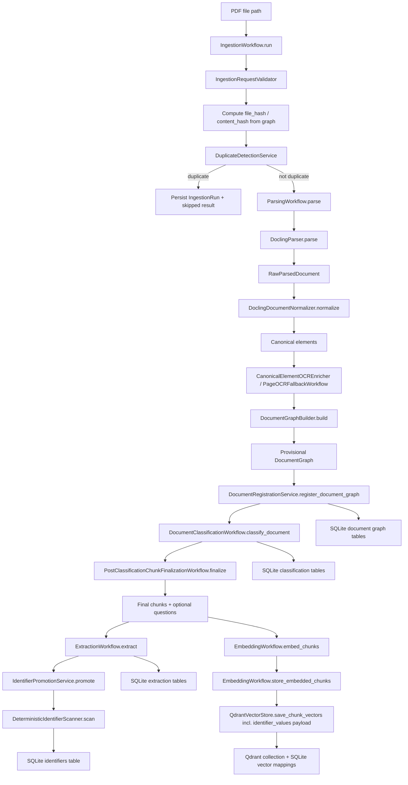
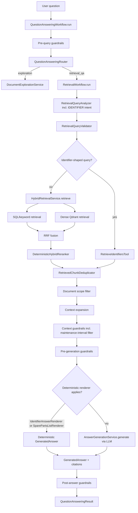
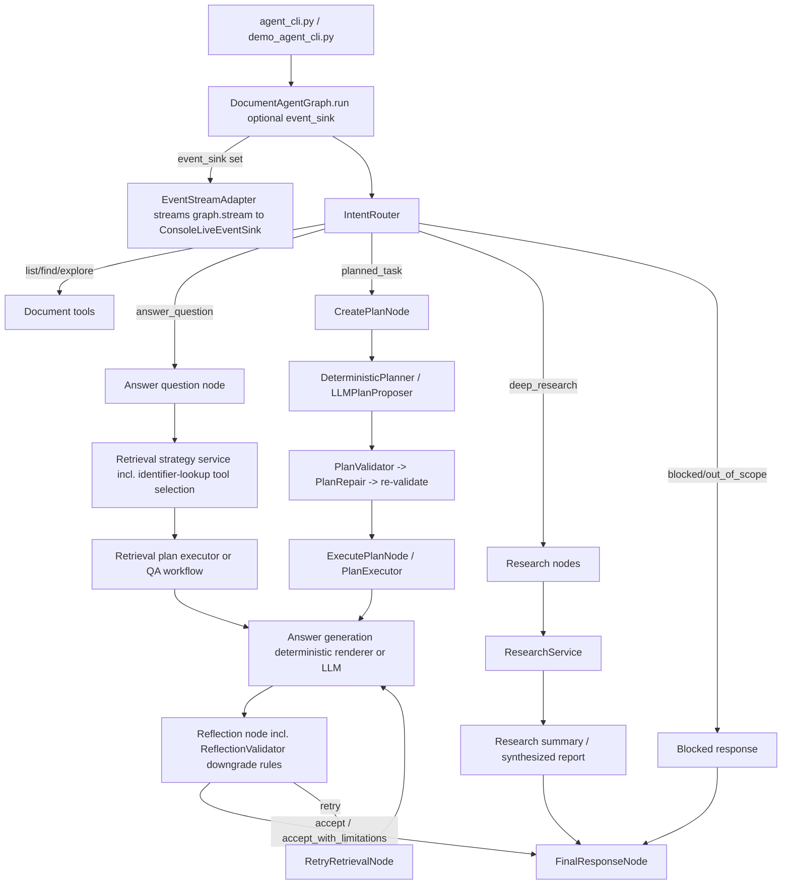
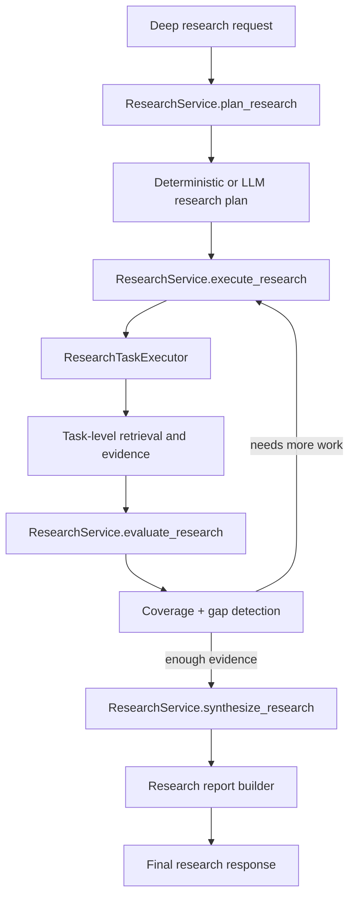

# Current Document AI Agent Flow Report

> Updated 2026-07-02 against commit `612700d`. The prior version of this report (commit `cb5b804`) predates 31 commits of active work on identifier extraction/promotion, deterministic answer rendering, reflection hardening, LangGraph planning, and live agent streaming. This revision re-verifies every claim in the prior report against current code and documents the new subsystems. Sections marked with a trailing note like *(new since last review)* did not exist in the prior report.

## 1. Executive Summary

The current system is a document-grounded AI stack with two major halves:

1. Ingestion: parse PDF-like documents, normalize them into canonical elements, build a `DocumentGraph`, classify the document, finalize chunking, optionally generate chunk questions, extract structured facts (including identifiers), promote and deterministically scan for identifiers, embed final chunks, persist metadata in SQLite, and store vectors in local Qdrant.
2. Retrieval and QA: accept a user query, route it through either a direct QA workflow or a LangGraph agent runtime, apply guardrails, select a retrieval strategy or build a multi-step execution plan, run deterministic or hybrid retrieval (including a dedicated identifier-lookup path), optionally expand context, generate a grounded answer (via LLM or one of two deterministic renderers), reflect and retry with a hardened validator, and in the LangGraph runtime optionally run deep research — all while streaming live progress to the console by default.

At the architecture level, the intended production ingestion path is `src/application/workflows/ingestion/ingestion_workflow.py::IngestionWorkflow.run`. The intended production QA path is split:

- direct workflow path: `src/application/workflows/question_answering/question_answering_workflow.py::QuestionAnsweringWorkflow.run`
- agent path: `src/application/langgraph/graphs/document_agent_graph.py::DocumentAgentGraph.run`

The system already contains:

- Docling-based PDF parsing
- canonical element normalization
- hierarchical section building
- policy-driven chunking with post-classification finalization
- document classification
- optional chunk classification and chunk-type reclassification
- optional question generation
- LLM-based structured extraction (tasks, spare parts, equipment, manufacturers, and now free-form identifiers)
- deterministic identifier promotion and regex-based identifier scanning *(new since last review)*
- embeddings via BGE, with identifier values written into Qdrant payloads *(new since last review)*
- vector persistence in Qdrant
- SQL/keyword plus dense hybrid retrieval
- a dedicated identifier-lookup retrieval tool with inventory-style listing *(materially expanded since last review)*
- retrieval deduplication, reranking, and context expansion
- multi-layer guardrails, including intent-aware context filtering
- a hybrid deterministic/LLM task-planning subsystem with validation and repair *(new since last review)*
- deterministic answer rendering for spare-parts lists and identifier lookups, bypassing the LLM when possible *(new since last review)*
- reflection with a much richer validator that protects legitimate partial answers from being discarded *(materially expanded since last review)*
- retrieval strategy planning
- deep research
- live streaming of agent progress to the console during interactive runs *(new since last review)*
- interactive demo runtime

The biggest current architecture realities are:

- three of the four P0 items from the prior review are now fixed: content-hash is a true semantic hash, the benchmark seeder routes new-document ingestion through `IngestionWorkflow`, and `SqlAlchemyIngestionRunRepository` import hygiene is clean. The fourth (safe reingest/delete) remains blocked.
- a full identifier subsystem now exists end-to-end (LLM extraction → promotion → deterministic scan → persistence → retrieval tool → deterministic answer rendering), closing most gaps flagged by the team's own prior identifier/planner architecture reviews — but a few seams are still incomplete (see §2.14 and §3.15).
- the benchmark corpus seeder's *reseed/refresh* paths (as opposed to first-time seeding) still bypass `IngestionWorkflow` and therefore skip identifier promotion/scanning entirely for re-ingested documents.
- Qdrant now carries `identifier_values` in its payload but nothing reads it back or filters on it yet — it is currently write-only.
- reflection's validator has absorbed several rounds of hand-tuned, domain-specific downgrade rules (maintenance-interval, spare-parts, identifier-inventory) to stop legitimate partial answers from being discarded; this is a strong safety net but treats a retrieval-side root cause (chunk-type leakage into maintenance-interval queries) rather than fixing it upstream.
- vector storage across SQLite and Qdrant is orchestrated but not atomic.
- reingestion and deletion are intentionally blocked because replacement boundaries are not fully safe yet.
- parsing bottlenecks are mostly Docling conversion and canonical normalization, not graph build.
- a configuration inconsistency exists: `.env` defines `ENABLE_IDENTIFIER_EXTRACTION` and `IDENTIFIER_MIN_LENGTH`, but no settings class consumes them — the new identifier promotion/scanning stages run unconditionally regardless of these flags.

## 2. Ingestion Flow: PDF to Embedding

### 2.1 Entry Points

#### Main production-style path

- `src/application/workflows/ingestion/ingestion_workflow.py::IngestionWorkflow.run`
- tool wrapper: `src/application/tools/ingestion/ingest_document_tool.py::IngestDocumentTool.run`

This is the most complete application-owned ingestion path. It owns:

- request validation
- duplicate detection
- parsing
- provisional graph registration
- document classification
- post-classification chunk finalization
- extraction (including LLM identifier extraction)
- identifier promotion and deterministic identifier scanning
- embedding
- vector indexing
- ingestion run persistence
- stage events

#### Debug and developer paths

- `scripts/debug_parse_document.py`
  - debug-only inspection path
  - runs parse -> classification -> post-classification chunk decision
  - writes Markdown and JSON inspection artifacts
  - does not persist to DB or vectors
- `scripts/profile_graph_build.py`
  - profiling/debug path for parsing and graph build performance

#### Evaluation / benchmark paths

- `scripts/seed_retrieval_benchmark_corpus.py`
  - evaluation corpus seeding path
  - for a genuinely new document, now constructs a real `IngestionRequest(force=True, ...)` and calls `IngestionWorkflow.run` directly (`retrieval_benchmark_corpus_seeder.py::RetrievalBenchmarkCorpusSeeder._seed_new_document`), then reloads the persisted graph via `DocumentLookupService`
  - **for a duplicate/`--force-reparse` re-seed**, `_reseed_existing_document` / `_refresh_existing_document` still call `parsing_workflow.parse`, `document_registration_service.replace_document_graph`, and classification/finalization directly — **not** through `IngestionWorkflow.run` — so re-seeded documents skip identifier promotion and deterministic scanning entirely
- `src/application/evaluation/retrieval/benchmarking/corpus/retrieval_benchmark_corpus_seeder.py::RetrievalBenchmarkCorpusSeeder`
- `scripts/run_retrieval_benchmark.py`
  - evaluation only
  - runs retrieval benchmark against final persisted chunks/vectors

#### Stubs / intentionally blocked paths

- `src/application/workflows/ingestion/ingestion_workflow.py::IngestionWorkflow.reingest`
  - raises `ReingestionNotSupportedError`
- `src/application/workflows/ingestion/delete_document_workflow.py::DeleteDocumentWorkflow.run`
  - raises `DeleteDocumentNotSupportedError`
- tool wrappers exist for both:
  - `src/application/tools/ingestion/reingest_document_tool.py`
  - `src/application/tools/ingestion/delete_document_tool.py`

#### Active-path conclusion

The active, workflow-owned ingestion design is `IngestionWorkflow.run`. First-time benchmark corpus seeding now uses it too, closing most of the path-unification gap flagged in the prior review. The remaining split is narrower than before: re-seeding an *existing* benchmark document (duplicate or forced reparse) still bypasses `IngestionWorkflow` and silently produces documents with no promoted/scanned identifiers.

### 2.2 File Registration and Hashing

#### Request validation

- `src/application/validation/ingestion/ingestion_request_validator.py::IngestionRequestValidator.validate`

`IngestionWorkflow.run` validates `IngestionRequest` before any work begins.

#### Hash computation — now a true two-signal hash

- file hash: `IngestionWorkflow._compute_file_hash` — raw SHA-256 over the file's bytes
- content hash: `IngestionWorkflow.run` calls `compute_content_hash_from_graph(parsing_result.document_graph)`, delegated to the new module `src/application/workflows/ingestion/content_hash.py`

The prior report's flagged weakness — file hash and content hash being identical — is fixed. `content_hash.py` normalizes whitespace/newlines per canonical element and hashes `element_type\tpage\ttext` for every element in reading order, explicitly excluding element IDs, timestamps, file path, and parser metadata. This makes content-hash duplicate detection genuinely independent of the raw file bytes: two byte-different files with the same semantic content (e.g. re-exported PDFs) now correctly collide, while the same content re-saved with different embedded metadata is now correctly deduplicated. Covered by `tests/unit/application/workflows/ingestion/test_content_hash.py`.

#### Duplicate detection

- `src/application/workflows/ingestion/ingestion_workflow.py::IngestionWorkflow._check_duplicate`
- `src/application/services/document/duplicate_detection_service.py::DuplicateDetectionService.check_file_hash`
- `src/application/services/document/duplicate_detection_service.py::DuplicateDetectionService.check_content_hash`

Order:

1. file-hash duplicate check
2. content-hash duplicate check

Settings gate the checks:

- `duplicate_detection_settings.enable_file_hash_check`
- `duplicate_detection_settings.enable_content_hash_check`

Both checks are now semantically meaningful signals rather than the same value checked twice.

#### Document ID creation

Document ID is created in parsing, not in the repository:

- `src/application/workflows/parsing/parsing_workflow.py::ParsingWorkflow.parse`

If no `document_id` is supplied, the workflow uses:

- `src/shared/ids/IdGenerator`
- `IdPrefix.DOCUMENT`

#### Ingestion run creation

In the main ingestion workflow, `IngestionRun` is created immediately:

- `src/application/workflows/ingestion/ingestion_workflow.py::IngestionWorkflow.run`
- domain model: `src/domain/workflow/ingestion_run.py::IngestionRun`

Persistence:

- repository contract: `src/application/contracts/document/ingestion_run_repository.py`
- implementation: `src/infrastructure/db/repositories/document/ingestion_run_repository.py::SqlAlchemyIngestionRunRepository`

The import-hygiene issue flagged in the prior review is fixed: `SqlAlchemyIngestionRunRepository` now imports contracts, mappers, ORM models, common types, and shared exceptions exclusively through `src.*` paths.

### 2.3 PDF Parsing

#### Main parser path

- `src/infrastructure/parsing/docling/docling_parser.py::DoclingParser.parse`
- converter factory: `src/infrastructure/parsing/docling/docling_converter_factory.py`
- orchestration: `src/application/workflows/parsing/parsing_workflow.py::ParsingWorkflow.parse`

#### Representation of parser output

- `src/application/workflows/parsing/raw_parsed_document.py::RawParsedDocument`

This carries the Docling raw document plus parser metadata like parser name, parser version, title, and page count.

#### Parser configuration

Configuration is supplied through:

- `src/config/settings/__init__.py`
- `docling_settings`

Current resolved non-secret runtime values:

- backend: `pypdfium2`
- accelerator device: `auto`
- image scale: `1.0`
- table structure: enabled
- threads: `2`
- layout batch size: `2`
- table batch size: `1`
- Docling OCR: disabled

#### OCR and parsing behavior

There are two OCR layers in the codebase:

1. Docling internal OCR
   - wired in `docling_converter_factory.py`
   - currently disabled by config
2. external provider OCR
   - wired later in parsing workflow through:
     - `src/application/workflows/parsing/canonical_element_ocr_enricher.py::CanonicalElementOCREnricher`
     - `src/application/workflows/parsing/ocr/page_ocr_fallback_workflow.py::PageOCRFallbackWorkflow`

Current resolved OCR settings:

- Docling OCR enabled: `False`
- provider OCR enabled: `True`
- provider OCR name: `paddleocr`
- asset OCR enrichment: enabled
- page fallback OCR: disabled
- region fallback OCR: disabled

#### Table extraction and image handling

Docling output is normalized through dedicated extractors:

- `DoclingTableExtractor`
- `DoclingCaptionExtractor`
- `DoclingItemExtractor`
- `DoclingProvenanceExtractor`

These live under:

- `src/application/workflows/parsing/normalizers/`

### 2.4 Canonical Normalization

#### Main normalizer

- `src/application/workflows/parsing/normalizers/docling_document_normalizer.py::DoclingDocumentNormalizer.normalize`

This converts `RawParsedDocument` into canonical elements tied to a resolved `document_id`.

#### Canonical element representation

- `src/application/workflows/parsing/canonical_element.py`
- element enum source: `src/domain/common/enums.py::ElementType`

Observed element types include:

- `title`
- `section_header`
- `text`
- `list_item`
- `table`
- `picture`
- `caption`
- `key_value`
- `form`
- `code`
- `formula`
- `unknown`

#### Metadata carried forward

Canonical elements include or derive:

- `element_id`
- `document_id`
- `element_type`
- `text`
- `page_start` / `page_end`
- `bbox`
- `order_index`
- `section_title`
- `section_path`
- `parent_section_id`
- `raw_ref`
- `metadata`

#### Table and image handling

Tables are converted into canonical table-bearing text and later into table assets.

Important fix already present:

- table markdown export now passes the Docling `doc` argument during export
- that avoids the Docling deprecation path for `TableItem.export_to_markdown()`

#### OCR enrichment after normalization

Optional canonical OCR enrichment:

- `src/application/workflows/parsing/canonical_element_ocr_enricher.py::CanonicalElementOCREnricher.enrich`

Optional page/region fallback OCR:

- `src/application/workflows/parsing/ocr/page_ocr_fallback_workflow.py::PageOCRFallbackWorkflow.run`

The OCR enrichment path is additive and defensive. It enriches elements rather than replacing the parser stage.

### 2.5 Document Graph Build

#### Main graph builder

- `src/application/workflows/parsing/builders/document_graph_builder.py::DocumentGraphBuilder.build`

This is where canonical elements become the domain aggregate:

- `src/domain/document/aggregates/document_graph.py::DocumentGraph`

#### Section building

- `src/application/workflows/parsing/builders/section_builder.py::SectionBuilder.build`

Supporting section logic includes:

- `SectionHeaderFilter`
- `SectionHierarchyResolver`
- `SectionPathRelinker`
- `SectionStackBuilder`

The builder creates:

- root section if needed
- parent/child hierarchy
- section path relinking
- section assignment for elements

#### Element ordering

Ordering is preserved from canonical elements through:

- `order_index`
- section reading order
- graph materialization via `ParsedElementFactory`

#### Chunk creation

Graph chunk orchestration:

- `src/application/workflows/parsing/builders/document_graph/graph_chunk_builder.py::GraphChunkBuilder.build_chunks`

Main chunk builder entrypoint:

- `src/application/workflows/parsing/builders/chunking/builders/section_chunk_builder.py::SectionChunkBuilder.build_document_chunk_payloads`

#### Chunk sizes and overlap

Chunking is policy-driven, not fixed globally.

Policy resolver:

- `src/application/workflows/parsing/builders/chunking/policies/document_chunking_policy_resolver.py::DocumentChunkingPolicyResolver`

Profiles:

- default
- manual
- datasheet
- drawing
- certificate
- report

Observed profile policies:

- default: `200 / 20`
- manual: `1000 / 100`
- datasheet: `600 / 75`
- drawing: `300 / 35`
- certificate: `500 / 60`
- report: `800 / 100`

Important nuance:

- `ingestion_settings.max_chunk_tokens=1000` and `chunk_overlap=150` are not the only active limits
- the actual runtime chunk policy is resolved by document type or inferred structural profile

#### Post-classification chunking

Chunking happens in two phases conceptually:

1. provisional structural chunking during parsing
2. final chunk decision in `PostClassificationChunkFinalizationWorkflow`

That workflow can:

- reuse stored chunks
- rebuild if missing
- refresh stale structures
- fully rechunk if hybrid type/profile decision changes the chunking profile

#### Table and asset linking

`DocumentGraphBuilder` also materializes and links:

- `TableAsset`
- `PictureAsset`

Nearby asset text is enriched by:

- `AssetNearbyTextEnricher`

#### Identifier extraction during graph build

Not part of graph build itself. `DocumentGraph.identifiers` (`IdentifierORM`-backed) is now actively populated, but later in the pipeline — see §2.9. Graph build only creates the aggregate shell that identifier promotion later appends to.

### 2.6 Classification

#### Document classification

- workflow: `src/application/workflows/classification/document_classification_workflow.py::DocumentClassificationWorkflow.classify_document`
- prompt builder: `src/application/prompts/classification/document_classification_prompt_builder.py::DocumentClassificationPromptBuilder`
- summary builder: `src/application/prompts/classification/document_classification_summary_builder.py::DocumentClassificationSummaryBuilder`
- parser: `ClassificationResponseParser`
- validator: `src/application/validation/classification/document_classification_validator.py::DocumentClassificationValidator`
- persistence service: `src/application/services/classification/classification_service.py::ClassificationService`

The document prompt uses:

- document metadata
- statistics
- graph-derived section and chunk summaries

It explicitly tells the model to prioritize graph-derived evidence over filename/path hints.

#### Hybrid document-type decision

- `src/application/workflows/classification/hybrid_document_type_resolver.py::HybridDocumentTypeResolver`

Inputs:

- parser/title hint document type
- structural chunking profile inference
- saved document classification

Output:

- effective document type
- effective chunking profile
- confidence
- reasons
- `should_rechunk`

#### Chunk classification and chunk-type classification

Two separate capabilities exist:

1. chunk type reclassification
   - `src/application/workflows/classification/chunk_type_classification_workflow.py`
   - used to reclassify unresolved/general chunk types
2. chunk classification persistence
   - `src/application/workflows/classification/chunk_classification_workflow.py`
   - validates and persists `ChunkClassification`

Current resolved settings:

- chunk classification enabled: `False`
- chunk-type classification enabled: `True`

So chunk-type refinement is active, but persisted chunk classification is currently off by default.

#### Models and provider path

Application wrapper:

- `src/application/services/ai/llm_service.py::LLMService`

Infrastructure provider:

- `src/infrastructure/ai/llm/ollama_llm_provider.py::OllamaLLMProvider`

Current resolved model settings (all changed since the prior review — see §7 for the full corrected table):

- general LLM: `qwen3:8b`
- classification LLM: `qwen3:8b`
- chunk classification LLM: `qwen3:8b` (a previously-unlisted, distinct setting)

#### Answer intent relevance

Answer intent exists, but it is not part of ingestion classification. It belongs to answer generation later in the retrieval/QA flow.

### 2.7 Question Generation

#### Active design

There is no standalone `QuestionGenerationWorkflow` currently used in ingestion. The active path is service-driven and invoked from post-classification finalization.

- service: `src/application/services/question_generation/question_generation_service.py::QuestionGenerationService`
- prompt builder: `src/application/prompts/question_generation/question_prompt_builder.py::QuestionPromptBuilder`
- orchestration call site: `src/application/workflows/classification/post_classification_chunk_finalization_workflow.py`

#### Behavior

Questions are generated:

- per chunk
- after final chunk selection
- only once
- after rechunk decision
- excluding `ChunkType.OVERVIEW`

#### Persistence

Generated questions are persisted through the graph/document repository path:

- domain model: `src/domain/document/entities/question.py::GeneratedQuestion`
- ORM: `src/infrastructure/db/orm_models/document_models.py::GeneratedQuestionORM`

#### Current runtime state

Current resolved setting:

- `enable_question_generation=False`

So the capability exists, but is off by default in the current runtime.

### 2.8 Structured Extraction *(now includes LLM identifier extraction — new since last review)*

#### Main workflow

- `src/application/workflows/extraction/extraction_workflow.py::ExtractionWorkflow.extract`

This is the same batched-LLM-call extraction step described in the prior review, but the LLM response is now parsed into one additional collection beyond tasks/spare parts/equipment/manufacturers:

- `ExtractionWorkflow._build_extracted_identifier` parses an `identifiers[]` array out of the JSON response into `ExtractedIdentifier` domain objects — each carries a free-form `identifier_type` string, a `raw_value`, a confidence score, and a human-review flag.
- Domain type: `src/domain/extraction/extracted_identifier.py::ExtractedIdentifier`
- `ExtractionResult` (`src/domain/extraction/extraction_result.py`) gained a new field: `extracted_identifiers: list[ExtractedIdentifier]`.

This is distinct from the existing `IdentifierType`-driven promotion described in §2.9: `ExtractedIdentifier` is the *raw* LLM output (any string type, unvalidated), while promotion converts it into a typed, deduplicated `Identifier` domain entity.

### 2.9 Identifier Promotion and Deterministic Scanning *(new since last review)*

This subsystem closes the gap flagged in the prior review ("active ingestion flow does not appear to populate `DocumentGraph.identifiers`"). It runs synchronously inside `IngestionWorkflow.run`, immediately after `ExtractionWorkflow.extract()` commits, and before embedding.

#### Stage 1 — Promotion

- `src/application/services/document/identifier_promotion_service.py::IdentifierPromotionService.promote`

Converts already-structured extraction output into typed `Identifier` entities:

- `SparePart.part_number` → `IdentifierType.PART_NUMBER`
- `EquipmentInfo.model_number` → `IdentifierType.MODEL_NUMBER`
- `EquipmentInfo.serial_number` → `IdentifierType.SERIAL_NUMBER`
- `Manufacturer.name` → `IdentifierType.MANUFACTURER_NAME`
- each `ExtractedIdentifier` → its typed `IdentifierType`, parsed from the free-form string with a silent fallback to `IdentifierType.UNKNOWN` on a bad/unrecognized value (no logging or metric currently records how often this fallback fires)

Identifiers are deduplicated by `(normalized_value, identifier_type)` and resolve `chunk_id` / `page_start` / `page_end` / `section_id` from the source chunk. The result is appended to `final_graph.identifiers` and persisted via `DocumentRegistrationService.register_document_identifiers`, then committed.

#### Stage 2 — Deterministic scan

- `src/application/services/document/deterministic_identifier_scanner.py::DeterministicIdentifierScanner.scan`

Runs immediately after promotion, seeded with the already-promoted normalized values (`existing_normalized`) so it doesn't duplicate them. It is a two-pass regex sweep over chunk `.content`:

1. specific patterns claim values first: `DRG`/`DWG` prefixes → `DRAWING_NUMBER`, `CERT`/`ISO`/`EN`/`IEC`/`ATEX` prefixes → `CERTIFICATE_NUMBER`, `SN-\d+` → `SERIAL_NUMBER`
2. a generic pattern (`[A-Z]{2,5}-\d{2,6}...`) fills in `PART_NUMBER` for anything left unclaimed

This scanner currently has only these few pattern families — part numbers embedded only in unstructured prose (rather than promoted from a structured `SparePart` record) may still be invisible if they don't match the generic pattern.

Results are also persisted via `DocumentRegistrationService.register_document_identifiers` and committed.

#### Data model changes

- `IdentifierType` (`src/domain/common/enums.py`) grew from 6 to 8 values, adding `CERTIFICATE_NUMBER` and `MANUFACTURER_NAME`.
- `Identifier` entity (`src/domain/document/entities/identifier.py`) gained provenance fields: `section_id`, `page_start`, `page_end`.
- Persistence: `Identifier` → `IdentifierORM` via `IdentifierMapper`; `IdentifierReader` (`src/infrastructure/db/repositories/document/identifier_reader.py`) now supports exact-value search, type search, chunk-scoped lookup, and page-scoped lookup.

#### Configuration inconsistency

`.env` defines `ENABLE_IDENTIFIER_EXTRACTION=true` and `IDENTIFIER_MIN_LENGTH=3` under an "Identifier Extraction" heading, but **no settings class in `src/` consumes either field**. Promotion and scanning currently run unconditionally on every ingestion regardless of these flags — the flags are dead configuration, not an active feature gate.

#### Historical note

Two team-authored architecture docs track this subsystem's build-out in detail and are useful history but are both now stale relative to `HEAD`:

- `outputs/architecture/identifier_architecture_review.md` — documents the *pre-fix* state (identifiers fully orphaned).
- `outputs/architecture/identifier_pipeline_verification.md` — verifies the initial promotion/scanner wiring, but predates the `CERTIFICATE_NUMBER` type, the `manufacturer`/`supplier` signal-extractor fix, and several `IdentifierReader` query methods added afterward (see §3.5).

### 2.10 Embedding Text Construction

#### Active construction path

- `src/application/services/ai/embedding_service.py::EmbeddingService`
- enrichment helper: `src/application/services/ai/chunk_embedding_enricher.py::enrich_embedding_text`

#### Base embedded text

The service embeds:

- `chunk.embedding_text` if present
- otherwise `chunk.content`

#### Additional enrichment

The current enrichment layer can add:

- `Chunk type: ...`
- `Section: ...`
- `Component: ...`
- table caption
- table context
- table headers
- row labels
- units
- related terms

That enrichment is selective and depends on chunk type or table metadata.

#### Included and not included

Included in active embedding construction:

- chunk content
- chunk type
- local section label
- parent component label
- table-oriented metadata
- related terms derived from content/section semantics

Not clearly included in the active embedding input path:

- generated questions
- extracted identifiers as first-class embedding *text* fields (they are attached as vector *payload*, see §2.11)
- document title as a mandatory explicit prefix

So the current embedding text is chunk-centric with structured enrichment, not question-augmented.

### 2.11 Embedding and Vector Storage

#### Application workflow

- `src/application/workflows/embedding/embedding_workflow.py::EmbeddingWorkflow`

Methods:

- `embed_chunks`
- `store_embedded_chunks`
- `embed_and_store_chunks`

#### Embedding provider

- contract: `src/application/contracts/ai/embedding_provider.py`
- service: `src/application/services/ai/embedding_service.py::EmbeddingService`
- infrastructure provider: `src/infrastructure/ai/embeddings/bge_embedding_provider.py::BgeEmbeddingProvider`

Current resolved embedding settings:

- provider: `bge`
- model: `BAAI/bge-small-en-v1.5`
- dimensions: `384`

#### Batching

Batch embedding is supported through `EmbeddingService.embed_chunks` and provider batch methods.

#### Vector store

- contract: `src/application/contracts/retrieval/vector_store.py`
- implementation: `src/infrastructure/retrieval/vector/qdrant_vector_store.py::QdrantVectorStore`

Current resolved vector settings:

- Qdrant mode: local
- Qdrant collection: `document_chunks`
- vector distance: `cosine`

#### Vector IDs and payload

In `QdrantVectorStore.save_chunk_vectors`:

- Qdrant point IDs are generated with `uuid4()`
- SQLite vector mapping records get their own `vector_id`

Payload mapping:

- `src/infrastructure/retrieval/vector/qdrant_payload_mapper.py::QdrantPayloadMapper.from_chunk`

Payload includes:

- `document_id`
- `chunk_id`
- `section_id`
- `section_path`
- `chunk_type`
- `content`
- `sequence_number`
- `chunk_index`
- `chunk_total`
- `page_start`
- `page_end`
- optional `document_type`
- `identifier_values` *(new since last review)* — a list of normalized identifier values found on that chunk

**`identifier_values` is currently write-only.** `QdrantVectorStore.save_chunk_vectors` builds `identifier_values_by_chunk_id` by loading `document_repository.get_document_graph(document_id).identifiers` and grouping by `chunk_id`, so values are populated correctly at storage time (identifier promotion/scanning runs before embedding, so the data is available). But `to_retrieved_chunk` (the payload → domain mapper on the read path) does not read `identifier_values` back out, and `_build_filter` has no identifier condition — nothing in the current retrieval path uses this payload field yet.

#### SQLite vector mapping

- ORM: `src/infrastructure/db/orm_models/vector_models.py::ChunkVectorORM`
- repository: `src/infrastructure/db/repositories/retrieval/vector_mapping_repository.py`

Stored mapping includes:

- document ID
- chunk ID
- qdrant collection
- qdrant point ID
- embedding model
- embedding text hash

#### Failure handling

Embedding workflow raises if embedding count does not match chunk count:

- `InfrastructureError` from `EmbeddingWorkflow.embed_chunks`

Important boundary:

- SQLite vector mappings and Qdrant upserts are orchestrated together
- they are not atomic across both stores

The ingestion workflow explicitly exposes that risk in success diagnostics.

### 2.12 SQLite Persistence

#### Main persistence seam

- `src/infrastructure/db/unit_of_work.py::SqlAlchemyUnitOfWork`

#### Schema management

- `src/infrastructure/db/schema_management.py::ensure_database_schema`

Beyond `Base.metadata.create_all`, this now also runs a lightweight SQLite auto-migration (`_ensure_sqlite_column`) that adds `elements.parser_extra_json TEXT` if the column is missing. This is a schema-drift patcher for parser/OCR trace metadata, unrelated to identifiers.

#### Main document graph persistence

- reader: `src/infrastructure/db/repositories/document/document_reader.py`
- writer: `src/infrastructure/db/repositories/document/document_writer.py`
- app service: `src/application/services/document/document_registration_service.py`

#### Persisted entities

Document metadata and graph:

- `DocumentORM`
- `SectionORM`
- `ElementORM`
- `ChunkORM`

Chunk dependents:

- `GeneratedQuestionORM`
- `IdentifierORM` (now actively populated — see §2.9)

Classification:

- `DocumentClassificationORM`
- `ChunkClassificationORM`

Extraction:

- `ExtractionResultORM`
- `MaintenanceTaskORM`
- `SparePartORM`
- `EquipmentInfoORM`
- `ManufacturerORM`

Vectors:

- `ChunkVectorORM`

Workflow/run tracking:

- `IngestionRunORM`

Support tables also exist for:

- activity
- audit
- events
- conversation/session memory

#### Replacement boundaries

`DocumentWriter.replace_document_chunk_artifacts` currently replaces:

- chunk classifications
- generated questions
- identifiers
- chunks

It does not replace extraction results in the same atomic boundary. That is one of the reasons safe reingestion is currently blocked.

### 2.13 Quality Gates / Validation

#### Request and graph validation

- `IngestionRequestValidator`
- `DocumentGraphValidator`
- `DocumentClassificationValidator`
- `ChunkClassificationValidator`
- `ExtractionResultValidator`
- `RetrievalQueryValidator`

#### Quality gate

- `src/application/validation/document_quality/document_quality_gate.py::DocumentQualityGate`

Checks parsing quality:

- section count
- orphan element ratio
- elements with pages
- OCR target failures
- OCR target page numbers

Checks chunking quality:

- general chunk ratio
- chunk section paths
- maintenance headings have chunks

Checks retrieval quality:

- retrieved chunk scores
- retrieved chunks have content

#### What happens on failure

Validation-style failures:

- `.raise_if_invalid()` is used in application services/workflows
- errors propagate as existing shared exceptions

Quality gate failures:

- they do not automatically abort ingestion
- they contribute warnings and diagnostics

#### What is missing

Missing or not clearly wired as an active gate:

- dedicated embedding vector-quality validator
- active `IngestionRunValidator` usage inside `IngestionWorkflow`
- no feature-flag gate for identifier promotion/scanning (see §2.9 configuration inconsistency)

### 2.14 Current Weaknesses / Risks

1. ~~`IngestionWorkflow._compute_hashes` returns identical file and content hashes~~ — **fixed**; content hash is now a real structural/semantic hash (§2.2).
2. The benchmark corpus seeder's first-time seeding now routes through `IngestionWorkflow`, but its reseed/refresh paths still bypass it and silently skip identifier promotion/scanning for re-ingested documents (§2.1).
3. Reingestion is intentionally unsupported because chunk replacement and extraction replacement are not fully atomic together.
4. Delete workflow is intentionally unsupported.
5. Qdrant writes and SQLite vector mappings are not atomic across both stores.
6. `IngestionStage.EXTRACTION` exists, but there is no matching `IngestionStatus.EXTRACTED`; the persisted run status does not reflect extraction as a distinct state.
7. `IngestionRequest.source_name` is accepted but not persisted by the current document model.
8. `IngestionRequest.enable_ocr` per-request override is accepted but not actually applied; the workflow emits a warning instead.
9. ~~Identifier storage exists architecturally, but active ingestion does not appear to populate `DocumentGraph.identifiers`~~ — **fixed**; a full promotion + deterministic-scan subsystem now populates identifiers on every `IngestionWorkflow.run` (§2.9).
10. Parsing performance is still dominated by Docling conversion and normalization, especially for large manuals.
11. There is no single canonical composition root used by all ingestion paths.
12. ~~Import hygiene is inconsistent in `SqlAlchemyIngestionRunRepository`~~ — **fixed**; imports are now `src.*`-only.
13. *(new)* `ENABLE_IDENTIFIER_EXTRACTION` and `IDENTIFIER_MIN_LENGTH` exist in `.env` but are not wired to any settings class — identifier promotion/scanning always runs, so the flags create false confidence in configurability.
14. *(new)* `ExtractedIdentifier.identifier_type` silently falls back to `IdentifierType.UNKNOWN` when the LLM emits an unrecognized type string, with no logging/metric to track how often this happens.
15. *(new)* Qdrant's `identifier_values` payload field is populated on write but has no read-back mapping or filter support — currently dead weight on the retrieval side.

## 3. Retrieval Flow: User Query to Final Response

### 3.1 Entry Points

#### Direct QA CLI

- `scripts/ask_document.py`

This is the simpler non-LangGraph path. It resolves a document, builds a `QuestionAnsweringWorkflow`, and runs retrieval plus answer generation.

#### LangGraph agent CLI

- `scripts/agent_cli.py`

This is the main engineering-facing agent entrypoint for routed commands and questions. It supports:

- routing
- retrieval strategy
- reflection
- deep research
- JSON output
- trace output
- context display

#### Demo runtime

- `scripts/demo_agent_cli.py`
- composition root: `src/application/agent_runtime/demo_agent_runtime.py::build_agent_runtime`

This is the richer interactive demo runtime with presenters, session state, command dispatch, progress indicator, and trace writing. It now **streams live agent progress to the console by default** during interactive runs (see §3.13) — the post-hoc `--show-react` trace block is only printed on top of that when `--debug` or trace-writing is also requested, since narrating the run twice would be redundant.

#### Evaluation and test paths

- `scripts/run_agent_eval.py`
- `scripts/run_retrieval_benchmark.py`
- `scripts/run_retrieval_quality_gate.py`

#### Active-path conclusion

There are two active answer paths:

1. direct QA workflow
2. LangGraph agent runtime

The richer current “agent” behavior lives in the LangGraph path.

### 3.2 User Input and Session Context

#### Direct QA path

`scripts/ask_document.py`:

- reads the question from CLI args
- resolves a document by:
  - explicit `--document-id`
  - partial `--document` lookup
  - `--latest`
- can output JSON
- can show context
- can write retrieval trace

This path is mostly stateless.

#### LangGraph path

`scripts/agent_cli.py` and `scripts/demo_agent_cli.py` pass user input into:

- `src/application/langgraph/graphs/document_agent_graph.py::DocumentAgentGraph.run`

The graph carries:

- selected document ID/title/file name
- session ID
- route
- tool results
- retrieval strategy state
- reflection state
- research state
- guardrail state
- trace

State model:

- `src/application/langgraph/state/agent_state.py::AgentState`

`IntentRouter.route()` now also accepts a `selected_document_id` parameter (in addition to any document explicitly named in the request), and `RouteRequestNode._route()` forwards `state["selected_document_id"]` into it. This fixed a real bug: `PreRouteGuardrailService.check()` previously only received `selected_document_id=document_id`, so a follow-up question referencing "the current document" without renaming it could be guardrail-checked against the wrong document (or none). It now receives both `document_id` and `selected_document_id or document_id`.

#### Session memory

The demo/agent runtime supports session persistence:

- `ConversationMemory`
- `SessionStateStore`
- `SessionManager`

The final response node saves selected document and clarification state back into memory.

### 3.3 Guardrails

#### Pre-route guardrails

- `src/application/guardrails/services/pre_route_guardrail_service.py::PreRouteGuardrailService.check`

This layer checks for:

- unsafe destructive requests
- prompt injection
- secret requests
- tool abuse
- domain scope problems
- ambiguity

Domain scope checking itself lives in `src/application/guardrails/retrieval/query_scope_guardrail.py::QueryScopeGuardrail`, backed by `src/application/guardrails/detectors/domain_scope_detector.py`. A recent regression test (`test_follow_up_identifier_listing_with_selected_document_returns_allow`) locks in existing behavior: when a query's literal wording doesn't match a known scope phrase (e.g. a typo like "serial and part nmubers") but a `selected_document_id` is already set, the query is still classified `DOCUMENT_AGENT_SCOPE` and allowed rather than rejected as out-of-scope.

#### Retrieval guardrails

Used in workflow/runtime composition:

- `QueryScopeGuardrail`
- `DocumentRelevanceGuardrail`
- `RetrievalEvidenceGuardrail`
- `IdentifierEvidenceGuardrail`
- `RetrievalConfidenceGuardrail`

#### Context guardrails

Public chain:

- `src/application/guardrails/context/context_guardrail_chain.py::ContextGuardrailChain.run`

`ContextGuardrailChain` itself is a thin, generic runner over an injected `list[Guardrail]` — the ordering (`ScopedDocumentConsistencyGuardrail` → `ContextFilteringGuardrail` → `ContextQualityGuardrail` → `ContextBudgetGuardrail`) is fixed at the construction site in `QuestionAnsweringWorkflow`, unchanged from the prior review.

`ContextFilteringGuardrail` (`src/application/guardrails/context/context_filtering_guardrail.py`) grew a new, intent-aware filter: if the query matches a maintenance-interval phrase and is *not* an explicit specification query, any candidate chunk of `ChunkType.TECHNICAL_SPECIFICATION` that lacks maintenance-related content is now rejected with `ViolationType.IRRELEVANT_CHUNKS` ("Technical specification chunk is off-intent for a maintenance interval query"). This is a direct, guardrail-side mitigation for the maintenance-interval chunk-leakage problem described in §3.10 and §3.15 — it does not touch spare-parts or identifier chunk types.

#### Pre-tool guardrails

Used in planning/tool execution paths:

- `src/application/guardrails/services/pre_tool_guardrail_service.py::PreToolGuardrailService`
- invoked by `src/application/langgraph/planning/plan_executor.py::PlanExecutor`

#### Pre-generation guardrails

- `src/application/guardrails/services/pre_generation_guardrail_service.py::PreGenerationGuardrailService.check`

This blocks answer generation when:

- evidence is missing
- source metadata is insufficient
- grounding requirements are not met

#### Post-response guardrails

- `src/application/guardrails/services/post_response_guardrail_service.py::PostResponseGuardrailService.check`

This can:

- sanitize internal IDs
- sanitize local file paths
- check prompt leakage
- check secret leakage
- check citation failures
- check grounding failures

#### Guardrail result storage

Primary model:

- `src/application/guardrails/models/guardrail_result.py::GuardrailResult`

Stored/returned in:

- `QuestionAnsweringResult.guardrail_result`
- `RetrievalWorkflowResult.guardrail_result`
- LangGraph final response patch:
  - `guardrail_result`
  - `guardrail_decision`
  - `guardrail_trace_id`
  - `guardrail_trace`

#### User-facing guardrail messages

- `src/application/guardrails/messages/guardrail_message_builder.py::GuardrailMessageBuilder`

User-safe messages propagate through `safe_user_message`.

### 3.4 Routing

#### Direct QA workflow routing

- `src/application/workflows/question_answering/question_answering_router.py::QuestionAnsweringRouter.decide`

This splits into:

- `DOCUMENT_EXPLORATION`
- `RETRIEVAL_QA`

#### LangGraph routing

- `src/application/langgraph/routing/intent_router.py::IntentRouter`
- route enum: `src/application/langgraph/routing/route_type.py::RouteType`

Observed route types include:

- `answer_question`
- `retrieve_evidence`
- `document_exploration`
- `list_documents`
- `find_document`
- `document_details`
- `planned_task`
- `deep_research`
- `blocked_action`
- `out_of_scope`
- `needs_clarification`
- `help`
- `exit`
- `select_document`, `clear_document`, `clarification_response`, `quality_gate`, `retrieval_trace`, `unknown`

No new route types were added by recent work; identifier lookups are **not** a distinct route. They are selected two layers deeper — inside retrieval strategy selection (§3.5) and inside plan construction (§3.12) — rather than at `IntentRouter` level.

#### Active routing conclusion

The direct QA path is simple and deterministic. The LangGraph path is the fully routed agent surface.

### 3.5 Retrieval Strategy Selection

#### Deterministic query analysis

- `src/application/workflows/retrieval/retrieval_query_analyzer.py::RetrievalQueryAnalyzer`

This enriches a `RetrievalQuery` with:

- detected identifiers
- deterministic rewritten query
- inferred retrieval intent
- chunk-type preferences

Supporting parts:

- `RetrievalQueryIdentifierExtractor`
- `RetrievalQueryRewriter`
- `RetrievalQueryIntentInferer`
- `RetrievalQueryChunkTypePreferenceMapper`

Current rewrite behavior is deterministic only. No generative query rewrite is active in the normal retrieval workflow.

`RetrievalQueryIntentInferer` gained a full identifier-detection branch: explicit patterns (`_EXPLICIT_IDENTIFIER_PATTERNS`, e.g. "serial/part/order/model/drawing/certificate/tag number", "what is position X", "what is type X") and listing verbs/markers (`_IDENTIFIER_LISTING_VERBS`/`_IDENTIFIER_LISTING_MARKERS`, including "manufacturer"/"supplier") now route matching queries to a new `RetrievalQueryIntent.IDENTIFIER` value. `RetrievalQueryChunkTypePreferenceMapper` correspondingly gained an `IDENTIFIER` branch with preference order `SPARE_PARTS_TABLE → TECHNICAL_SPECIFICATION → CERTIFICATION_INFO → DRAWING_REFERENCE → GENERAL` (with `CERTIFICATION_INFO` promoted to front for certificate/approval/IECEx/ATEX terms).

#### LangGraph retrieval strategy layer

- `src/application/langgraph/retrieval_strategy/services/retrieval_strategy_service.py::RetrievalStrategyService.select_and_plan`

It uses:

- `RetrievalQueryAnalyzer`
- `RetrievalSignalExtractor`
- `DeterministicStrategySelector`
- optional `LLMStrategySelector`
- optional `StrategyAdvisor`
- `StrategyDecisionMerger`
- `RetrievalStrategyValidator`
- `RetrievalPlanner`
- `RetrievalPlanValidator`

`RetrievalSignalExtractor`'s `_IDENTIFIER_TERMS` now includes `"manufacturer"` and `"supplier"` (previously absent, so manufacturer/supplier questions scored 0.0 toward identifier-lookup). `DeterministicStrategySelector` tightened its identifier scoring/threshold logic to match. Together with `IdentifierType.MANUFACTURER_NAME` and `IdentifierPromotionService` now promoting `Manufacturer.name` into an `Identifier`, manufacturer-name questions are now reachable end-to-end through the identifier-lookup strategy — a gap the team's own prior identifier review had flagged as open.

#### LLM advisor

- `src/application/langgraph/strategy_advisor/advisor.py::StrategyAdvisor`

This is guarded and optional. It can propose strategy refinements, but the result is validated and merged back into the deterministic baseline.

#### The identifier-lookup retrieval tool

- `src/application/tools/retrieval/retrieve_identifiers_tool.py::RetrieveIdentifiersTool`

This tool grew substantially and now supports three modes:

1. **exact value lookup** — given `identifier_value`, calls `DocumentLookupService.search_identifiers()` plus a scoped `RetrieveChunksTool` call limited to `TECHNICAL_SPECIFICATION` / `SPARE_PARTS_TABLE` / `CERTIFICATION_INFO` / `DRAWING_REFERENCE` chunk types for supporting evidence.
2. **inventory-style listing** — given `query_text`, detects "list/show/enumerate all part numbers/serial numbers/..." phrasing (`_is_identifier_inventory_query` / `_requested_identifier_types`) and, when matched, pulls *all* matching identifiers of the requested type(s) from `DocumentExplorationService.explore()` rather than only what's mentioned in retrieved chunk text.
3. **document-wide dump** — given only `document_id`, returns the full set of identifiers from document exploration.

Its output is a `ToolResult` carrying `chunks`, `context_chunks`, and a structured `identifiers` list, feeding both the standard evidence-validation flow (§3.7) and the deterministic identifier-answer renderer (§3.9).

Routing to this tool is not a dedicated `RouteType` — it's selected via `RetrievalStrategy.IDENTIFIER_LOOKUP` (from signal extraction / deterministic selection, mapped to the `"retrieve_identifiers"` tool by `RetrievalPlanBuilder`) or via `DeterministicPlanner` detecting identifier patterns/terms and building a plan whose first step is `retrieve_identifiers` (§3.12).

#### Trace

Strategy trace model:

- `src/application/langgraph/retrieval_strategy/tracing/retrieval_strategy_trace.py`

`agent_cli.py --show-retrieval-strategy` exposes the selected strategy and plan.

### 3.6 Retrieval Execution

Verified unchanged against the prior review — none of the core retrieval files were touched by the recent 31-commit window.

#### Main retrieval workflow

- `src/application/workflows/retrieval/retrieval_workflow.py::RetrievalWorkflow.run`

Stages:

1. analyze query
2. validate query
3. optional pre-retrieval guardrails
4. retrieve candidate pool
5. deduplicate candidates
6. enforce document scope
7. optional post-retrieval guardrails
8. strict evidence checks
9. context expansion
10. return `RetrievalWorkflowResult`

#### Hybrid retrieval service

- `src/application/services/retrieval/hybrid_retrieval_service.py::HybridRetrievalService.retrieve`

Inputs:

- SQL/keyword backend
- optional dense vector store
- optional reranker

#### Keyword / SQL retrieval

- `src/infrastructure/db/repositories/retrieval/sql_keyword_repository.py`
- scorer: `src/infrastructure/retrieval/keyword/sql_keyword_scorer.py::SqlKeywordScorer`

Searches across:

- chunk content
- embedding text
- section path
- document title
- document filename

Filters:

- `document_id`
- `document_types`
- `chunk_types`

Current candidate breadth logic expands beyond final top-k before scoring.

#### Dense retrieval

- `src/infrastructure/retrieval/vector/qdrant_vector_store.py::QdrantVectorStore.search`

Query embedding is generated from `query.effective_query()`.

Dense filters support:

- `document_id`
- `document_type`
- `chunk_type`

(No identifier filter yet — see §2.11.)

#### Fusion

Hybrid fusion uses reciprocal-rank fusion in:

- `HybridRetrievalService._fuse_results` — `score = 1.0 / (rrf_constant + rank)`

Metadata recorded per candidate includes:

- retrieval source list
- fused score
- best source score
- per-source score

#### Reranking

- `src/infrastructure/retrieval/rerankers/deterministic_hybrid_reranker.py::DeterministicHybridReranker`

This is the active reranker seam in runtime composition.

#### Deduplication

- `src/application/workflows/retrieval/deduplication/retrieved_chunk_deduplicator.py::RetrievedChunkDeduplicator`

This runs after candidate collection and before final top-k slicing.

#### Top-k handling

`RetrievalWorkflow` can widen candidate breadth through `_candidate_query()` before final slicing.

Current resolved settings (**corrected** from the prior review — dense/keyword/SQL top-k were reported as 20 but are actually 10; see §7 for the full corrected table):

- retrieval top-k: `10`
- dense top-k: `10`
- keyword top-k: `10`
- SQL top-k: `10`
- rerank top-k: `20`
- final retrieval top-k: `5`

### 3.7 Evidence Validation

#### Document scope validation

`RetrievalWorkflow` enforces document scope twice:

- immediately after retrieval result assembly
- again after context expansion

Rejected chunk IDs are placed into diagnostics.

#### Guardrail-based evidence validation

Evidence guardrails in use include:

- `QueryScopeGuardrail`
- `DocumentRelevanceGuardrail`
- `RetrievalEvidenceGuardrail`
- context consistency/quality filters

#### Evidence sufficiency

- `RetrievalResult.has_results()`
- `RetrievalResult.has_enough_evidence(min_chunks)`

`RetrievalWorkflow` can raise:

- `NoEvidenceFoundError`

when `strict_evidence=True`.

#### Leakage prevention

Leakage prevention is layered:

- retrieval scope filter
- context scope filter
- `ScopedDocumentConsistencyGuardrail`
- reflection evidence-quality scoring

#### Identifier-lookup evidence

For identifier/spare-parts-shaped questions, `RetrieveIdentifiersTool` (§3.5) is the evidence source instead of (or alongside) the generic hybrid retrieval path — its structured `identifiers` list and scoped chunk evidence feed the same downstream evidence checks described above.

### 3.8 Answer Intent and Prompt Building

#### Answer intent detection

- intent enum: `src/application/services/answer_generation/intent/answer_intent.py::AnswerIntent`
- analyzer: `src/application/services/answer_generation/intent/answer_intent_analyzer.py::AnswerIntentAnalyzer`

Observed answer intents — still exactly 10 values; **no new enum value was added** despite the amount of new spare-parts/identifier logic:

- general
- specification summary
- maintenance summary
- procedure steps
- safety warnings
- troubleshooting
- certification summary
- identifier lookup
- table summary
- document summary

Spare-parts-list detection is layered on top of the existing `TABLE_SUMMARY` / `IDENTIFIER_LOOKUP` intents via lexical scoring rather than a dedicated intent: `AnswerIntentAnalyzer` gained `_SPARE_PARTS_LIST_PHRASES` (boosts `TABLE_SUMMARY`), `_IDENTIFIER_LISTING_VERBS`/`_IDENTIFIER_LISTING_MARKERS` (boosts `IDENTIFIER_LOOKUP`), and `_apply_maintenance_procedure_disambiguation` (separates maintenance-summary from procedure-steps questions).

The analyzer combines:

- question terms
- retrieval intent
- chunk-type preferences
- approved chunk content
- route hints

#### Answer format policy

- `src/application/services/answer_generation/formatting/answer_format_policy.py::AnswerFormatPolicy`

This keeps output-format policy separate from prompt-building logic.

#### Context organization

The active organizer sits under the QA workflow package:

- `src/application/workflows/question_answering/answer_context/answer_context_organizer.py::AnswerContextOrganizer`

Supporting files:

- `structured_answer_context.py`
- `key_value_extractor.py`
- `source_group_builder.py`
- `section_group_builder.py`

#### Answer prompt builder

- `src/application/prompts/answer_generation/answer_prompt_builder.py::AnswerPromptBuilder`

The prompt includes:

- grounding rules
- answer intent
- format policy
- question
- organized context
- raw sources

### 3.9 Answer Generation

#### Main service — now hybrid deterministic/LLM

- `src/application/services/answer_generation/answer_generation_service.py::AnswerGenerationService.generate`

The service's overall shape is unchanged (resolve intent → build structured context → resolve format policy → generate), but `generate()` now inserts a **deterministic-render short-circuit before the LLM call**:

1. `IdentifierAnswerRenderer.render(...)` is tried first.
2. If it declines (returns `None`), `SparePartsListRenderer.render(...)` is tried.
3. If either returns text, the LLM is **never called** — a `GeneratedAnswer` is built directly, with `model_name` set to `"deterministic_identifier_renderer"` or `"deterministic_spare_parts_renderer"`, and a `deterministic_renderer` diagnostics key recording which one fired.
4. Only if both renderers decline does the flow fall through to `AnswerPromptBuilder` + `LLMService.generate()`, unchanged from before.

Both renderers are injected constructor dependencies, so they're independently mockable/testable.

#### `IdentifierAnswerRenderer`

- `src/application/services/answer_generation/formatting/identifier_answer_renderer.py::IdentifierAnswerRenderer`

Gate: `answer_intent == AnswerIntent.IDENTIFIER_LOOKUP` only. Collects `resolved_identifiers` (typed `Identifier` objects, now populated end-to-end from §2.9) plus `structured_context.key_values`, dedupes, optionally filters to the types the question actually mentions (part/serial/model/drawing/order/certificate/manufacturer), and renders a grouped "Requested identifiers" block (e.g. "Part Numbers:", "Serial Numbers:").

#### `SparePartsListRenderer`

- `src/application/services/answer_generation/formatting/spare_parts_list_renderer.py::SparePartsListRenderer`

Gate: answer intent is `TABLE_SUMMARY` or `IDENTIFIER_LOOKUP`, the question textually asks about "spare part(s)", and it does *not* ask for an export format (markdown/CSV/spreadsheet). It filters context chunks to `ChunkType.SPARE_PARTS_TABLE` with actual table evidence (section title/content containing "spare parts list" or header markers like "pos.", "qty", "p&id"), parses rows via four heuristic layouts (structured pipe-table headers, PID/tag free-text rows, position-pair pairs, free-form "pos qty unit desc" lines), and renders a deterministic summary block (row counts, page numbers, and an explicit "only partial row content was available" caveat when rows are incomplete).

#### Model

Current resolved LLM-path answer-generation model: `qwen3:8b` (`answer_generation_llm` is unset in `.env` and falls back to `general_llm` — see §7).

Provider path:

- `LLMService`
- `OllamaLLMProvider`

#### Result model

- `src/application/services/answer_generation/answer_generation_result.py::GeneratedAnswer`

#### Citation behavior

Citations are not trusted from model output. They are built from approved retrieved chunks by:

- `AnswerGenerationService._build_citations`

That is a good grounding decision, and it applies equally to the two deterministic renderers' output.

#### Failure behavior

If answer generation is disabled:

- the QA workflow returns a safe retrieval-only message

If answer generation is not configured:

- the QA workflow returns a configured-not-available message

If pre-generation guardrails fail:

- the workflow returns a blocked/clarification-safe result instead of generating

`QuestionAnsweringWorkflow` now also forwards `resolved_identifiers=list(request.resolved_identifiers)` into `AnswerGenerationRequest`, wiring the identifier renderer's input on the direct QA path as well as the LangGraph path.

### 3.10 Reflection / Self-Correction

#### Main service

- `src/application/langgraph/reflection/services/reflection_service.py::ReflectionService.review`

This combines:

- deterministic scoring
- optional LLM reflection review
- validator-enforced safe decision

#### A new decision value: `ACCEPT_WITH_LIMITATIONS`

- `src/application/langgraph/reflection/models/reflection_decision.py::ReflectionDecisionType`

A new value, `ACCEPT_WITH_LIMITATIONS`, was inserted between `ACCEPT` and `RETRIEVE_AGAIN`. It represents "usable but imperfect" answers (e.g. a spare-parts list with only partial row content, or a maintenance-interval answer after retries are exhausted but relevant evidence exists) and is now treated as a **usable** decision throughout the pipeline (`_USABLE_REFLECTION_DECISIONS = {"ACCEPT", "ACCEPT_WITH_LIMITATIONS"}` in `response_text_resolver.py` and `final_response_node.py`), not a failure.

#### Inputs

The reflection service considers:

- original user question
- generated answer
- selected document
- answer intent
- approved chunks
- rejected chunks
- citations
- reflection attempt count
- retrieval retry count
- two new precomputed booleans: `has_relevant_maintenance_evidence` and `has_relevant_spare_parts_evidence`

#### `ReflectionValidator` — the most heavily revised file in the recent window

- `src/application/langgraph/reflection/validation/reflection_validator.py::ReflectionValidator`

This file changed in every one of the last several commits. Its responsibility is now: take the raw LLM/deterministic `ReflectionDecision` and re-derive a policy-compliant final decision using several hand-tuned, domain-specific "don't discard a legitimate answer" rules layered on top of generic checks. Applied roughly in this order:

1. clamp confidence to `[0, 1]`
2. **document-scope leakage always fails**, unconditionally, checked first
3. **`RETRIEVE_AGAIN` handling**: if the context is a spare-parts-list question and the answer is judged a "legitimate partial spare parts answer" (has pages plus identifying/raw rows and doesn't deny the list or return only artifact rows), downgrade to `ACCEPT_WITH_LIMITATIONS`; otherwise, if retries are policy-disabled or exhausted, downgrade to `ACCEPT_WITH_LIMITATIONS` when maintenance-interval evidence exists, else `FAIL`
4. **identifier-inventory handling**: if the question asks to list/enumerate identifiers and evidence exists, but the answer text doesn't actually contain identifier values/labels, downgrade `ACCEPT`/`ACCEPT_WITH_LIMITATIONS`/`CLARIFY` to `RETRIEVE_AGAIN` (if retries remain) or `FAIL`
5. **spare-parts-list handling on `ACCEPT`/`ACCEPT_WITH_LIMITATIONS`**: if the answer denies a list exists, or only returns "unit artifact" rows (bare quantity/unit with no real content), force `RETRIEVE_AGAIN` (if retries remain) or `FAIL`
6. **`CLARIFY` handling**: downgrade to `ACCEPT_WITH_LIMITATIONS` for maintenance-interval context; otherwise `FAIL` if clarification is policy-disabled or missing an actual clarification question, unless the answer/evidence is already usable
7. **`FAIL` handling**: downgrade to `ACCEPT_WITH_LIMITATIONS` for maintenance-interval context or a legitimate partial spare-parts answer
8. **reflection-attempt-limit exceeded**: same maintenance/spare-parts downgrade logic, else `FAIL`

The validator does its own lexical re-analysis of the answer text (independent of the LLM's stated reasoning) via helper predicates like `_is_legitimate_partial_spare_parts_answer`, `_answer_only_has_unit_artifact_rows`, `_answer_denies_spare_parts_list`, and `_answer_contains_identifier_inventory`.

#### `ReflectionPromptBuilder` — matching prompt-level guidance

- `src/application/langgraph/reflection/prompts/reflection_prompt_builder.py::ReflectionPromptBuilder`

Detects `maintenance_interval_review` and `spare_parts_list_review` contexts from the question/intent and injects extra instruction blocks telling the LLM explicitly not to `FAIL`/deny when relevant evidence is present, and how/when to use `ACCEPT_WITH_LIMITATIONS`. This largely mirrors the validator's downgrade logic as a first line of defense at the prompt level.

#### Retry flow

- node: `src/application/langgraph/nodes/question_answering/retry_retrieval_node.py::RetryRetrievalNode`

Retry behavior:

- can build a retry query
- can use retrieval strategy planning again
- merges initial and retry evidence via `EvidenceMerger`
- reruns answer generation with merged context
- (new) uses `node_utils.py` helpers (`deserialize_identifiers`, `extract_identifiers_from_step_results`, `deduplicate_identifiers`) to reconstitute `Identifier` objects from serialized plan-step results when retrying identifier-shaped questions

#### Retry limit

- policy: `src/application/langgraph/reflection/policies/reflection_policy.py`
- validator: `src/application/langgraph/reflection/validation/reflection_validator.py`

Observed default:

- `max_reflection_attempts = 1`

#### Why this file changed so much: the underlying bug narrative

Two debug reports (`outputs/debug_agent_runtime/accept_with_limitations_final_response_bug.md` and `outputs/debug_agent_runtime/maintenance_interval_end_to_end_debug_report.md`) explain the churn:

- **The response-recovery bug**: `ACCEPT_WITH_LIMITATIONS` answers could still be silently overwritten by a stale "safe failure" `response_text` because `resolve_state_response_text` preferred `state.response_text`, and the post-response guardrail could re-inject a grounding-failure message even after a good answer was generated. Fixed by treating `ACCEPT_WITH_LIMITATIONS` as usable and adding recovery logic in the resolver and final-response node (§3.14).
- **The maintenance-interval leakage bug**: a live trace of "What are the maintenance intervals?" showed reflection being inconsistently permissive because the *retrieval strategy layer* leaked `TECHNICAL_SPECIFICATION` chunks into maintenance-interval answers (a false lexical signal plus an overly broad chunk-type preference mapping). The validator's maintenance-interval and spare-parts downgrade/retry rules are a **reflection-side mitigation** layered on top of this; the retrieval-side root cause is flagged in that debug report as a separate, not-yet-applied fix (the `ContextFilteringGuardrail` change in §3.3 is a partial guardrail-side mitigation, but the signal-extractor/chunk-type-mapper root cause itself has not been changed for the maintenance-interval case specifically). This explains the rule-by-rule growth of `reflection_validator.py` across commits — each commit hardened one more failure mode rather than a single redesign.

### 3.11 Deep Research Flow

#### Main service

- `src/application/langgraph/research/services/research_service.py::ResearchService`

It owns:

- planning
- execution
- evaluation
- synthesis

#### Planning

- deterministic planner first
- optional validated LLM research planner

Relevant files:

- `ResearchPlanningPromptBuilder`
- `ResearchPlanBuilder`
- `ResearchPlanValidator`
- `ResearchPlanRepair`

Identifier awareness here is still shallow: the deterministic research planner's `_task_for_concept` only surfaces an `identifier_value` in task diagnostics — it does not perform an actual identifier pre-fetch before semantic search the way `RetrieveIdentifiersTool` / `DeterministicPlanner` now do for single-turn questions (§3.5, §3.12).

#### Execution

- `src/application/langgraph/research/executors/research_task_executor.py::ResearchTaskExecutor`

This performs task-level retrieval and evidence collection.

#### Evaluation

Research evaluation uses:

- evidence coverage evaluation
- gap detection
- iteration control

#### Synthesis

Research synthesis uses:

- `ResearchReportBuilder`
- report validator
- presentation formatters

#### Models

- `ResearchGoal`
- `ResearchPlan`
- `ResearchTask`
- `ResearchEvidence`
- `ResearchReport`

### 3.12 Planning / Task Execution *(new since last review)*

The prior report described `plan_executor.py` only in passing, under pre-tool guardrails. A full hybrid deterministic/LLM planning subsystem now exists under `src/application/langgraph/planning/`, triggered by the `planned_task` route (and consulted from `answer_question` when a query looks identifier-shaped).

#### Models

- `src/application/langgraph/planning/execution_plan.py::ExecutionPlan` — frozen multi-step plan (goal, steps, source, document scope, diagnostics)
- `src/application/langgraph/planning/plan_step.py::PlanStep` — single planned tool call with args, dependencies, required/source metadata

#### Building a plan

1. `src/application/langgraph/planning/deterministic_planner.py::DeterministicPlanner` always runs first, building a baseline `ExecutionPlan` from compound/task-keyword heuristics, including identifier-pattern/term detection (`_IDENTIFIER_VALUE_RE`, `_IDENTIFIER_TERM_RE`) that can produce a `retrieve_identifiers → [retrieve_chunks?] → answer_question` plan.
2. If the deterministic plan's confidence is ≥ 0.8 (or LLM planning is disabled), it wins outright.
3. Otherwise `src/application/langgraph/planning/llm_plan_proposer.py::LLMPlanProposer` proposes a plan as text (no direct tool execution by the LLM), parsed by `plan_parser.py::PlanParser`.
4. `src/application/langgraph/planning/plan_validator.py::PlanValidator` checks the proposal against a tool whitelist (`plan_policy.py::PlanPolicy.allowed_tools`), known argument names, unsafe/mutating tool markers, and dependency correctness, returning a `PlanValidationResult`.
5. If invalid, `src/application/langgraph/planning/plan_repair.py::PlanRepair` attempts to rewrite/normalize unsafe or malformed tool names and args, then the plan is re-validated.
6. If it's still invalid after repair, the deterministic plan from step 1 is used as a safe fallback.

The "no LLM direct tool execution" invariant holds throughout — the LLM only ever proposes a plan description; the actual tool calls are made by `PlanExecutor`.

#### Execution

- `src/application/langgraph/planning/plan_executor.py::PlanExecutor` — dispatches each `PlanStep` to a real tool via `_build_request()`, checked by `PreToolGuardrailService` before each call
- graph nodes: `src/application/langgraph/nodes/planning/create_plan_node.py::CreatePlanNode`, `src/application/langgraph/nodes/planning/execute_plan_node.py::ExecutePlanNode`

#### Identifier-awareness gap-closure

Two team-authored reviews (`outputs/architecture/planner_architecture_review.md`, then `outputs/architecture/identifier_pipeline_verification.md` on the same day) tracked this: the first found `retrieve_identifiers` entirely missing from `PlanPolicy.allowed_tools`, `PlanValidator`'s known-args/retrieval-tool sets, `PlanRepair`'s allowed-args, and `PlanPromptBuilder`'s tool hints, with no identifier plan type in `DeterministicPlanner`. The second confirmed all four gaps were closed. Verified independently against current `HEAD`, two further fixes landed afterward:

- **canonical-key collision fix**: `PlanExecutor._store_canonical_tool_result` now maps only `"retrieve_chunks"` → `"retrieve_evidence"`; `retrieve_identifiers` keeps its own result key, so a compound plan (identifiers, then chunks) no longer loses the identifier results when chunk retrieval runs afterward.
- **bad hint fix**: `PlanPromptBuilder`'s identifier-type hint list now reads `part_number|serial_number|model_number|certificate_number|drawing_number|component_code|manufacturer_name` (the incorrect `order_code` was removed; `certificate_number`/`manufacturer_name` were added, matching the now-8-value `IdentifierType` enum).

Remaining known gap: `DeterministicIdentifierScanner` still has only two specific regex families (drawing, certificate) plus one generic pattern — a part number embedded only in unstructured prose that doesn't match the generic pattern is still invisible to `retrieve_identifiers`, independent of planning correctness.

### 3.13 Live Agent Streaming *(new since last review)*

A new package, `src/application/agent_runtime/streaming/`, solves a distinct problem from final-response assembly: printing agent progress **incrementally, as LangGraph nodes execute**, instead of only printing the final answer once `DocumentAgentGraph.run` returns.

#### Event model

- `streaming/live_agent_event.py::LiveAgentEventType` — an enum: `RUN_STARTED`, `UNDERSTAND_REQUEST`, `PLAN_STARTED`/`PLAN_COMPLETED`, `ACTION_STARTED`/`ACTION_COMPLETED`, `OBSERVATION`, `REFLECTION_STARTED`/`REFLECTION_COMPLETED`, `FINAL_STARTED`/`FINAL_COMPLETED`, `RUN_COMPLETED`, `ERROR`, `BLOCKED`, `STRATEGY_STARTED`/`STRATEGY_COMPLETED`
- `streaming/live_agent_event.py::LiveAgentEvent` — event type plus a payload dict

#### Sinks

- `streaming/live_event_sink.py::LiveEventSink` — a `Protocol` with `emit(event)`, plus `NullEventSink` (no-op, used for `--quiet`/`--json` modes)
- `streaming/console_event_sink.py::ConsoleLiveEventSink` — the terminal renderer; suppresses "started" bookkeeping events by default and prints numbered progress lines (`[1] Understand`, `[2] Plan`, `[3] Retrieve`, `Evaluate`/`Observation`, `[n] Reflect`, `[n] Guardrail`), lazily printing an "Agent Loop" header on first real event

#### Adapter

- `streaming/event_stream_adapter.py::EventStreamAdapter` — the bridge between LangGraph and a sink. `.run()` calls `compiled_graph.stream(initial_state)` (LangGraph's native per-node streaming API) instead of `.invoke()`, maps each node name to a `LiveAgentEventType` (`route_request` → `UNDERSTAND_REQUEST`, `create_plan`/`create_research_plan` → `PLAN_COMPLETED`, `retrieve_evidence`/`execute_plan`/`execute_research` → `ACTION_COMPLETED`, `evaluate_research`/`synthesize_research` → `OBSERVATION`, `reflect_answer` → `REFLECTION_COMPLETED`), and builds rich payloads (chunk counts/pages, plan task titles, coverage ratios, reflection decisions). It special-cases the `answer_question` node — since that route doesn't pass through explicit retrieval nodes, the adapter synthesizes retrieve+observation events from its tool payload so the live feed still narrates something meaningful.

#### Wiring

- `DocumentAgentGraph.run` gained an `event_sink: Any = None` parameter; `_invoke` branches to `EventStreamAdapter(event_sink).run(...)` (using `graph.stream`) when a sink is supplied, otherwise behaves exactly as before (`compiled_graph.invoke`) — no change to graph topology.
- `AgentRuntime.run_graph_request` (`demo_agent_runtime.py`) gained and forwards an `event_sink` parameter.
- `DemoAgent.execute_graph_command` chooses the sink: `NullEventSink()` for `--quiet`/`--json`, otherwise `ConsoleLiveEventSink(stream=sys.stdout)` — **live streaming is the default interactive behavior**, not an opt-in flag.
- `scripts/demo_agent_cli.py`'s post-run `--show-react` trace block is now gated behind `debug` or `write_trace` — since the console sink already narrates the run live, dumping the full post-hoc trace on every answer would be redundant.

#### Relationship to `react_loop/` — a separate, pre-existing mechanism

`src/application/agent_runtime/react_loop/` (`react_event.py`, `react_step.py`, `react_trace.py`, `react_trace_builder.py`, `react_presenter.py`) predates this window and was only lightly touched. It is a **post-hoc reconstruction**, not a live loop: `ReactTraceBuilder.build()` takes the already-completed `GraphResult` and synthesizes a linear narrative (steps tagged `THOUGHT_SUMMARY`, `PLAN`, `RETRIEVAL_STRATEGY`, `ACTION`, `OBSERVATION`, `REFLECTION`, ...) that `ReactPresenter` renders into an "Agent Trace"/"Debug Trace" text block after the run finishes. There is no iterative reason→act LLM control loop here or elsewhere — `react_loop` is a naming/presentation convention, not a new agent control loop; the actual control flow is still the LangGraph `StateGraph`. The new streaming package renders the *same* underlying node execution *live*, during `graph.stream()`; `react_loop` renders it *after the fact* from the final result object. Both now coexist in `DemoAgent`/`ConsolePresenter`.

### 3.14 Final Response Assembly

#### LangGraph final response node

- `src/application/langgraph/nodes/control/final_response_node.py::FinalResponseNode`

Responsibilities:

- save session state
- resolve final response text
- run post-response guardrails
- attach guardrail result and trace

#### Response text resolver — now with a reflection-recovery override

- `src/application/langgraph/common/response_text_resolver.py::resolve_state_response_text`

Base priority (unchanged from the prior review):

1. combined formatted answer if already present
2. `answer_question` tool payload answer text
3. fallback response text

A new special case was inserted **ahead of** that base order: if `reflection_decision` is `ACCEPT` or `ACCEPT_WITH_LIMITATIONS`, and the fallback text is a known "safe failure" canned message (from `REFLECTION_SAFE_FAILURE_MESSAGE` or `GuardrailMessageBuilder.grounding_failure_message()`), and a real, non-safe-failure generated answer exists — that generated answer wins instead. This prevents a legitimate reflection-accepted answer from being silently swallowed by a generic failure string introduced later in the pipeline (e.g. by a guardrail).

The identical recovery pattern is duplicated in three more places for defense-in-depth: `DocumentAgentGraph._build_result`, `FinalResponseNode.__call__` (guarding against the post-response guardrail overwriting the text, and setting a `final_response_warning` when it does), and `ConsolePresenter._final_answer_text` as a last-resort CLI-side guard.

#### `node_utils.py` — general helpers plus new identifier reconstruction

- `src/application/langgraph/nodes/node_utils.py`

This is a pre-existing helper module (`serialize_tool_result`, `extend_trace`, `build_error`, `resolve_selected_document`, `format_document_options`, used across many nodes) that gained identifier-specific helpers: `deserialize_identifiers`, `extract_identifiers_from_step_results`, `deduplicate_identifiers`. These are consumed by `answer_question_node.py` and `retry_retrieval_node.py` to reconstitute `Identifier` domain objects out of serialized plan-step results.

#### CLI formatting

`scripts/agent_cli.py` currently supports:

- response text
- `--show-context`
- `--json`
- `--trace`
- `--show-retrieval-strategy`
- `--show-plan`
- `--show-research-plan`
- `--show-research-trace`

Context formatting helper:

- `scripts/agent_cli.py::print_context_chunks`

JSON helper:

- `scripts/agent_cli.py::build_json_output`

Current JSON includes:

- route
- success
- answer
- document ID
- context chunks
- citations
- diagnostics
- optional trace

#### Direct QA CLI formatting

`scripts/ask_document.py` has its own, simpler result presentation. This means the repo currently has more than one response-formatting surface.

### 3.15 Current Weaknesses / Risks

1. There are two active answer surfaces, `ask_document.py` and LangGraph, so UX and safeguards can drift.
2. The retrieval architecture is strong, but complex; behavior now depends on guardrails, dedup, reranking, context expansion, answer intent, deterministic answer rendering, planning, and optional strategy/reflection layers.
3. There is no separate protected-identifier preservation service beyond deterministic rewrite and identifier extraction — though identifier resolution is now materially more capable end-to-end (extraction → promotion → scan → dedicated retrieval tool → deterministic renderer).
4. Final answer composition is more polished in the LangGraph/demo path than in the older direct QA path.
5. Cross-document leakage is heavily guarded, but the architecture relies on multiple layers rather than one hard boundary.
6. Reflection is limited to one retry by default; that is safe, but shallow for hard cases. It's also now carrying substantial hand-tuned, question-shape-specific logic (maintenance-interval, spare-parts, identifier-inventory) inside the validator, which is effective but adds maintenance burden — every new "shape" of question risks needing its own downgrade rule.
7. The root cause behind the maintenance-interval reflection churn (retrieval-strategy chunk-type leakage of `TECHNICAL_SPECIFICATION` content into maintenance-interval queries) is only partially mitigated (via a new `ContextFilteringGuardrail` intent filter) — the underlying signal-extractor/chunk-type-mapper behavior for this specific query shape has not itself been corrected.
8. Deep research exists, but it adds many moving parts and needs continued evaluation coverage; its identifier awareness is shallower than the single-turn planning/retrieval paths (diagnostics-only, no real pre-fetch).
9. Internal agent/runtime composition still lives heavily in scripts and runtime factories rather than one universal application entry surface.
10. *(new)* `identifier_answer_renderer.py` has no dedicated unit test file anywhere in `tests/`, despite being a load-bearing, LLM-bypassing code path for identifier-lookup answers.
11. *(new)* No end-to-end test exercises a `planned_task` route through `DocumentAgentGraph` with a real repaired/validated plan, nor a test combining `PlanRepair` + `PlanValidator` against an adversarial malformed LLM plan.
12. *(new)* No CLI-level test verifies `scripts/demo_agent_cli.py` actually wires `EventStreamAdapter`/`ConsoleLiveEventSink` end-to-end during a real interactive run.

## 4. End-to-End Diagrams

### 4.1 Ingestion Pipeline Diagram



### 4.2 Retrieval / QA Pipeline Diagram



### 4.3 LangGraph Agent Flow Diagram



### 4.4 Deep Research Flow Diagram



## 5. Key Data Models

| Model | File | What it represents |
|---|---|---|
| `DocumentGraph` | `src/domain/document/aggregates/document_graph.py` | Aggregate for document, sections, elements, chunks, questions, identifiers, and assets |
| `DocumentSection` | `src/domain/document/entities/section.py` | Hierarchical section node with path and ordering |
| `DocumentChunk` | `src/domain/document/entities/chunk.py` | Retrieval unit with chunk type, section path, page range, linked elements/assets, and embedding text |
| `GeneratedQuestion` | `src/domain/document/entities/question.py` | Generated chunk-level question |
| `Identifier` | `src/domain/document/entities/identifier.py` | Typed, deduplicated identifier (part/serial/model/drawing/certificate/manufacturer number) with `chunk_id`, `section_id`, `page_start`, `page_end` provenance |
| `ExtractedIdentifier` | `src/domain/extraction/extracted_identifier.py` | Raw LLM-extracted identifier (free-form type string + value + confidence) pending promotion into a typed `Identifier` |
| `DocumentClassification` | `src/domain/classification/document_classification.py` | Final document-level classification |
| `ChunkClassification` | `src/domain/classification/chunk_classification.py` | Persisted chunk classification result |
| `ExtractionResult` | `src/domain/extraction/extraction_result.py` | Structured extraction aggregate for tasks/parts/equipment/manufacturers/extracted identifiers |
| `IngestionRun` | `src/domain/workflow/ingestion_run.py` | Persisted ingestion run status and model metadata |
| `RetrievalQuery` | `src/domain/retrieval/retrieval_query.py` | Retrieval request with query text, filters, top-k, and analysis fields |
| `RetrievalResult` | `src/domain/retrieval/retrieval_result.py` | Ranked retrieval result set |
| `RetrievedChunk` | `src/domain/retrieval/retrieved_chunk.py` | Retrieved chunk plus score, section path, metadata, and citation |
| `Citation` | `src/domain/retrieval/citation.py` | User-facing citation metadata |
| `AnswerGenerationRequest` | `src/application/services/answer_generation/answer_generation_request.py` | Answer-generation input bundle with context, intent, formatting, and resolved identifiers |
| `GeneratedAnswer` | `src/application/services/answer_generation/answer_generation_result.py` | Answer text, citations, diagnostics, and model metadata (including deterministic-renderer provenance) |
| `QuestionAnsweringResult` | `src/application/workflows/question_answering/question_answering_result.py` | Direct QA workflow result |
| `RetrievalWorkflowResult` | `src/application/workflows/retrieval/retrieval_workflow_result.py` | Retrieval result plus context chunks, sufficiency, and diagnostics |
| `GuardrailResult` | `src/application/guardrails/models/guardrail_result.py` | Guardrail decision, user-safe message, and diagnostics |
| `GraphResult` | `src/application/langgraph/common/graph_result.py` | LangGraph runtime result returned to CLI/demo |
| `AgentState` | `src/application/langgraph/state/agent_state.py` | Mutable state carried through the LangGraph execution |
| `ExecutionPlan` | `src/application/langgraph/planning/execution_plan.py` | Frozen multi-step tool-execution plan (goal, steps, source, document scope, diagnostics) |
| `PlanStep` | `src/application/langgraph/planning/plan_step.py` | Single planned tool call with args, dependencies, and required/source metadata |
| `ReflectionDecisionType` | `src/application/langgraph/reflection/models/reflection_decision.py` | Reflection outcome enum: `ACCEPT`, `ACCEPT_WITH_LIMITATIONS`, `RETRIEVE_AGAIN`, `CLARIFY`, `FAIL` |
| `LiveAgentEvent` / `LiveAgentEventType` | `src/application/agent_runtime/streaming/live_agent_event.py` | Streaming event emitted per LangGraph node transition for live progress reporting |
| `ResearchGoal` | `src/application/langgraph/research/models/research_goal.py` | Research objective and type |
| `ResearchPlan` | `src/application/langgraph/research/models/research_plan.py` | Multi-step deep research plan |
| `ResearchTask` | `src/application/langgraph/research/models/research_task.py` | One research execution step |
| `ResearchEvidence` | `src/application/langgraph/research/models/research_evidence.py` | Structured evidence collected during deep research |
| `ResearchReport` | `src/application/langgraph/research/models/research_report.py` | Synthesized research output |

## 6. Key Services / Workflows

| Area | File/Class | Responsibility |
|---|---|---|
| Ingestion | `src/application/workflows/ingestion/ingestion_workflow.py::IngestionWorkflow` | End-to-end ingestion orchestration, now including identifier promotion/scanning |
| Parsing | `src/application/workflows/parsing/parsing_workflow.py::ParsingWorkflow` | Docling parse, normalization, OCR enrichment, graph build |
| Docling adapter | `src/infrastructure/parsing/docling/docling_parser.py::DoclingParser` | Infrastructure parser adapter |
| Canonical normalization | `src/application/workflows/parsing/normalizers/docling_document_normalizer.py::DoclingDocumentNormalizer` | Docling output to canonical elements |
| Graph build | `src/application/workflows/parsing/builders/document_graph_builder.py::DocumentGraphBuilder` | Build `DocumentGraph` from canonical elements |
| Section build | `src/application/workflows/parsing/builders/section_builder.py::SectionBuilder` | Build section hierarchy and assignments |
| Chunk build | `src/application/workflows/parsing/builders/chunking/builders/section_chunk_builder.py::SectionChunkBuilder` | Structural and structured chunk payload assembly |
| Document registration | `src/application/services/document/document_registration_service.py::DocumentRegistrationService` | Validate and persist graphs/chunk artifacts/identifiers |
| Duplicate detection | `src/application/services/document/duplicate_detection_service.py::DuplicateDetectionService` | File-hash and (now genuinely independent) content-hash duplicate lookup |
| Content hashing | `src/application/workflows/ingestion/content_hash.py::compute_content_hash_from_graph` | Structural/semantic content hash over normalized canonical elements |
| Document classification | `src/application/workflows/classification/document_classification_workflow.py::DocumentClassificationWorkflow` | Prompt, classify, validate, persist document type |
| Hybrid type decision | `src/application/workflows/classification/hybrid_document_type_resolver.py::HybridDocumentTypeResolver` | Merge parser/structural/model signals |
| Post-classification finalization | `src/application/workflows/classification/post_classification_chunk_finalization_workflow.py::PostClassificationChunkFinalizationWorkflow` | Final chunk decision, optional chunk classification, optional question generation, optional embedding |
| Question generation | `src/application/services/question_generation/question_generation_service.py::QuestionGenerationService` | Generate chunk questions |
| Extraction | `src/application/workflows/extraction/extraction_workflow.py::ExtractionWorkflow` | Extract structured facts (tasks/parts/equipment/manufacturers/identifiers) from final chunks |
| Identifier promotion | `src/application/services/document/identifier_promotion_service.py::IdentifierPromotionService` | Promotes spare-parts/equipment/manufacturer/LLM-extracted identifiers into deduped `Identifier` domain objects tied to source chunks |
| Deterministic identifier scanner | `src/application/services/document/deterministic_identifier_scanner.py::DeterministicIdentifierScanner` | Two-pass regex scan of chunk content (drawing/certificate/serial first, generic part-number second) producing `Identifier` objects without LLM involvement |
| Embedding | `src/application/workflows/embedding/embedding_workflow.py::EmbeddingWorkflow` | Generate embeddings and store vectors, including identifier payload attachment |
| Embedding provider | `src/infrastructure/ai/embeddings/bge_embedding_provider.py::BgeEmbeddingProvider` | BGE embedding adapter |
| LLM provider | `src/infrastructure/ai/llm/ollama_llm_provider.py::OllamaLLMProvider` | Ollama chat/completion adapter |
| OCR provider | `src/infrastructure/ai/ocr/paddle_ocr_provider.py::PaddleOCRProvider` | PaddleOCR adapter |
| Retrieval backend | `src/application/services/retrieval/hybrid_retrieval_service.py::HybridRetrievalService` | SQL + dense hybrid retrieval and fusion |
| SQL retrieval | `src/infrastructure/db/repositories/retrieval/sql_keyword_repository.py` | SQL-backed lexical retrieval |
| SQL scoring | `src/infrastructure/retrieval/keyword/sql_keyword_scorer.py::SqlKeywordScorer` | Deterministic lexical ranking |
| Dense retrieval | `src/infrastructure/retrieval/vector/qdrant_vector_store.py::QdrantVectorStore` | Qdrant indexing and search |
| Reranking | `src/infrastructure/retrieval/rerankers/deterministic_hybrid_reranker.py::DeterministicHybridReranker` | Intent-aware final reranking |
| Retrieval orchestration | `src/application/workflows/retrieval/retrieval_workflow.py::RetrievalWorkflow` | Validation, retrieval, dedup, scope, guardrails, context expansion |
| Identifier-lookup tool | `src/application/tools/retrieval/retrieve_identifiers_tool.py::RetrieveIdentifiersTool` | Exact-value lookup, inventory-style listing, and document-wide identifier dump |
| Direct QA | `src/application/workflows/question_answering/question_answering_workflow.py::QuestionAnsweringWorkflow` | Direct retrieval QA workflow |
| Answer generation | `src/application/services/answer_generation/answer_generation_service.py::AnswerGenerationService` | Intent-aware answer generation; tries deterministic renderers before falling back to the LLM |
| Spare-parts rendering | `src/application/services/answer_generation/formatting/spare_parts_list_renderer.py::SparePartsListRenderer` | Deterministic spare-parts table rendering, bypassing the LLM when a match is found |
| Identifier-answer rendering | `src/application/services/answer_generation/formatting/identifier_answer_renderer.py::IdentifierAnswerRenderer` | Deterministic identifier-lookup rendering grouped by identifier type |
| Answer context organization | `src/application/workflows/question_answering/answer_context/answer_context_organizer.py::AnswerContextOrganizer` | Structured answer context shaping |
| Guardrails | `src/application/guardrails/services/*.py` | Pre-route, pre-tool, pre-generation, post-response guardrail orchestration |
| LangGraph graph | `src/application/langgraph/graphs/document_agent_graph.py::DocumentAgentGraph` | Main agent graph; optional `event_sink` for live streaming |
| LangGraph routing | `src/application/langgraph/routing/intent_router.py::IntentRouter` | Route user input into tools, QA, planning, research |
| Retrieval strategy | `src/application/langgraph/retrieval_strategy/services/retrieval_strategy_service.py::RetrievalStrategyService` | Strategy selection and plan building, including identifier-lookup detection |
| Deterministic planner | `src/application/langgraph/planning/deterministic_planner.py::DeterministicPlanner` | Baseline heuristic multi-step plan builder, including identifier-shaped plans |
| LLM plan proposer | `src/application/langgraph/planning/llm_plan_proposer.py::LLMPlanProposer` | Optional LLM plan proposal (text-only, no direct tool execution) |
| Plan validation / repair | `src/application/langgraph/planning/plan_validator.py::PlanValidator`, `src/application/langgraph/planning/plan_repair.py::PlanRepair` | Whitelist/argument/dependency validation and automated repair of proposed plans |
| Plan execution | `src/application/langgraph/planning/plan_executor.py::PlanExecutor` | Executes a validated `ExecutionPlan` step by step against real tools with pre-tool guardrails |
| Reflection | `src/application/langgraph/reflection/services/reflection_service.py::ReflectionService` | Review answer quality and decide accept/accept-with-limitations/retry/clarify/fail |
| Reflection validation | `src/application/langgraph/reflection/validation/reflection_validator.py::ReflectionValidator` | Post-processes raw reflection decisions with maintenance-interval/spare-parts/identifier-inventory downgrade rules |
| Deep research | `src/application/langgraph/research/services/research_service.py::ResearchService` | Plan, execute, evaluate, synthesize research |
| Live event streaming | `src/application/agent_runtime/streaming/event_stream_adapter.py::EventStreamAdapter` | Bridges LangGraph node execution into live console progress events |
| Console event sink | `src/application/agent_runtime/streaming/console_event_sink.py::ConsoleLiveEventSink` | Default interactive renderer for live agent progress |
| Agent runtime composition | `src/application/agent_runtime/demo_agent_runtime.py::build_agent_runtime` | Builds the LangGraph runtime and dependencies |
| Demo agent | `src/application/agent_runtime/demo_agent.py::DemoAgent` | Interactive runtime orchestration, including live-stream vs. quiet/JSON sink selection |

## 7. Current Configuration

Configuration objects are exported from:

- `src/config/settings/__init__.py`

Important active settings, re-verified against `src/config/settings/*.py` and `.env`. **Several values changed since the prior review — corrections are called out explicitly.**

### Storage

- database provider: `sqlite`
- database file: `data/maintenance_ai.db`
- Qdrant mode: `local`
- Qdrant path: `qdrant_data`
- Qdrant collection: `document_chunks`
- Qdrant distance: `cosine`

### Embeddings

- embedding provider: `bge`
- embedding model: `BAAI/bge-small-en-v1.5`
- embedding dimensions: `384`
- Ollama embedding model configured separately: `nomic-embed-text`

### LLMs — **corrected; all stage models moved from `qwen2.5:3b` to `qwen3:8b`**

- general LLM: `qwen3:8b` *(was `qwen2.5:3b`)*
- classification LLM: `qwen3:8b` *(was `qwen2.5:3b`)*
- chunk classification LLM: `qwen3:8b` *(new, previously-unlisted distinct setting; `CHUNK_CLASSIFICATION_LLM` in `.env`)*
- question generation LLM: `qwen3:8b` *(was `qwen2.5:3b`)*
- extraction LLM: `qwen3:8b` *(unchanged)*
- answer generation LLM: `qwen3:8b` *(unset in `.env`; falls back to general LLM — was reported as `qwen2.5:3b`)*
- planning LLM: `qwen3:8b` *(unset in `.env`; falls back to general LLM — was reported as `qwen2.5:3b`)*

### Chunking and parsing

- max chunk tokens setting: `1000`
- chunk overlap setting: `150`
- min section text length: `150`
- Docling backend: `pypdfium2`
- Docling device: `auto`
- Docling image scale: `1.0`
- Docling threads: `2`
- Docling table structure: enabled
- Docling OCR: disabled
- Docling OCR engine: `auto`
- Docling OCR batch size: `1`
- Docling layout batch size: `2`
- Docling table batch size: `1`

### OCR

- provider OCR enabled: `True`
- provider OCR provider: `paddleocr`
- asset OCR fallback: enabled
- page OCR fallback: disabled
- region OCR fallback: disabled
- OCR trace: disabled

### Identifier extraction — configuration inconsistency

- `.env` defines `ENABLE_IDENTIFIER_EXTRACTION=true` and `IDENTIFIER_MIN_LENGTH=3`, but **no settings class consumes either field**. Identifier promotion and deterministic scanning (§2.9) run unconditionally on every ingestion; these `.env` values currently have no effect and should not be read as an active feature gate.

### Classification

- classification enabled: `True`
- chunk classification enabled: `False`
- chunk-type classification enabled: `True`
- classification confidence threshold: `0.75`
- strong model threshold: `0.80`
- strong structural threshold: `0.75`
- weak signal threshold: `0.55`

### Question generation / answer generation

- question generation enabled: `False`
- answer generation enabled: `True`

### Retrieval — **corrected; dense/keyword/SQL top-k are 10, not 20**

- retrieval top-k: `10`
- dense top-k: `10` *(was reported as `20`)*
- keyword top-k: `10` *(was reported as `20`)*
- SQL top-k: `10` *(was reported as `20`)*
- rerank top-k: `20` *(new — previously unlisted)*
- final retrieval top-k: `5`
- retrieval context token budget: `900`
- retrieval max context chunks: `8`
- retrieval neighbor window: `1`
- retrieval min score: `0.5`
- retrieval relevance threshold: `0.4`
- minimum evidence chunks: `2`
- citations required: `True`
- answer minimum claim support score: `0.6`

### LangGraph / agent

- LangGraph enabled: `True`
- LangGraph max steps: `20`
- LangGraph checkpointing: `False` *(new — previously unlisted)*
- LLM planning enabled: `True` *(code default; not present in `.env`, so not independently re-confirmed this pass)*
- deep research enabled: `True` *(code default; same caveat)*
- LLM research planning enabled: `True` *(code default; same caveat)*
- reflection enabled: `True` *(code default; same caveat)*
- retrieval strategy enabled: `True` *(code default; same caveat)*
- LLM retrieval strategy enabled: `True` *(code default; same caveat)*

## 8. Test Coverage Map

### Coverage summary

| Area | Existing Tests | Missing Tests |
|---|---|---|
| Ingestion | `tests/unit/application/workflows/ingestion/test_ingestion_workflow.py`, `tests/unit/application/workflows/ingestion/test_content_hash.py`, `tests/unit/application/tools/ingestion/test_ingestion_tools.py`, `tests/integration/db/test_ingestion_run_repository.py` | no full end-to-end production ingestion smoke test through DB + Qdrant boundary |
| Parsing | `tests/unit/application/workflows/parsing/*`, `tests/unit/infrastructure/parsing/docling/*` | limited heavy-document performance regression coverage |
| Graph build / chunking | `tests/unit/application/workflows/parsing/builders/*`, `tests/unit/application/workflows/parsing/builders/chunking/*` | no single end-to-end chunk-quality acceptance test across all document families |
| Classification | `tests/unit/application/workflows/classification/*`, `tests/unit/application/validation/classification/*`, `tests/integration/db/test_classification_repository.py` | limited integration coverage for chunk-type reclassification inside finalization |
| Question generation | service path is indirectly covered by finalization tests; prompt/service tests exist around related modules | no dedicated end-to-end workflow test with persistence enabled |
| Extraction | `tests/unit/application/workflows/extraction/test_extraction_workflow.py`, `tests/unit/application/services/extraction/*`, `tests/integration/db/test_extraction_repository.py` | no full ingestion-stage extraction integration test |
| Identifier extraction / promotion | `tests/unit/application/services/document/test_identifier_promotion_service.py`, `tests/unit/application/services/document/test_deterministic_identifier_scanner.py`, `tests/integration/db/test_identifier_repository.py` | no integration test exercising scanner → promotion → graph persistence together inside a live `IngestionWorkflow.run`; no test asserting a feature-flag gate (since `ENABLE_IDENTIFIER_EXTRACTION`/`IDENTIFIER_MIN_LENGTH` are unwired) |
| Embedding | `tests/unit/application/workflows/embedding/test_embedding_workflow.py`, `tests/unit/application/services/ai/test_embedding_service.py`, `tests/unit/infrastructure/ai/embeddings/*`, `tests/unit/infrastructure/retrieval/vector/test_qdrant_vector_store.py` | limited failure-mode coverage for partial Qdrant/SQLite vector write mismatch; no test exercising `identifier_values` payload read-back (none exists to test, since nothing reads it back yet) |
| Retrieval | `tests/unit/application/workflows/retrieval/*`, `tests/unit/application/services/retrieval/test_hybrid_retrieval_service.py`, `tests/unit/infrastructure/retrieval/keyword/*`, `tests/unit/infrastructure/retrieval/rerankers/*`, `tests/integration/db/test_retrieval_repositories.py` | more end-to-end scoped retrieval tests would help |
| QA workflow | `tests/unit/application/workflows/question_answering/test_question_answering_workflow.py`, `tests/unit/application/tools/question_answering/test_answer_question_tool.py` | limited coverage for parity between direct QA CLI and LangGraph answer paths |
| Answer generation formatting (spare parts / identifiers) | `tests/unit/application/services/answer_generation/formatting/test_spare_parts_list_renderer.py`, `tests/unit/application/services/answer_generation/intent/test_answer_intent_analyzer.py` | **`identifier_answer_renderer.py` has no dedicated test file anywhere in `tests/`** — a real coverage gap for a load-bearing, LLM-bypassing code path |
| Guardrails | `tests/unit/application/guardrails/*` | more cross-layer agent integration tests with guardrail-triggered route changes |
| Reflection | `tests/unit/application/langgraph/reflection/validation/test_reflection_validator.py`, `tests/unit/application/langgraph/reflection/services/test_reflection_service.py`, `tests/unit/application/langgraph/reflection/prompts/test_reflection_prompt_builder.py`, `tests/unit/application/langgraph/reflection/services/test_reflection_json_parser.py` | no integration test running the full reflection→retry loop against a real `RetrievalWorkflow`/`AnswerGenerationService` pair for the maintenance-interval/spare-parts scenarios the validator specifically targets |
| Planning (deterministic + LLM repair/validation) | `tests/unit/application/langgraph/planning/test_deterministic_planner.py`, `test_llm_plan_proposer.py`, `test_plan_parser.py`, `test_plan_policy.py`, `test_plan_validator.py`, `test_plan_repair.py`, `test_plan_prompt_builder.py`, `test_plan_executor.py`, `test_plan_models.py` | no integration/end-to-end test running a `planned_task` route through `DocumentAgentGraph` with a real repaired/validated plan; no test combining `PlanRepair` + `PlanValidator` in sequence against an adversarial malformed LLM plan |
| LangGraph | `tests/unit/application/langgraph/**/*`, `tests/unit/cli_scripts/test_agent_cli.py`, `tests/unit/cli_scripts/test_demo_agent_cli.py` | limited long-path integration tests across strategy + planning + reflection + deep research in one run |
| Agent-runtime live streaming | `tests/unit/application/agent_runtime/streaming/test_live_agent_event.py`, `test_live_event_sink.py`, `test_console_event_sink.py`, `test_event_stream_adapter.py`, `test_agent_loop_style.py`, `tests/unit/application/agent_runtime/test_live_react_streaming.py`, `tests/unit/cli_scripts/test_demo_agent_cli_live_output.py` | no CLI-level test verifying `scripts/demo_agent_cli.py` actually wires `EventStreamAdapter`/`ConsoleLiveEventSink` end-to-end during a genuinely interactive run |
| Deep research | `tests/unit/application/langgraph/research/**/*` | no true end-to-end research execution against a seeded corpus |
| Evaluation / benchmarking | `tests/unit/application/evaluation/retrieval/**/*`, `tests/unit/cli_scripts/test_run_agent_eval.py`, `tests/unit/application/evaluation/.../test_corpus_seeder_uses_ingestion_workflow.py` | corpus-level acceptance still relies heavily on manual reseed/benchmark runs; reseed/refresh paths that bypass `IngestionWorkflow` have no test asserting identifier promotion is (or should be) skipped there |
| Demo runtime | `tests/unit/application/agent_runtime/**/*`, `tests/unit/cli_scripts/test_demo_agent_cli.py` | limited operator-facing UX regression testing |

### Lightweight verification commands run-safe in this repo

These are good manual verification commands for the current architecture:

```powershell
python -m pytest tests/unit/application/workflows/parsing -q
python -m pytest tests/unit/application/langgraph -q --basetemp tmp_pytest_arch_langgraph
python -m pytest tests/unit/application/guardrails -q
python -m pytest tests/unit/application/services/document -q
python -m pytest tests/unit/application/agent_runtime/streaming -q
```

Additional manual flow verification commands:

```powershell
python scripts/debug_parse_document.py --input "TestDoc\\19P006-31-FWC12-5-1-0_Manual.pdf"
python scripts/ask_document.py "What is the maintenance interval?" --latest --show-context
python scripts/agent_cli.py "What is the maintenance interval?" --document FWC12 --show-context --trace
python scripts/agent_cli.py "List all spare part numbers" --document FWC12 --show-plan --trace
python scripts/demo_agent_cli.py --interactive
python scripts/seed_retrieval_benchmark_corpus.py --truth-set TestDoc/retrieval_truth_set.md
python scripts/run_retrieval_benchmark.py --truth-set TestDoc/retrieval_truth_set.md
python scripts/run_agent_eval.py
```

## 9. Recommended Next Improvements

### P0 — correctness / safety

1. ~~Fix true content-hash computation in `IngestionWorkflow._compute_hashes`~~ — **done**. `content_hash.py` now hashes normalized structural content independent of file bytes.
2. ~~Route benchmark corpus seeding through `IngestionWorkflow`~~ — **done for first-time seeding**. Remaining work: route the reseed/refresh paths (`_reseed_existing_document`/`_refresh_existing_document` in `RetrievalBenchmarkCorpusSeeder`) through `IngestionWorkflow` too, or explicitly document why they can't, so re-seeded benchmark documents stop silently missing identifiers.
   - Where: `scripts/seed_retrieval_benchmark_corpus.py`, `RetrievalBenchmarkCorpusSeeder`
   - Risk if ignored: benchmark documents re-seeded after a truth-set edit will have empty `DocumentGraph.identifiers`, silently degrading identifier-lookup benchmark scores without an obvious cause.
3. Close the extraction/reingestion replacement gap.
   - Why: delete/reingest are blocked because chunk artifact replacement is safer than extraction replacement.
   - Where: `DocumentWriter.replace_document_chunk_artifacts`, ingestion/delete/reingest workflows
   - Risk if ignored: operational lifecycle remains incomplete.
4. ~~Fix import hygiene in `SqlAlchemyIngestionRunRepository`~~ — **done**; all imports are `src.*`.
5. *(new)* Wire or remove `ENABLE_IDENTIFIER_EXTRACTION` / `IDENTIFIER_MIN_LENGTH`.
   - Why: these `.env` values currently do nothing — identifier promotion/scanning always runs regardless. That's either a missing feature gate or dead configuration creating false confidence.
   - Where: `src/config/settings/extraction_settings.py` (or wherever an `IdentifierSettings` class should live), `IdentifierPromotionService`, `DeterministicIdentifierScanner`
   - Risk if ignored: operators believe they can disable this stage via `.env` and cannot.
6. *(new)* Add a dedicated unit test for `IdentifierAnswerRenderer`.
   - Why: it's a load-bearing, LLM-bypassing answer path for identifier-lookup questions with zero direct test coverage today.
   - Where: `src/application/services/answer_generation/formatting/identifier_answer_renderer.py`
   - Risk if ignored: silent regressions in a path that never calls the LLM (so nothing else would catch a formatting bug at inference time).

### P1 — architecture cleanup

1. Introduce one canonical application composition root for ingestion.
   - Why: scripts and evaluation runtimes currently own too much orchestration.
   - Where: ingestion runtime/bootstrap layer
   - Risk if ignored: duplicated orchestration logic continues to drift.
2. Make `IngestionRun` status model fully match stage model.
   - Why: extraction is a stage but not a first-class persisted status.
   - Where: `src/domain/common/enums.py`, `IngestionWorkflow`
   - Risk if ignored: confusing observability and lifecycle reporting.
3. *(new)* Close the Qdrant `identifier_values` read/filter gap.
   - Why: the payload field is written on every embed but nothing reads it back (`to_retrieved_chunk`) or filters on it (`_build_filter`) — it's dead weight today, and a missed opportunity to let dense search filter to identifier-bearing chunks directly.
   - Where: `src/infrastructure/retrieval/vector/qdrant_vector_store.py`, `qdrant_payload_mapper.py`
   - Risk if ignored: continued maintenance cost for a field nothing consumes.
4. *(new)* Add logging/metrics for `ExtractedIdentifier` type-parsing fallback to `UNKNOWN`.
   - Why: silent fallbacks hide LLM output-format drift; there's currently no way to tell how often the LLM emits an identifier type string that doesn't map to `IdentifierType`.
   - Where: `src/application/services/document/identifier_promotion_service.py`
   - Risk if ignored: quality regressions in LLM identifier typing go unnoticed.
5. *(new)* Fix the retrieval-side root cause of maintenance-interval chunk leakage, not just the reflection-side symptom.
   - Why: `outputs/debug_agent_runtime/maintenance_interval_end_to_end_debug_report.md` traces the issue to the retrieval-strategy signal extractor and chunk-type preference mapper leaking `TECHNICAL_SPECIFICATION` chunks into maintenance-interval queries; the current fix is a `ContextFilteringGuardrail` intent filter plus several `ReflectionValidator` downgrade rules layered on top, which mask rather than eliminate the miscategorization.
   - Where: `RetrievalSignalExtractor`, `RetrievalQueryChunkTypePreferenceMapper`
   - Risk if ignored: `ReflectionValidator` keeps accumulating question-shape-specific patches instead of the underlying retrieval quality improving.
6. Decide whether graph identifiers are active or legacy scaffolding — **resolved**: they are now fully active (promotion + scan + retrieval tool + deterministic rendering). This item can be closed.

### P2 — performance

1. Continue optimizing Docling conversion and normalization, not graph build.
   - Why: current measurements show graph build is already much faster than earlier stages.
   - Where: Docling pipeline configuration, normalization hot paths
   - Risk if ignored: ingestion latency remains dominated by pre-graph work.
2. Add explicit performance regression tracking for large manuals and scanned/image-heavy PDFs.
   - Why: this is the current operational bottleneck.
   - Where: profiling scripts and parsing performance tests
   - Risk if ignored: performance regressions will be discovered late.

### P3 — UX / demo polish

1. Unify final-answer presentation quality across `ask_document.py`, `agent_cli.py`, and `demo_agent_cli.py`.
   - Why: the LangGraph/demo path is more polished than the older direct QA path, and now also has live streaming that the direct QA path lacks entirely.
   - Where: CLI presenters and answer formatting
   - Risk if ignored: inconsistent user-facing quality.
2. Keep debug metadata out of primary answers and only under explicit trace/debug flags.
   - Why: enterprise users need polished answers, not internal IDs.
   - Where: CLI formatting and post-response presentation
   - Risk if ignored: developer artifacts leak into demo/operator output.
3. *(new)* Add a CLI-level end-to-end test for the live-streaming demo path.
   - Why: `EventStreamAdapter`/`ConsoleLiveEventSink` wiring into `scripts/demo_agent_cli.py` has unit coverage for each piece but no test exercising the actual CLI entrypoint.
   - Where: `tests/unit/cli_scripts/test_demo_agent_cli_live_output.py` (extend), `scripts/demo_agent_cli.py`
   - Risk if ignored: the default interactive experience regresses without any test catching it.

### P4 — future V9 agent reasoning

1. Strengthen end-to-end evaluation coverage for strategy, planning, reflection, and deep research together.
   - Why: the agent stack is now layered enough (strategy → planning → reflection → deep research, with a hardened validator on top) that unit coverage alone is not enough.
   - Where: `run_agent_eval`, LangGraph integration tests
   - Risk if ignored: regressions surface only during manual demos.
2. Add deeper task-level traces for research and strategy debugging.
   - Why: agent behavior is complex and benefits from auditable decisions; the new live-streaming events are a good foundation for this but currently only cover the interactive console path, not structured trace export.
   - Where: LangGraph tracing and evaluation reporting
   - Risk if ignored: failures become harder to diagnose.
3. *(new)* Extend deep research's identifier awareness beyond diagnostics-only.
   - Why: the single-turn planning/retrieval paths now do real identifier pre-fetch and deterministic rendering; deep research's `_task_for_concept` only surfaces `identifier_value` in diagnostics without an actual pre-fetch step.
   - Where: `src/application/langgraph/research/` planner/executor
   - Risk if ignored: research-mode answers about identifiers remain weaker than single-turn answers about the same identifiers.

## 10. Final Verdict

### Is ingestion architecture solid?

Yes, and more so than at the prior review.

The main ingestion architecture is coherent:

- parsing is separated from normalization
- graph build is separate from final chunk decision
- classification owns hybrid document-type resolution
- question generation and embedding happen only after final chunk selection
- extraction is a first-class ingestion stage, now including LLM identifier extraction
- identifier promotion and deterministic scanning give the pipeline a genuine, end-to-end identifier subsystem where none existed before
- persistence, vectors, and runs are modeled explicitly, with content-hash now a true semantic signal

What is not yet solid is path unification and lifecycle completeness — narrower than before, but still present:

- benchmark reseed/refresh paths still bypass the main workflow (first-time seeding no longer does)
- delete/reingest are still blocked
- extraction replacement is not yet part of a safe reingestion boundary
- the new `identifier_values` Qdrant payload field is write-only with no consumer yet

### Is retrieval architecture solid?

Yes, and it has grown materially more capable since the prior review.

The current retrieval/QA stack is mature:

- deterministic query analysis, now including identifier-intent detection
- SQL plus dense hybrid retrieval, plus a dedicated identifier-lookup retrieval tool
- reranking, deduplication, context expansion
- multi-layer guardrails, including an intent-aware maintenance-interval filter
- a hybrid deterministic/LLM planning subsystem with validation and repair
- answer intent, answer formatting policy, and now two deterministic answer renderers that bypass the LLM entirely for spare-parts and identifier questions
- a reflection system that has absorbed real production failure modes (partial spare-parts answers, identifier-inventory omissions, maintenance-interval flapping) into explicit, testable rules
- deep research
- live agent progress streaming for the interactive demo path

The main risk is unchanged in kind but larger in scope: not lack of capability, but coordination complexity across many layers, and a growing amount of hand-tuned, question-shape-specific logic inside the reflection validator that treats symptoms of a retrieval-strategy miscategorization rather than the root cause.

### What must be fixed before demo?

P0 demo-critical items:

1. keep demo paths on the same ingestion truth as production-style ingestion — narrower gap now, but still true for benchmark reseed/refresh
2. ~~fix content-hash semantics~~ — done
3. keep response surfaces aligned so the user sees polished grounded answers in every entrypoint — now also true for live-streaming UX, which only exists in the demo path
4. keep guardrail and document-scope behavior covered with evaluation runs
5. *(new)* decide whether `ENABLE_IDENTIFIER_EXTRACTION`/`IDENTIFIER_MIN_LENGTH` should actually gate the identifier subsystem before a demo audience notices spare-parts/identifier answers appearing even when they believe the feature is off

### What can wait until after demo?

These can wait if the current demo scope is controlled:

- safe reingestion support
- safe delete workflow
- Qdrant `identifier_values` read/filter wiring
- deeper research-mode identifier pre-fetch
- broader end-to-end performance automation
- broader research/agent evaluation breadth beyond the current suites
- fixing the retrieval-side root cause of maintenance-interval chunk leakage (the reflection-side mitigation is already in place and safe for demo purposes)

Overall verdict:

- ingestion architecture: good and more complete than before; identifier subsystem closes a major gap; path unification and lifecycle completion remain the main open items
- retrieval architecture: strong, feature-rich, and now includes deterministic answer paths and a real planning subsystem; complexity and a growing pile of validator-level special cases are the main risks to watch
- main pre-demo work: path unification for benchmark reseeding, correctness cleanup, presentation consistency, and clarifying the identifier-extraction feature-flag story
- post-demo work: lifecycle completion, deeper performance tuning, Qdrant identifier-payload consumption, and broader end-to-end evaluation
